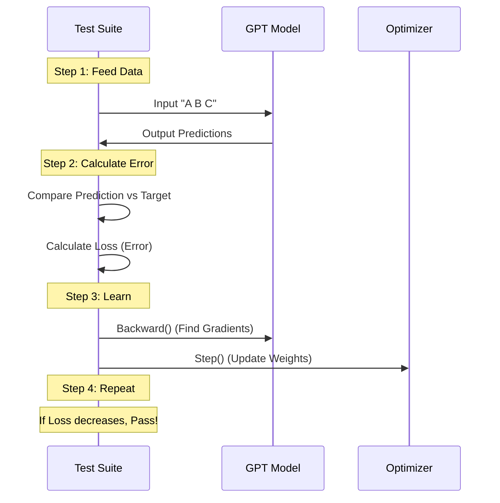

# Chapter 10: GPT Tests

In the previous chapter, **[GPT Architecture](09_gpt_architecture.md)**, we achieved a massive milestone: we assembled the entire Generative Pre-trained Transformer. We connected the embeddings, stacked the blocks, and attached the output head.

But just because we built a car doesn't mean it drives.

## Motivation: The "Start Engine" Moment

Imagine you have just finished assembling a complex LEGO car. It looks perfect on the outside. But did you connect the steering wheel to the tires? Did you put the batteries in correctly?

In AI Engineering, we face the same uncertainty. We need to answer three critical questions before we try to train this model on millions of books:

1.  **Plumbing:** Does data flow from start to finish without crashing?
2.  **Size:** Is the model the size we expect, or did we accidentally create a monster that will crash our memory?
3.  **Learning Ability:** Can the model actually *learn*? (i.e., Do the gradients work?)

This chapter is about writing the **Final Inspection** test suite.

---

## Test 1: The Plumbing Check (Output Shape)

The first test is simple. We feed the model a sequence of numbers (tokens) and ensure it outputs a prediction for every single token.

If we feed in **10 words**, we expect **10 predictions**. Each prediction should contain a score for every word in our vocabulary.

### The Code

```python
import torch
from tinytorch import GPT, GPTConfig

def test_gpt_output_shape():
    # 1. Setup a small model
    config = GPTConfig(vocab_size=100, n_embd=32, n_layer=2)
    model = GPT(config)

    # 2. Create dummy input: Batch=1, Sequence Length=5
    idx = torch.tensor([[1, 5, 2, 9, 3]])

    # 3. Get predictions
    logits = model(idx)

    # 4. Check shape: [Batch, Time, Vocab] -> [1, 5, 100]
    assert logits.shape == (1, 5, 100)
    print("✅ Plumbing Check Passed: Output shape is correct.")
```

**Explanation:**
*   We use a tiny `vocab_size=100` to make the test fast.
*   We feed in 5 numbers.
*   We verify we get back a grid of `1 x 5 x 100`.

---

## Test 2: The Weight Check (Parameter Counting)

GPT-3 has 175 Billion parameters. Our model will be smaller, but we need to know exactly how big it is. This test ensures we aren't accidentally creating extra layers or missing layers.

### The Concept
We iterate through every "tensor" in the model (weights and biases) and count how many numbers are inside them.

### The Code

```python
def test_parameter_count():
    # 1. Setup specific config
    config = GPTConfig(vocab_size=100, n_embd=64, n_layer=2, n_head=2)
    model = GPT(config)
    
    # 2. Count parameters manually
    # sum up the number of elements (numel) in each weight
    total_params = sum(p.numel() for p in model.parameters())
    
    # 3. Print for inspection
    print(f"Total Parameters: {total_params}")
    
    # 4. Sanity check: Should be > 0
    assert total_params > 0
    print("✅ Weight Check Passed.")
```

**Explanation:**
*   `p.numel()`: Returns the total number of items in a tensor (e.g., a 10x10 matrix has 100 elements).
*   In a real scenario, you might calculate the exact expected number formulaically (like `12 * n_layer * n_embd^2...`) and assert equality.

---

## Test 3: The "Can It Learn?" Check

This is the most powerful test in your toolkit.

Before training on Wikipedia (which takes days), we train the model on **one single batch of data** for 10 steps.

*   **If the loss goes down:** The model is learning! The gradients are flowing, and the optimizer is connected.
*   **If the loss stays flat:** Something is broken. Maybe we forgot to connect the residual path, or our learning rate is zero.

### Internal Implementation: The Training Loop

Here is what happens during this test.



### The Code: Overfitting a Batch

We will use a simple optimizer and try to force the model to memorize a random sequence.

**Step 1: Setup**
```python
def test_model_learning():
    # 1. Setup Model
    config = GPTConfig(vocab_size=100, n_embd=32, n_layer=2)
    model = GPT(config)
    
    # 2. Create a dummy input and a dummy target
    # We want the model to predict 'target' from 'input'
    input_ids = torch.randint(0, 100, (1, 8))
    target_ids = torch.randint(0, 100, (1, 8))
```

**Step 2: The Training Loop**
```python
    # 3. Create a basic optimizer
    optimizer = torch.optim.AdamW(model.parameters(), lr=1e-3)
    
    # 4. Track the loss
    initial_loss = None
    
    for _ in range(10): # Run 10 training steps
        optimizer.zero_grad()           # Reset gradients
        logits = model(input_ids)       # Forward pass
        
        # Calculate loss (Cross Entropy)
        # Reshape logits to [Batch*Time, Vocab] for PyTorch
        B, T, V = logits.shape
        loss = torch.nn.functional.cross_entropy(
            logits.view(B*T, V), 
            target_ids.view(B*T)
        )
```

**Step 3: Update and Verify**
```python
        # Record first loss
        if initial_loss is None: 
            initial_loss = loss.item()
            
        # Backward pass (Calculate gradients)
        loss.backward()
        
        # Update weights
        optimizer.step()
        
    # 5. Verdict: Did we improve?
    final_loss = loss.item()
    print(f"Start Loss: {initial_loss:.4f}, End Loss: {final_loss:.4f}")
    assert final_loss < initial_loss
    print("✅ Learning Check Passed: Loss is decreasing.")
```

**Explanation:**
*   **Optimizer:** This is the mechanic that tweaks the engine screws (parameters) to make the car run smoother (lower loss).
*   **loss.backward():** This traces the path backwards from the output to the input to figure out which parameters caused the error.
*   **The Assertion:** If `final_loss < initial_loss`, it means the "brain" is physically capable of updating itself.

---

## Running the Full Suite

We combine all our checks into one executable block.

```python
if __name__ == "__main__":
    print("🚀 Starting GPT Systems Check...")
    
    test_gpt_output_shape()
    test_parameter_count()
    test_model_learning()
    
    print("🎉 All Systems Go! The GPT model is ready for launch.")
```

---

## Conclusion

We have successfully verified our full GPT assembly.

1.  **Output Shape:** The plumbing works.
2.  **Parameters:** The size is correct.
3.  **Learning:** The brain can update itself.

We now have a working model. But "working" doesn't mean "efficient." A model might output the correct shape but take 10GB of RAM and run incredibly slowly.

Before we deploy this, we need to understand the **costs** of running it. How much memory does it need? How fast can it generate text?

In the next chapter, we will perform a systems-level analysis of our creation.

Next Step: **[Systems Analysis](11_systems_analysis.md)**

---

Generated by [Code IQ](https://github.com/adityasoni99/Code-IQ)