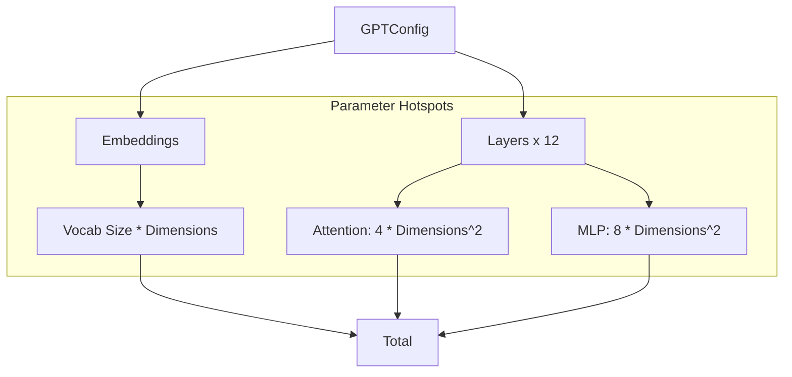
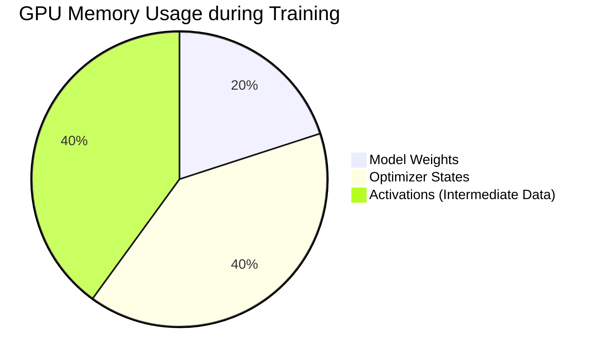

# Chapter 11: Systems Analysis

In the previous chapter, **[GPT Tests](10_gpt_tests.md)**, we verified that our model works. It processes data, learns from it, and doesn't crash.

But in the world of AI Engineering, "It works" is only half the battle. The other half is: **"Can we afford to run it?"**

## Motivation: The Backpack Analogy

Imagine you are planning a hiking trip. You have designed the perfect backpack (your model). It has pockets for everything (layers) and looks great.

Before you leave, you need to answer two questions:
1.  **Weight:** How heavy is it? (Parameter Count)
2.  **Space:** Will it fit in your tent? (Memory Footprint)

If you build a model that requires 24GB of memory, but your laptop only has 16GB, your program will crash immediately. In this chapter, we will write code to **analyze the system costs** of our model before we even start training.

---

## Concept 1: Parameter Counting

A "Parameter" is a single number in the neural network that the AI learns. It's one connection between two neurons.

When people say "GPT-3 is a 175 Billion parameter model," they are talking about the **count**.

### How to Count
To count the parameters, we iterate through every layer we built in **[GPT Architecture](09_gpt_architecture.md)** and sum up the size of the tensors.

```python
def get_model_params(model):
    # 1. Start counter at zero
    total_params = 0
    
    # 2. Iterate over every tensor in the model
    for p in model.parameters():
        # 3. .numel() gives "Number of Elements" in the tensor
        total_params += p.numel()
        
    return total_params
```

**Explanation:**
*   If a matrix is size $10 \times 10$, `numel()` returns 100.
*   We sum these up to get the total "brain cells" of our AI.

---

## Concept 2: Memory Estimation (Bytes)

Knowing the count isn't enough. We need to know the **File Size**.

In most AI training (Standard Float32), every single parameter takes up **4 Bytes** of memory.

*   1 Parameter = 4 Bytes
*   1 Million Parameters $\approx$ 4 Megabytes (MB)
*   1 Billion Parameters $\approx$ 4 Gigabytes (GB)

### The Formula
To estimate the RAM usage:
$$ \text{Memory (GB)} = \frac{\text{Total Params} \times 4}{1,024 \times 1,024 \times 1,024} $$

---

## Internal Implementation: The Estimator

We don't actually need to build the model to know how big it will be! We can calculate it using the math from our architecture.

Let's trace where the parameters live:



### 1. Estimating the Block
In **[Transformer Block](07_transformer_block.md)**, we saw that the block has two main parts: Attention and MLP.

*   **Attention:** Uses 4 matrices (Query, Key, Value, Output). Each is size `dim * dim`.
*   **MLP:** Uses an expansion of 4x. This results in roughly 8 matrices of size `dim * dim`.

Let's write a function to estimate this.

```python
from tinytorch import GPTConfig

def estimate_static_size(config: GPTConfig):
    # 1. Calculate Embedding Size
    # (Vocab + Position) * Embedding Dimension
    embeddings = (config.vocab_size + config.block_size) * config.n_embd
    
    # 2. Calculate One Block Size
    # Attention (4 matrices) + MLP (roughly 8 matrices)
    # Factor 12 comes from: 4 (Attn) + 8 (MLP: 4 up, 4 down)
    block_params = 12 * (config.n_embd ** 2)
    
    # 3. Total
    total = embeddings + (block_params * config.n_layer)
    return total
```

*Note: This is a rough estimation. It ignores Biases and LayerNorms because they are tiny compared to the big matrices.*

---

## Analysis: Putting it to the test

Now, let's create a script that compares our **Estimation** (Math) vs the **Actual Model** (Code). This proves we understand our own architecture.

### Step 1: Define a Configuration
We will use a small configuration for this test.

```python
from tinytorch import GPT
    
# Setup: A small "Baby GPT"
config = GPTConfig(
    vocab_size=1000, 
    n_embd=256, 
    n_layer=4, 
    n_head=4
)
```

### Step 2: Run the Estimation
We use the function we wrote above.

```python
# Calculate using pure math
estimated_count = estimate_static_size(config)

# Convert to MB (Count * 4 bytes / 1024 / 1024)
estimated_mb = (estimated_count * 4) / (1024 * 1024)

print(f"Estimated Params: {estimated_count:,}")
print(f"Estimated Memory: {estimated_mb:.2f} MB")
```

### Step 3: Run the Actual Measurement
We build the real model and count the actual tensors.

```python
# Build the actual model
model = GPT(config)

# Count actual parameters
actual_count = get_model_params(model)
actual_mb = (actual_count * 4) / (1024 * 1024)

print(f"Actual Params:    {actual_count:,}")
print(f"Actual Memory:    {actual_mb:.2f} MB")
```

**Expected Result:**
The numbers should be very close (usually within 1%). If they are widely different, it means our mental model of the architecture (the estimation formula) doesn't match the code we wrote in **[GPT Architecture](09_gpt_architecture.md)**.

---

## Visualizing the Scale

Why does this matter? Because parameters grow **quadratically**.

If you double the embedding size (`n_embd`), the model becomes **4x** larger, not 2x larger. This is because most matrices are `n_embd * n_embd`.

Let's look at how the size explodes:

| Model | Embedding Size | Layers | Params (Approx) | Memory (FP32) |
|---|---|---|---|---|
| **Baby** | 64 | 2 | ~0.1 Million | 0.4 MB |
| **Small** | 768 | 12 | ~85 Million | 340 MB |
| **Medium** | 1024 | 24 | ~300 Million | 1.2 GB |
| **XL** | 1600 | 48 | ~1.5 Billion | 6.0 GB |

**The Lesson:** A small change in `n_embd` in your **[Core Utilities](02_core_utilities.md)** config can crash your computer!

---

## The Hidden Cost: Activations

There is one final trap in Systems Analysis.

The file size (Weights) is only part of the cost. When you actually *run* the model (forward pass), you need to store the intermediate numbers (Activations) for every single layer so you can calculate gradients later.



*   **Model Weights:** The file size we calculated above.
*   **Activations:** The data flowing through the layers.
*   **Optimizer:** The "scratchpad" used by the training algorithm.

**Rule of Thumb:** You typically need **3x to 4x** the memory of the model file size to actually train it.

---

## Conclusion

We have analyzed our creation from a systems perspective.
1.  We learned how to **count parameters**.
2.  We learned that memory usage is **Params $\times$ 4 Bytes**.
3.  We learned that size grows **quadratically** with embedding dimension.

We now have a fully verified, analyzed, and understood GPT model. We know how it works, we know it's correct, and we know how much it costs to run.

It is time to bring everything together. In the final chapter, we will wrap up our journey, review the entire architecture we have built, and discuss where to go from here.

Next Step: **[Integration and Conclusion](12_integration_and_conclusion.md)**

---

Generated by [Code IQ](https://github.com/adityasoni99/Code-IQ)