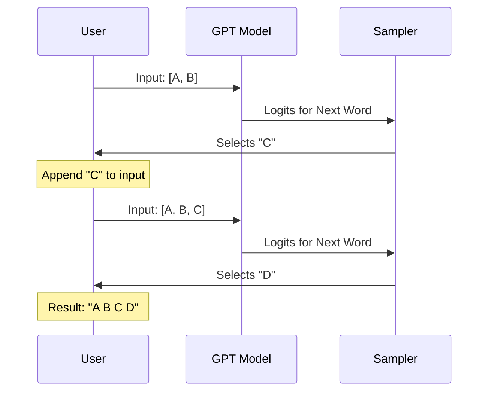
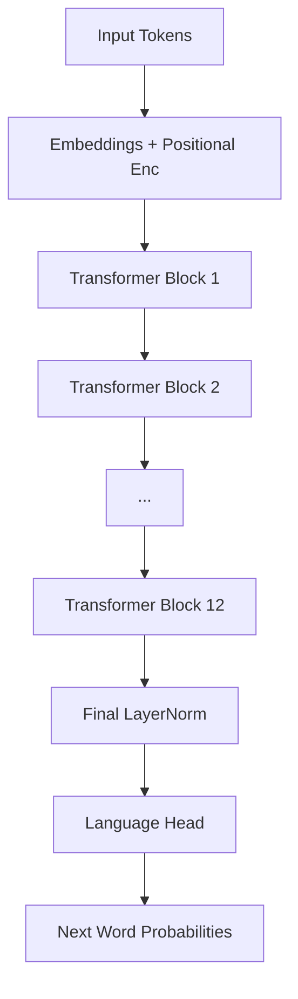

# Chapter 12: Integration and Conclusion

Welcome to the finale!

In the previous chapter, **[Systems Analysis](11_systems_analysis.md)**, we weighed our model and estimated how much memory it requires. We know it works, and we know how heavy it is.

Now, we are going to take our GPT model for a test drive.

## Motivation: The Autocomplete Engine

We have spent 11 chapters building components like **[Layer Normalization](03_layer_normalization.md)** and the **[Transformer Block](07_transformer_block.md)**. But a user doesn't care about normalization or blocks. They care about one thing:

**Input:** "Once upon a..."
**Output:** "...time, in a galaxy far away."

The core function of a Generative Pre-trained Transformer is **Text Generation**. It is essentially a very fancy autocomplete system.

In this chapter, we will:
1.  Implement the `generate` loop (the ability to create new text).
2.  Run a final integration test to ensure the whole system holds together.
3.  Review our journey and discuss what comes next.

---

## Concept 1: The Generation Loop

Our model, as built in **[GPT Architecture](09_gpt_architecture.md)**, does one thing: it takes a sequence of words and predicts the probability of the *next* word.

To generate a full sentence, we need to loop this process.

### The Logic

1.  Feed the model "Hello".
2.  Model predicts "World".
3.  **Append** "World" to the input. New input is "Hello World".
4.  Feed the model "Hello World".
5.  Model predicts "!".
6.  Repeat.

### Internal Implementation: The Sequence

Let's visualize the flow of data during generation.



### Implementing `generate`

We will add this method to our `GPT` class. Since we are writing a tutorial, we will write it as a standalone function that takes a model and runs the loop.

We need to handle a specific constraint: **Context Length**. The model has a fixed `block_size` (e.g., 1024). If we generate text longer than that, we must crop the input so we only feed the last 1024 words.

```python
import torch
import torch.nn.functional as F

def generate(model, idx, max_new_tokens, block_size):
    # idx is the input tensor of shape (Batch, Time)
    for _ in range(max_new_tokens):
        # 1. Crop context if it is too long
        idx_cond = idx[:, -block_size:]
        
        # 2. Get predictions
        logits = model(idx_cond)
        
        # 3. Focus only on the last time step
        logits = logits[:, -1, :] 
        
        # 4. Convert to probabilities & Sample
        probs = F.softmax(logits, dim=-1)
        idx_next = torch.multinomial(probs, num_samples=1)
        
        # 5. Append sampled index to the running sequence
        idx = torch.cat((idx, idx_next), dim=1)
        
    return idx
```

**Explanation:**
*   `idx_cond`: We ensure we never ask the model to read more than it can handle.
*   `logits[:, -1, :]`: We calculate predictions for every word, but we only care about predicting the *future*, so we take the very last prediction.
*   `torch.multinomial`: This picks a random word based on the probabilities. If "The" is 90% likely, it picks "The" 90% of the time.

---

## Concept 2: The Final Integration Test

We need to prove that our **[GPT Architecture](09_gpt_architecture.md)** can actually run this loop without crashing.

This acts as our "Flight Readiness Review."

### The Test Code

We will create a small model, give it a starting number, and ask it to generate 10 new numbers.

```python
from tinytorch import GPT, GPTConfig

def test_generation_capabilities():
    # 1. Setup a miniature GPT
    config = GPTConfig(vocab_size=100, n_embd=32, n_layer=2, block_size=20)
    model = GPT(config)
    model.eval() # Switch to evaluation mode (turns off Dropout)
    
    # 2. Start with a single token (e.g., the number 5)
    # Shape: (Batch=1, Time=1)
    context = torch.tensor([[5]], dtype=torch.long)
    
    # 3. Generate 10 new tokens
    generated = generate(model, context, max_new_tokens=10, block_size=20)
    
    # 4. Verify Output
    # We started with 1, added 10. Total length should be 11.
    print(f"Start length: {context.shape[1]}")
    print(f"End length:   {generated.shape[1]}")
    
    assert generated.shape[1] == 11
    print("✅ Integration Test Passed: Generation loop works.")

if __name__ == "__main__":
    test_generation_capabilities()
```

### Expected Outcome
Since we haven't trained the model on books or the internet, it acts like an untrained puppy. It will output random gibberish numbers.

**However**, if the code runs and produces 11 numbers, the *architecture* is perfect. The brain is built; it just hasn't gone to school yet.

---

## Concept 3: The Full System Demo

Let's look at how we would use this in a real application. This puts together everything we have learned in the book.

### The "Hello World" of GPT

```python
# 1. Configuration (The Blueprint)
# We use settings compatible with our lightweight implementation
config = GPTConfig(
    vocab_size=50304, # Standard GPT-2 size
    n_layer=12, 
    n_head=12, 
    n_embd=768
)

# 2. Build the Model (The Construction)
print("Building GPT model...")
model = GPT(config)

# 3. The Input (The Prompt)
# Ideally, we would use a Tokenizer here to convert text to numbers
# For now, let's pretend [66, 12, 99] means "AI is"
input_ids = torch.tensor([[66, 12, 99]])

# 4. Generate (The Action)
print("Generating text...")
output_ids = generate(model, input_ids, max_new_tokens=20, block_size=1024)

# 5. Result
print(f"Generated sequence: {output_ids.tolist()}")
```

This snippet represents the culmination of 12 chapters of work. Every component—from the **[Core Utilities](02_core_utilities.md)** to the **[MLP Tests](06_mlp_tests.md)**—is firing inside that `generate` function.

---

## Module Summary: The Journey

We have come a long way. Let's look back at the architecture we have built from scratch.

### Phase 1: The Foundation
We started by defining our tools.
*   **[Core Utilities](02_core_utilities.md)** gave us the `GPTConfig` and the critical `Causal Mask` to prevent time travel.
*   **[Layer Normalization](03_layer_normalization.md)** gave us stability, ensuring our math didn't explode.

### Phase 2: The Components
We built the organs of the AI.
*   **[Multi-Layer Perceptron](05_multi_layer_perceptron.md)** provided the "thinking" capability (processing individual words).
*   **[Transformer Block](07_transformer_block.md)** combined Attention (communication between words) with the MLP.

### Phase 3: The Verification
We didn't just write code; we acted like engineers.
*   We wrote tests for **[Layer Normalization](04_layer_normalization_tests.md)**, **[MLP](06_mlp_tests.md)**, and the **[Transformer Block](08_transformer_block_tests.md)**.
*   We performed a **[Systems Analysis](11_systems_analysis.md)** to understand the cost of our creation.

### The Final Architecture



---

## Conclusion

You have successfully built a Generative Pre-trained Transformer architecture from the ground up.

You now understand that "AI" isn't magic. It is:
1.  **Embeddings** converting words to numbers.
2.  **Attention** allowing words to look at each other.
3.  **MLPs** processing that information.
4.  **Layers** stacked deep to create complexity.

### Where to go from here?

We have built the **body** and the **brain**, but the brain is empty. The next logical step in your AI journey is **Training**.

Training involves:
1.  Downloading a massive dataset (like Wikipedia).
2.  Writing a training loop (Forward Pass -> Calculate Loss -> Backward Pass).
3.  Running this for days or weeks on powerful GPUs.

But structurally, the code you have written here is the exact same code used to train the world's most powerful models.

**Congratulations on completing the Transformer Architecture module!**

---

Generated by [Code IQ](https://github.com/adityasoni99/Code-IQ)