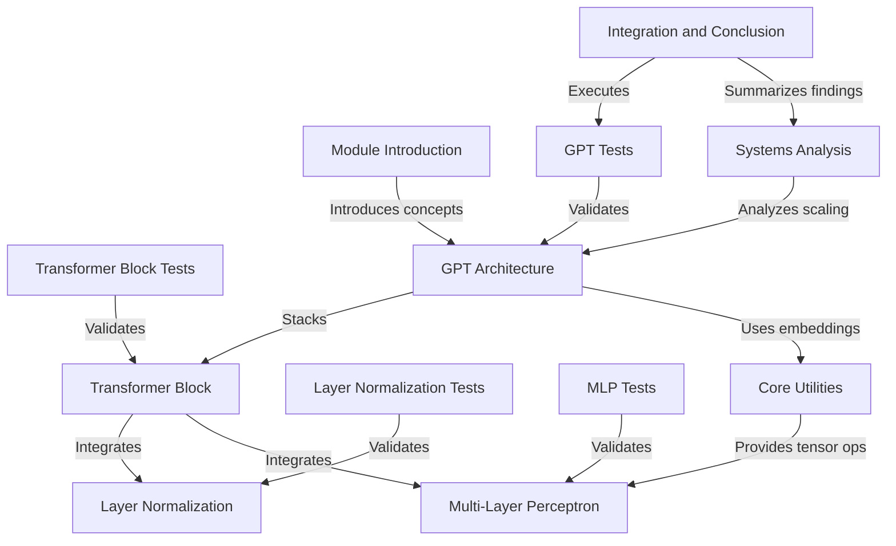

# Tutorial: cs249r_book

**TinyTorch** is an educational framework for building **Machine Learning Systems** from scratch, specifically focusing on the implementation of **Transformer** architectures. It enables users to construct, train, and profile **GPT-style models**, providing deep insights into the *systems impact* of **attention mechanisms**, **computational complexity**, and **memory scaling**.

**Source Repository:** [https://github.com/harvard-edge/cs249r_book](https://github.com/harvard-edge/cs249r_book)

## Chapters

1. [Module Introduction](01_module_introduction.md)
2. [Core Utilities](02_core_utilities.md)
3. [Layer Normalization](03_layer_normalization.md)
4. [Layer Normalization Tests](04_layer_normalization_tests.md)
5. [Multi-Layer Perceptron](05_multi_layer_perceptron.md)
6. [MLP Tests](06_mlp_tests.md)
7. [Transformer Block](07_transformer_block.md)
8. [Transformer Block Tests](08_transformer_block_tests.md)
9. [GPT Architecture](09_gpt_architecture.md)
10. [GPT Tests](10_gpt_tests.md)
11. [Systems Analysis](11_systems_analysis.md)
12. [Integration and Conclusion](12_integration_and_conclusion.md)

---

Generated by [Code IQ](https://github.com/adityasoni99/Code-IQ)