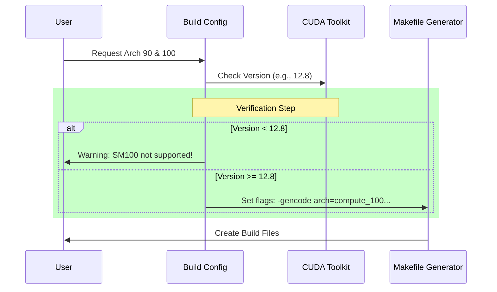

# Chapter 1: Build Configuration

Welcome to the first chapter of the CUTLASS tutorial! Before we can write high-performance matrix multiplication kernels, we need to set up our workshop.

In the world of C++ and CUDA, this means configuring the **Build System**.

### Motivation: Why is this complex?

Imagine you are a chef (the compiler) trying to cook a meal (the program) for a specific guest (the GPU).
*   If the guest is from 2017 (Volta Architecture), they have specific dietary restrictions.
*   If the guest is from 2024 (Blackwell Architecture), they have a completely different palate and digestion system.

If you feed a Blackwell meal to a Volta guest, they won't be able to eat it (the code won't run). If you feed a Volta meal to a Blackwell guest, it might be edible, but it won't be the gourmet experience they are capable of (low performance).

This chapter explains how we tell the build system **exactly** which GPU we are targeting and which C++ features we need.

---

### Key Concepts

#### 1. CMake
CUTLASS uses **CMake**. Think of CMake as the "Manager" of the kitchen. You don't cook directly; you tell the Manager what you want, and the Manager writes the detailed instructions (Makefiles) for the chefs.

#### 2. C++17
CUTLASS 3.x is a modern library. It relies heavily on features introduced in the **C++17** standard (like `constexpr if` and structure bindings) to do its "template magic." We must strictly enforce this standard.

#### 3. Compute Capability (SM)
NVIDIA GPUs have a version number for their architecture, often called "SM" (Streaming Multiprocessor) or Compute Capability.
*   **SM70:** Volta (e.g., V100)
*   **SM80:** Ampere (e.g., A100)
*   **SM90:** Hopper (e.g., H100)
*   **SM100/SM120:** Blackwell (Next-gen)

---

### How to Configure the Build

To build CUTLASS, you typically create a build directory and run `cmake`. Here is the central use case: **Configuring a build for an H100 (Hopper) and the new Blackwell architecture.**

#### Basic Command
```bash
mkdir build && cd build
cmake .. -DCUTLASS_NVCC_ARCHS="90;100" -DCUTLASS_ENABLE_TESTS=ON
```

*   `-DCUTLASS_NVCC_ARCHS="90;100"`: This tells CUTLASS to compile code specifically for Hopper (90) and Blackwell (100).
*   `-DCUTLASS_ENABLE_TESTS=ON`: This generates the test executables so we can verify our code works.

---

### The `CMakeLists.txt` Walkthrough

Let's look under the hood of the `CMakeLists.txt` file provided in the project root. We will break it down into small, digestible pieces.

#### 1. Setting the Language Standard
First, we ensure the "kitchen" is stocked with modern tools. CUTLASS requires C++17.

```cmake
# CUTLASS 3.x requires C++17
set(CMAKE_CXX_STANDARD 17)
set(CMAKE_CXX_STANDARD_REQUIRED ON)
set(CMAKE_CXX_EXTENSIONS OFF)

# CUDA also needs to know we are using C++17
set(CMAKE_CUDA_STANDARD 17)
set(CMAKE_CUDA_STANDARD_REQUIRED ON)
```
**Explanation:** This snippet forces the compiler to use C++17. If your compiler is too old and doesn't support C++17, CMake will stop with an error immediately.

#### 2. Defining Supported Architectures
This is the logic that determines which GPUs are supported based on your installed CUDA Toolkit version.

```cmake
set(CUTLASS_NVCC_ARCHS_SUPPORTED "")

# CUDA 11.4+ supports Volta (70) through Ampere (80/86)
if (CUDA_VERSION VERSION_GREATER_EQUAL 11.4)
  list(APPEND CUTLASS_NVCC_ARCHS_SUPPORTED 70 72 75 80 86 87)
endif()

# CUDA 11.8+ adds Ada (89) and Hopper (90)
if (CUDA_VERSION VERSION_GREATER_EQUAL 11.8)
  list(APPEND CUTLASS_NVCC_ARCHS_SUPPORTED 89 90)
endif()
```
**Explanation:** CMake checks your `CUDA_VERSION`. If you have an older toolkit (e.g., 11.4), it won't let you try to build for Hopper (90) because that compiler doesn't know what Hopper is yet.

#### 3. The Future: Blackwell Support
CUTLASS is ready for the future. The configuration includes logic for the upcoming Blackwell architecture (SM100, SM120), provided you have a very new CUDA Toolkit (12.8+).

```cmake
# CUDA 12.8+ adds initial Blackwell support (100, 120)
if (CUDA_VERSION VERSION_GREATER_EQUAL 12.8)
  list(APPEND CUTLASS_NVCC_ARCHS_SUPPORTED 100 100a 120 120a)
endif()

# CUDA 12.9+ adds variants (100f, 120f)
if (CUDA_VERSION VERSION_GREATER_EQUAL 12.9)
  list(APPEND CUTLASS_NVCC_ARCHS_SUPPORTED 100f 120f)
endif()
```
**Explanation:** This block unlocks the bleeding-edge architectures. Note the suffix letters (like `100a` or `120f`); these often denote specific variants or feature sets within the Blackwell family.

#### 4. Applying the Configuration
Finally, CMake takes the list of requested architectures and applies them to the build targets.

```cmake
# Default to building all supported archs if user didn't specify
set(CUTLASS_NVCC_ARCHS ${CUTLASS_NVCC_ARCHS_SUPPORTED} ... )

# Tell the user what we are doing
message(STATUS "CUDA Compilation Architectures: ${CUTLASS_NVCC_ARCHS_ENABLED}")
```
**Explanation:** This sets the default behavior. If you don't manually type `-DCUTLASS_NVCC_ARCHS=...`, CUTLASS will try to build for *every* GPU your compiler supports. This takes a long time! It is better to be specific.

---

### Internal Implementation

What happens when you run that `cmake` command? Let's visualize the flow.



#### Deep Dive: Flag Generation
Inside the `CMakeLists.txt`, there is a helper function `cutlass_apply_cuda_gencode_flags`. While the full code is complex, here is the simplified logic of what it does:

```cmake
function(cutlass_apply_cuda_gencode_flags TARGET)
  # Iterate over every architecture the user requested (e.g., 90, 100)
  foreach(ARCH ${ARCHS_ENABLED})
    
    # 1. Create the "Real" binary flag (SASS)
    # This runs natively on the GPU
    list(APPEND __CMAKE_CUDA_ARCHS ${ARCH}-real)

    # 2. Create the "Virtual" binary flag (PTX)
    # This allows forward compatibility
    list(APPEND __CMAKE_CUDA_ARCHS ${ARCH}-virtual)
    
  endforeach()
  
  # Apply these properties to the target library
  set_property(TARGET ${TARGET} PROPERTY CUDA_ARCHITECTURES ${__CMAKE_CUDA_ARCHS})
endfunction()
```
**Explanation:** 
For every architecture you select, CMake generates two things:
1.  **Real Binary (SASS):** Machine code optimized exactly for that chip.
2.  **Virtual Binary (PTX):** Intermediate code that the GPU driver can "Just-In-Time" compile. This is useful if you run an SM90 program on an SM91 GPU that didn't exist when you compiled the code.

### Summary
In this chapter, we learned:
1.  **Configuration is Key:** We must tell CUTLASS which GPUs to support.
2.  **Modern C++:** We are strictly bound to C++17.
3.  **Architectures:** We can target everything from Volta (SM70) to the cutting-edge Blackwell (SM100+), provided we have the right CUDA Toolkit.

Now that our build environment is configured and we know how to target our specific hardware, we need to understand how to read the instructions for the library itself.

[Next Chapter: Documentation](02_documentation.md)

---

Generated by [Code IQ](https://github.com/adityasoni99/Code-IQ)