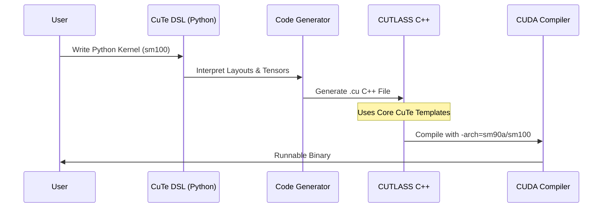

# Chapter 2: Documentation

In the previous chapter, [Chapter 1: Build Configuration](01_build_configuration.md), we set up our "kitchen" by configuring the build system for specific architectures like Hopper and Blackwell.

Now that our tools are ready, we need the **recipes**.

In CUTLASS 4.4, "Documentation" isn't just about reading PDF files. It represents the map of the library's capabilities, specifically focusing on three major pillars that have evolved recently:
1.  **CuTe DSL** (Python interface)
2.  **Blackwell Architecture** (New hardware features)
3.  **Advanced Numerics** (FP8, Block Scaling, SSD)

### Motivation: Why do we need this map?

CUTLASS has grown into a massive library. If you dive straight into the C++ headers without a map, you will get lost in a sea of templates.

Imagine you want to cook a "Block Scaled Matrix Multiplication" for the new Blackwell GPU.
*   **The Old Way:** Search through thousands of C++ files hoping to find the right template parameters.
*   **The New Way:** Look at the documentation for **CuTe DSL** and the specific **Blackwell Examples**.

This chapter guides you through these high-level concepts so you know *what* to look for in the code.

---

### Key Concept 1: CuTe DSL (The "Easy Mode")

Historically, writing high-performance kernels meant writing verbose C++. **CuTe DSL** changes this. It is a Python-based interface that allows you to write CUDA kernels using Python syntax, which then generates the high-performance C++ code for you.

#### Why use it?
It flattens the learning curve. You describe the *logic* of data movement and math in Python, and the system handles the C++ boilerplate.

#### Example: The Concept
Instead of managing C++ pointers and template arguments, you work with high-level objects.

```python
# Conceptual Python DSL snippet
import cutlass.cute as cute

# 1. Define shapes and layouts in Python
shape = (128, 128, 32)
layout = cute.make_layout(shape)

# 2. The DSL generates the C++ types automatically
# No need to manually write typename Cutlass::Gemm::...
```
**Explanation:** This snippet shows how you define the geometry of your problem in Python. The DSL middleware takes this and writes the complex C++ for you.

---

### Key Concept 2: Blackwell Architecture (SM100/SM120)

The documentation highlights specific features for NVIDIA's Blackwell architecture. This is the "Ferrari" of GPUs, and it introduces new ways to move data.

#### The "TMA" Revolution
Blackwell relies heavily on the **Tensor Memory Accelerator (TMA)**.
*   **Old GPU:** Threads manually carry data from Global Memory to Shared Memory like workers carrying boxes.
*   **Blackwell:** You tell the TMA "Move this block," and it moves the entire block asynchronously while the threads do math.

#### State Space Decomposition (SSD)
You will see references to **SSD Kernels** (e.g., Example 111 and 112). This isn't about storage drives! It refers to a mathematical technique often used in Mamba/SSM models (alternatives to Transformers). CUTLASS now supports these natively.

---

### Key Concept 3: Narrow Precision & Block Scaling

To make AI models faster, we use smaller numbers.
*   **FP8:** 8-bit floating point.
*   **Int4:** 4-bit integers.

**Block Scaling (MXFP4/NVFP4):**
Imagine you have a group of very small numbers. If they are all tiny, you lose precision. **Block scaling** shares a single "scale factor" (exponent) across a block of numbers (e.g., 32 numbers). This allows high precision with very few bits.

CUTLASS 4.4 documentation emphasizes **Mixed Input GEMMs** where inputs might be these exotic compressed formats.

---

### Use Case: Finding the "Holy Grail" Kernel

Let's apply this knowledge. Your goal is to find the code for a **Blackwell Dense Block-Scaled GEMM** using the **Python DSL**.

#### Step 1: Navigate the Directory
Based on the documentation structure, we know DSL examples live in a specific folder.

```text
examples/
  python/
    CuTeDSL/
      blackwell/
        sm103_dense_blockscaled_gemm_persistent.py
```

#### Step 2: Reading the "Recipe"
When you open this file, you are looking for the **Kernel Specification**.

```python
# Inside the Python Example (Simplified)
kernel = cute.Kernel(
    "Blackwell_BlockScaled_GEMM",
    arch = "sm100",   # Targeting Blackwell
    opcode = "f16",   # Output type
    use_tma = True    # Using the hardware accelerator
)
```
**Explanation:** This Python code configures the build. It explicitly requests `sm100` (Blackwell) and enables TMA. This single Python object replaces hundreds of lines of C++ configuration.

---

### Internal Implementation: How Documentation becomes Code

How does reading a Python example result in a binary that runs on a GPU?



#### Deep Dive: The C++ Connection

Even if you use the Python DSL, it eventually generates C++ code using **CuTe**. The documentation links these concepts.

If you look at **Example 112 (Blackwell SSD)** in C++, you will see the raw templates that the DSL tries to hide:

```cpp
// examples/112_blackwell_ssd/blackwell_ssd.cu (Simplified)

// 1. Define the Hardware Instruction (SM100)
using Arch = cutlass::arch::Sm100;

// 2. Define the Algorithm using CuTe Layouts
using LayoutA = cute::Layout<Shape<M, K>, Stride<K, _1>>;

// 3. Define the Collective (Data Movement)
using CollectiveMainloop = cutlass::gemm::collective::CollectiveMma<...>;
```
**Explanation:**
*   `cutlass::arch::Sm100`: This tag tells the compiler to use Blackwell-specific assembly instructions (like specialized TMA commands).
*   `cute::Layout`: This is the core of the math. It describes how the matrix is shaped in memory.

### Summary

In this chapter, we learned how to read the map:
1.  **CuTe DSL** is the modern, Pythonic entry point for generating kernels.
2.  **Blackwell** requires specific `sm100` configurations and relies on **TMA**.
3.  **New Numerics** like Block Scaling allow for extreme performance by compressing data types.

Now that we understand the high-level features and how to find them in the documentation, we need to understand the basic building blocks of the C++ library itself.

[Next Chapter: Library Definitions](03_library_definitions.md)

---

Generated by [Code IQ](https://github.com/adityasoni99/Code-IQ)