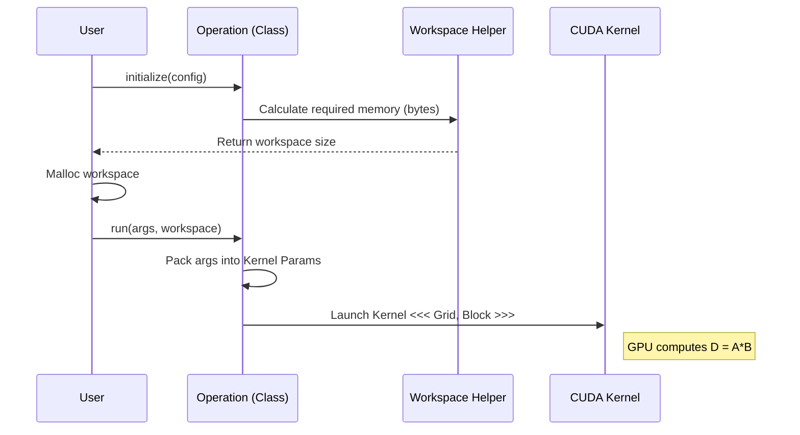

# Chapter 3: Library Definitions

In [Chapter 2: Documentation](02_documentation.md), we learned how to read the recipes and find the features available in CUTLASS, such as Blackwell support and CuTe DSL.

Now, we need to learn how to **order the meal**.

In the CUTLASS C++ Utility Library, we don't just call a function with 50 parameters. Instead, we use a structured system of **Definitions**. These are C++ structs and classes that organize our data.

### Motivation: Why do we need "Definitions"?

Imagine walking into a restaurant and shouting, "Burger, medium, cheese, no pickles, table 5, credit card!" at the chef. It's chaotic.

Instead, restaurants use **tickets** or **forms**.
1.  **The Setup (Configuration):** The kitchen needs to know if you are ordering off the Lunch Menu or Dinner Menu (this determines the prep work).
2.  **The Order (Arguments):** The specific details: "Table 5 needs a Burger."

CUTLASS separates these two concepts to maximize performance. We want to do the heavy setup once (`Configuration`) and run the computation many times with different data (`Arguments`).

---

### Key Concept 1: The `Operation` Class

Everything in the CUTLASS Utility Library inherits from a base class called `Operation`. Think of this as the "Manager" of a specific kernel.

The `Operation` class forces every matrix multiplication kernel to follow the same rules.

```cpp
// cutlass/library/library.h

class Operation {
public:
  // 1. Setup: Prepare memory (expensive)
  virtual Status initialize(
    void const *configuration, 
    void *host_workspace, 
    void *device_workspace = nullptr, 
    cudaStream_t stream = nullptr) const = 0;

  // 2. Execute: Run the math (fast)
  virtual Status run(
    void const *arguments, 
    void *host_workspace, 
    void *device_workspace = nullptr, 
    cudaStream_t stream = nullptr) const = 0;
};
```
**Explanation:**
*   **Initialize:** Checks if the GPU supports the kernel and allocates workspace memory.
*   **Run:** Launches the actual CUDA kernel using the pointers provided in `arguments`.

---

### Key Concept 2: Configuration (The Setup)

**Configuration** structs contain parameters that usually require computationally expensive calculations or memory allocation to change.

Let's look at the `GemmConfiguration`. This tells the library *how* the problem is shaped.

```cpp
// cutlass/library/library.h

struct GemmConfiguration {
  // The size of the matrix (M, N, K)
  gemm::GemmCoord problem_size{};

  // Leading dimensions (Strides for A, B, C, D)
  int64_t lda{0};
  int64_t ldb{0};
  int64_t ldc{0};
  int64_t ldd{0};

  // How many ways to split the work
  int split_k_slices{0};
};
```
**Explanation:**
*   `problem_size`: How big are the matrices?
*   `lda/ldb`: How are the matrices laid out in memory? (Column-major vs Row-major logic).
*   **Why is this Configuration?** Calculating the grid size (how many thread blocks to launch) depends on these numbers. We don't want to recalculate grid logic for every single run if the size hasn't changed.

---

### Key Concept 3: Arguments (The Data)

**Arguments** structs contain lightweight parameters that can change every time you run the kernel without penalty. These are mostly pointers to your data.

```cpp
// cutlass/library/library.h

struct GemmArguments {
  // Pointers to your data on the GPU
  void const *A{nullptr};
  void const *B{nullptr};
  void const *C{nullptr};
  void *D{nullptr};

  // Scaling factors: D = alpha * A*B + beta * C
  void const *alpha{nullptr};
  void const *beta{nullptr};
};
```
**Explanation:**
*   You can call `Operation::run` 100 times in a loop.
*   Each time, you can pass a different `GemmArguments` struct (pointing to different memory buffers).
*   This is very fast because the kernel is already compiled and configured.

---

### Key Concept 4: Advanced Definitions

As we move to more complex math, the structs simply grow to accommodate more data.

#### Batched GEMM
If you want to run 100 small matrix multiplications at once, you use the **Batched** definition. Notice what gets added:

```cpp
struct GemmBatchedConfiguration {
  // Standard stuff...
  gemm::GemmCoord problem_size{};

  // NEW: How far apart are the matrices in memory?
  int64_t batch_stride_A{0};
  int64_t batch_stride_B{0};
  // ...

  // NEW: How many matrices?
  int batch_count{1};
};
```

#### Block Scaled GEMM (Blackwell Feature)
For the advanced Block Scaling mentioned in the Documentation, we need extra pointers for the scaling factors (`SF`).

```cpp
struct BlockScaledGemmArguments {
  // Standard Matrix Pointers
  void const *A{nullptr};
  void const *B{nullptr};

  // NEW: Pointers to Scaling Factors (metadata)
  void const *SFA{nullptr};
  void const *SFB{nullptr}; 
  
  // NEW: Normalization constants
  void const *norm_constant{nullptr};
};
```

---

### Use Case: Defining a Simple GEMM

How do we solve a basic matrix multiplication use case using these definitions?

**Goal:** Multiply Matrix A and B.

#### Step 1: Fill out the Configuration
We define the geometry of our problem.

```cpp
cutlass::library::GemmConfiguration config;

// Define a 128x128x64 matrix multiply
config.problem_size = cutlass::gemm::GemmCoord(128, 128, 64);

// Define strides (assuming column major, usually M, K, M)
config.lda = 128; 
config.ldb = 64; 
config.ldc = 128;
```

#### Step 2: Fill out the Arguments
We point to our actual data.

```cpp
cutlass::library::GemmArguments args;

args.A = ptr_to_A_on_gpu;
args.B = ptr_to_B_on_gpu;
args.C = ptr_to_C_on_gpu;
args.D = ptr_to_output_on_gpu;

// Host pointer to scaling factor (alpha = 1.0)
float alpha = 1.0f;
args.alpha = &alpha; 
```

Now, these two structs (`config` and `args`) are ready to be passed to an `Operation` object.

---

### Internal Implementation

What happens inside the library when we use these structs?

The `Operation` class acts as a bridge between these C++ structs and the specific CUDA kernel generation logic.



#### Deep Dive: The Universal Arguments

In recent versions of CUTLASS (3.x and 4.x), many specialized GEMM arguments have been unified into `GemmUniversalArguments`. This allows a single struct to handle standard GEMM, Batched GEMM, and even some Mixed Input types.

This is defined in `library.h`:

```cpp
// cutlass/library/library.h

struct GemmUniversalArguments {
  // Basic geometry
  gemm::GemmCoord problem_size{};
  int batch_count{1};

  // Pointers
  void const *A{nullptr};
  void const *B{nullptr};
  
  // Batch Strides (used if batch_count > 1)
  int64_t batch_stride_A{0};
  
  // Mixed Precision Metadata (Advanced)
  void *Scale{nullptr};                 
  void *Zero{nullptr};                  
};
```
**Why this matters:**
This struct is "polymorphic" in usage.
1.  If `batch_count` is 1, `batch_stride` is ignored.
2.  If `Scale` is `nullptr`, it runs a standard dense GEMM.
3.  If `Scale` is set, it might trigger the new FP8/Int4 kernels.

This design reduces the number of unique classes you need to learn. You master `GemmUniversalArguments`, and you can control 90% of the library.

---

### Summary

In this chapter, we learned:
1.  **Definitions** are the standard forms (Structs) we use to talk to the library.
2.  **Configuration** handles the expensive setup (sizes, layout).
3.  **Arguments** handles the cheap runtime data (pointers).
4.  **Operation** is the manager that takes these forms and runs the GPU kernel.

We now have the blueprints (Configuration) and the raw materials (Arguments). But we still need the machinery to actually *create* the `Operation` object.

In the next chapter, we will look at how to instantiate these operations using wrappers.

[Next Chapter: Operation Wrappers](04_operation_wrappers.md)

---

Generated by [Code IQ](https://github.com/adityasoni99/Code-IQ)