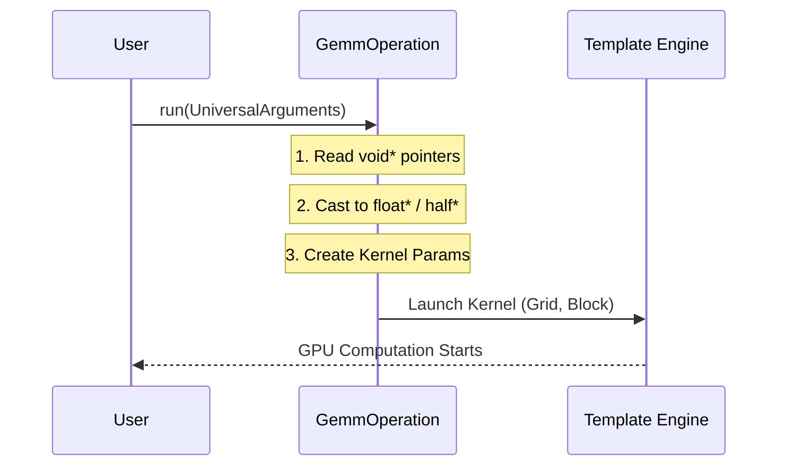

# Chapter 4: Operation Wrappers

In the previous chapter, [Chapter 3: Library Definitions](03_library_definitions.md), we learned how to fill out the "forms" (Configurations and Arguments) to describe *what* we want to compute.

Now, we need the machine that actually processes those forms.

In this chapter, we explore **Operation Wrappers**. These are special C++ classes that act as a bridge between the rigid, compile-time world of C++ templates and the dynamic, runtime world of your application.

### Motivation: The "Static vs. Dynamic" Problem

CUTLASS is famous for using **C++ Templates** to achieve high performance. A matrix multiplication kernel is customized at compile-time for specific data types (e.g., `float`), layouts, and tile sizes.

**The Problem:**
Imagine you are writing a deep learning framework (like PyTorch). You don't know until the program runs whether the user wants to multiply `float` matrices or `int8` matrices.
*   **Templates (Static):** Must be known before the program starts.
*   **User Input (Dynamic):** Only known while the program is running.

**The Solution:**
We wrap the rigid template in a flexible "Operation Wrapper." This wrapper creates a standard interface (Polymorphism) so your program can pick the right tool for the job at runtime.

---

### Central Use Case

We want to create a generic handle that represents a specific Matrix Multiplication (e.g., Float32, 128x128 tile size). We want to treat this handle like a generic object, initialize it, and run it.

#### 1. The Template (The Engine)
First, somewhere in the code, the actual high-performance kernel exists. This is the "engine."

```cpp
// This is the compile-time engine (simplified)
using MyGemmKernel = cutlass::gemm::device::Gemm<
    float,        // Element A
    LayoutA,      // Layout A
    float,        // Element B
    LayoutB,      // Layout B
    float,        // Output
    LayoutC       // Layout C
>;
```

#### 2. The Wrapper (The Car)
We cannot call `MyGemmKernel` directly from a generic list. We wrap it using `cutlass::library::GemmOperation`.

```cpp
#include "cutlass/library/gemm_operation.h"

// We wrap the kernel in the Operation class
// This class inherits from the generic 'Operation' base class
using MyGemmWrapper = cutlass::library::GemmOperation<MyGemmKernel>;
```

#### 3. Instantiation (The Keys)
Now we can create an instance of this wrapper and store it in a generic pointer.

```cpp
// Create the operation
cutlass::library::Operation *op = new MyGemmWrapper("my_fast_gemm");

// Now 'op' can be stored in a list of supported operations!
std::vector<cutlass::library::Operation*> manifest;
manifest.push_back(op);
```
**Why is this powerful?** The `manifest` vector can hold hundreds of *different* kernels (float, int8, double), but they all look like a generic `Operation*` to your program.

---

### Internal Implementation: How it Works

What happens when you call `run()` on this wrapper? The wrapper performs a translation.

1.  **Input:** Takes the generic `GemmUniversalArguments` (void pointers) we learned about in Chapter 3.
2.  **Process:** Casts these `void*` pointers back to the specific types (e.g., `float*`) that the template expects.
3.  **Output:** Launches the actual CUDA kernel.



#### Code Dive: `gemm_operation.h`

Let's look inside `tools/library/src/gemm_operation.h` to see how this translation happens.

The class `GemmOperation` inherits from `GemmOperationBase`. Its most important job is inside the `run` method, specifically a helper called `update_arguments_`.

```cpp
// cutlass/library/src/gemm_operation.h

template <typename Operator_>
class GemmOperation : public GemmOperationBase<Operator_> {
  
  // Define the types based on the Template Engine
  using ElementA = typename Operator::ElementA;
  // ...
```

When you ask the wrapper to run, it calls `update_arguments_`. This is where the magic casting happens:

```cpp
  static Status update_arguments_(
    OperatorArguments &operator_args,
    GemmArguments const *arguments) { // <-- Generic Arguments from Chapter 3

    // 1. Cast the generic void* pointer to the specific ElementA* (e.g., float*)
    operator_args.ref_A.reset(
        static_cast<ElementA const *>(arguments->A)
    );

    // 2. Do the same for B, C, and D
    operator_args.ref_B.reset(static_cast<ElementB const *>(arguments->B));
    operator_args.ref_C.reset(static_cast<ElementC const *>(arguments->C));
    operator_args.ref_D.reset(static_cast<ElementD *>(arguments->D));

    return Status::kSuccess;
  }
```
**Explanation:**
*   `GemmArguments` holds `void* A`. The compiler doesn't know it's a float.
*   `Operator_` (the template) *knows* `ElementA` is `float`.
*   The wrapper uses `static_cast` to bridge this gap.

---

### Convolution Wrappers

The same logic applies to Convolution, but the wrapper handles more complexity regarding tensor geometry. This is found in `tools/library/src/conv2d_operation.h`.

The `Conv2dOperation` wrapper takes the generic `ConvArguments` and calculates the necessary strides and packed layouts that the specific Convolution Kernel expects.

```cpp
// cutlass/library/src/conv2d_operation.h

// Inside Conv2dOperation...
static Status construct_arguments_(
    OperatorArguments &operator_args,
    Conv2dConfiguration const *configuration) {

    operator_args.problem_size = configuration->problem_size;

    // The wrapper automatically handles packing logic for the kernel
    operator_args.ref_A = {
      nullptr, 
      LayoutA::packed(implicit_gemm_tensor_a_extent(...))
    };
    
    return Status::kSuccess;
}
```
**Why this helps:** You don't need to manually calculate the stride of a packed tensor every time you run a convolution. The wrapper does it for you based on the configuration.

---

### Describing the Operation

Besides running code, the wrapper also *describes* itself. This is useful for creating a catalog of available kernels.

When the wrapper is created, it fills out a `GemmDescription` struct:

```cpp
// Constructor of GemmOperationBase
GemmOperationBase(char const *name = "unknown_gemm") {

    // Describes the math (e.g., Multiply-Add)
    description_.tile_description.math_instruction.math_operation =
      MathOperationMap<typename Operator::MathOperator>::kId;

    // Describes the hardware requirements (e.g., Minimum SM80)
    description_.tile_description.minimum_compute_capability = 
      ArchMap<typename Operator::ArchTag, typename Operator::OperatorClass>::kMin;
}
```

This allows a tool to loop through a list of wrappers and ask, "Do you support NVIDIA Volta (SM70)?" or "Do you support int8?" without trying to run them.

---

### Summary

In this chapter, we learned:
1.  **Templates are Static:** They can't change at runtime.
2.  **Wrappers are Dynamic:** The `GemmOperation` class wraps the template to provide a standard interface.
3.  **Translation:** The wrapper casts generic `void*` arguments (from Chapter 3) into the specific types the kernel needs.
4.  **Self-Description:** Wrappers know their own hardware requirements and data types.

We now have the Definitions (Chapter 3) and the Wrappers (Chapter 4). But how do we know which wrapper is the fastest for our specific GPU? We need to benchmark them.

[Next Chapter: Profiler Tool](05_profiler_tool.md)

---

Generated by [Code IQ](https://github.com/adityasoni99/Code-IQ)