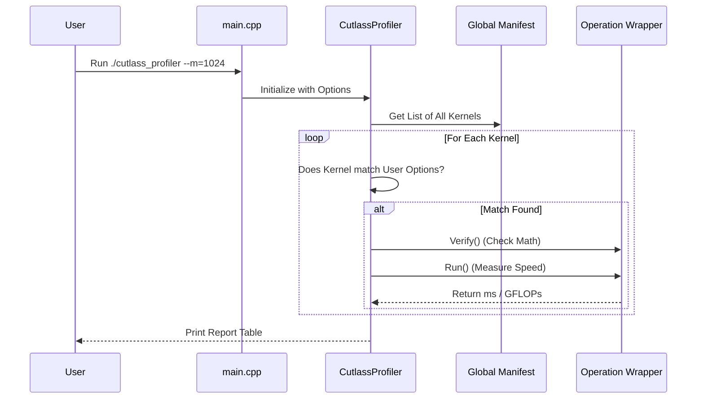

# Chapter 5: Profiler Tool

In the previous chapter, [Chapter 4: Operation Wrappers](04_operation_wrappers.md), we learned how to wrap rigid C++ templates into flexible objects. We created a "Menu" of available operations.

Now, imagine you have a menu with 100 different ways to cook a burger (100 different matrix multiplication kernels). Some use small tiles, some use large tiles, some use different pipeline stages.

**Which one is the fastest?**

You don't want to guess. You want to measure. This is where the **Profiler Tool** comes in.

---

### Motivation: The "Stopwatch" for Kernels

Writing a C++ program just to measure the speed of one specific matrix multiplication is tedious. You would have to:
1.  Allocate memory on the GPU.
2.  Initialize random data.
3.  Launch the kernel.
4.  Use CUDA events to time it.
5.  Calculate GFLOPs.

The **CUTLASS Profiler** (`cutlass_profiler`) is a pre-built command-line tool that does all of this for you. It acts as a universal test harness.

**Central Use Case:**
You want to see how fast your GPU can multiply two float32 matrices of size 4096 x 4096 x 4096.

**The Command:**
```bash
./tools/profiler/cutlass_profiler --operation=Gemm --m=4096 --n=4096 --k=4096
```

---

### Key Concepts

#### 1. The Executable
When you build CUTLASS (as described in [Chapter 1: Build Configuration](01_build_configuration.md)), you generate a binary file named `cutlass_profiler`. This single program contains *every* kernel defined in the library's manifest.

#### 2. Filters (Finding the right kernel)
The profiler contains thousands of kernels. You rarely want to run all of them. You use **command line arguments** to filter the list.

*   `--operation=Gemm`: Only run Matrix Multiplications.
*   `--accum=f32`: Only run kernels that accumulate in float32.
*   `--A=f16`: Only run kernels where input A is float16.

#### 3. Verification (Trust, but Verify)
Speed means nothing if the math is wrong.
By default, the profiler performs **Verification**.
1.  It runs the fast CUTLASS kernel.
2.  It runs a slow, simple "Reference" implementation on the CPU or GPU.
3.  It compares the results.
If the results don't match, it reports `Failed` instead of a speed.

#### 4. The Profiling Loop
Once a kernel passes verification, the profiler runs it many times (e.g., 50 iterations) to warm up the GPU and get a stable average runtime.

---

### How to Use the Profiler

Let's look at a concrete example of using the tool.

#### Step 1: Basic Benchmarking
Run the profiler asking for a specific problem size.

```bash
# Run all GEMM kernels on a 1024x1024x1024 problem
./cutlass_profiler --m=1024 --n=1024 --k=1024
```

**What happens?**
The tool will print a long table. Each row represents a specific kernel (Wrapper). The columns show:
*   **Runtime:** How many milliseconds it took.
*   **GFLOPs:** Computations per second (Higher is better).
*   **Status:** `Passed` (Math is correct) or `Failed`.

#### Step 2: Saving Results
You can save the output to a file for analysis (e.g., in Excel or Python).

```bash
# Save results to a CSV file
./cutlass_profiler ... --output=benchmark_results.csv
```

---

### Internal Implementation

How does this tool actually work under the hood? It connects the **Definitions** (Chapter 3) and **Wrappers** (Chapter 4) into a runnable application.

#### Conceptual Flow
1.  **Initialize:** The tool starts and looks at all the compiled "Wrappers" (the Manifest).
2.  **Filter:** It compares each Wrapper against your command line arguments (e.g., "Is this a GEMM?").
3.  **Setup:** For every matching Wrapper, it allocates the **Host Tensors** (memory).
4.  **Run:** It executes the `initialize()` and `run()` methods we learned about in Chapter 3.



#### Code Walkthrough

The entry point is surprisingly simple. It lives in `tools/profiler/src/main.cpp`.

```cpp
// tools/profiler/src/main.cpp

int main(int argc, char const *arg[]) {

  // 1. Parse command line arguments
  cutlass::CommandLine cmdline(argc, arg);
  cutlass::profiler::Options options(cmdline);

  // 2. Create the Profiler object
  cutlass::profiler::CutlassProfiler profiler(options);

  // 3. Run it!
  return profiler();
}
```
**Explanation:**
The `main` function does almost nothing. It just packages the command line text into an `Options` object and hands it off to the `CutlassProfiler` class.

#### The `CutlassProfiler` Class

This is the brain of the operation, found in `tools/profiler/include/cutlass/profiler/cutlass_profiler.h`.

```cpp
// tools/profiler/include/cutlass/profiler/cutlass_profiler.h

class CutlassProfiler {
private:
  // The user settings (problem size, verification mode, etc.)
  Options options_;

  // A list of "Operation Profilers" 
  // Each one knows how to profile a specific *type* of operation (GEMM, Conv, etc.)
  OperationProfilerVector operation_profilers_;

public:
  // The main operator() that runs the logic
  int operator()();
};
```
**Explanation:**
The `CutlassProfiler` owns a vector of `operation_profilers_`.
*   We have a specific profiler for GEMM.
*   We have a specific profiler for Convolution.
*   We have a specific profiler for Rank-K updates.

When you run `profiler()`, it iterates through these specific profilers.

#### The Profiling Logic

Inside the execution loop (in the source file), the profiler interacts with the **Singleton Manifest**. This is a global list where all the Wrappers registered themselves.

```cpp
// Pseudo-code logic inside CutlassProfiler::profile_()

// 1. Get the global list of all compiled operations
auto const & manifest = library::Manifest::get_instance();

// 2. Loop through every operation in the library
for (auto const * operation : manifest) {

  // 3. Check if the user wants this operation
  if (!filter_operation(operation, options_)) {
      continue; 
  }

  // 4. Measure it!
  result = profile_operation(operation, options_);
  
  // 5. Print the row
  print_result(result);
}
```
**Explanation:**
This loop is the engine. It ensures that if you built a library with 5,000 kernels, but you only asked for one specific type, the tool skips the other 4,999 instantly.

### Summary

In this chapter, we learned:
1.  **The Profiler** is a CLI tool to benchmark kernels without writing C++ code.
2.  **Filters** allow us to select specific kernels (like `f16` inputs) from the massive library.
3.  **Verification** ensures the kernel calculates the correct answer before timing it.
4.  **Internal Flow:** The `CutlassProfiler` iterates through the global **Manifest** of wrappers we created in the previous chapter.

To run these tests, the profiler needs to allocate memory on the CPU and GPU and sync them. This requires a robust utility for managing tensors.

[Next Chapter: Host Tensor Utility](06_host_tensor_utility.md)

---

Generated by [Code IQ](https://github.com/adityasoni99/Code-IQ)