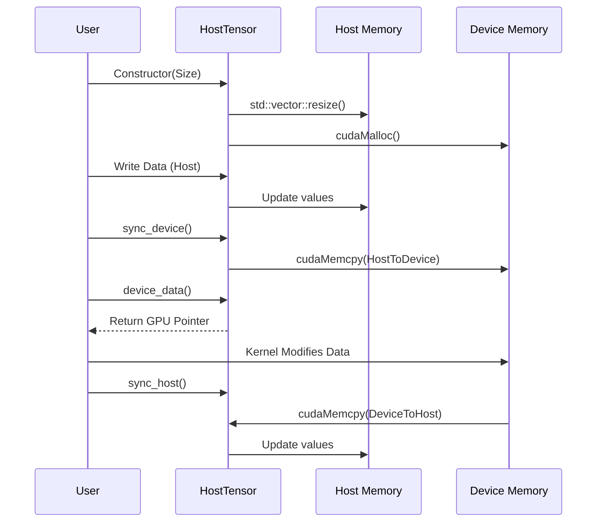

# Chapter 6: Host Tensor Utility

In the previous chapter, [Chapter 5: Profiler Tool](05_profiler_tool.md), we learned how to use the automated profiler to benchmark kernels. But what if you want to write your own test or integration?

To run a kernel on a GPU, you need data. This creates a logistical problem:
1.  You can easily generate data on the CPU (Host).
2.  You need to move it to the GPU (Device).
3.  You run the calculation.
4.  You need to move the result back to the CPU to check if it's correct.

Managing these memory allocations and copies manually (using `cudaMalloc`, `cudaMemcpy`, etc.) is tedious and error-prone.

This chapter introduces the **Host Tensor Utility**, a smart container that handles this "logistics" for you.

---

### Motivation: The "Dropbox" for Tensors

Think of the **Host Tensor** as a **Cloud-Synced Folder** (like Dropbox or Google Drive) for your data.

*   **Host (CPU):** This is your local laptop folder. You can open files, edit them, and print them easily.
*   **Device (GPU):** This is the cloud server. It's powerful, but you can't directly "touch" the files there.

**Without Host Tensor:**
You have to manually upload (copy to device) and download (copy to host) every time you change something.

**With Host Tensor:**
You create one object. It manages both the local copy and the cloud copy. You simply say "Sync," and it handles the movement.

#### Central Use Case
We want to verify a Matrix Multiplication.
1.  Create Matrix A (128x128) on the CPU.
2.  Fill it with random numbers.
3.  **Use Host Tensor** to move it to the GPU.
4.  Run the CUTLASS kernel.
5.  **Use Host Tensor** to bring the result back to verify.

---

### Key Concepts

#### 1. Dual Memory Ownership
The `cutlass::HostTensor` class owns **two** blocks of memory:
1.  `std::vector<Element> host_`: A standard C++ vector living in system RAM.
2.  `device_memory::allocation<Element> device_`: A raw pointer to GPU VRAM.

#### 2. Layouts and Extents
Just like the Definitions we learned in [Chapter 3: Library Definitions](03_library_definitions.md), a tensor needs to know its shape (Extent) and how it is arranged in memory (Layout).

*   **Extent:** The size, e.g., `{128, 64}` (Rows, Columns).
*   **Layout:** Column-Major or Row-Major.

#### 3. Synchronization
The class provides simple methods to keep the two memory banks in sync:
*   `sync_device()`: Copies data **Host -> Device**.
*   `sync_host()`: Copies data **Device -> Host**.

---

### How to Use Host Tensor

Let's walk through the standard workflow for setting up a test.

#### Step 1: Include and Define
First, we define the type of tensor we want. In this example, a Matrix of `float`s.

```cpp
#include "cutlass/util/host_tensor.h"
#include "cutlass/layout/matrix.h"

// Define a Tensor for float elements, Column Major layout
using MyTensor = cutlass::HostTensor<float, cutlass::layout::ColumnMajor>;

// Define the size (M=128, N=64)
auto size = cutlass::MatrixCoord(128, 64);
```

#### Step 2: Allocation
We instantiate the object. The constructor automatically allocates memory on **both** the CPU and the GPU.

```cpp
// Create the tensor
// This calls malloc() on CPU and cudaMalloc() on GPU automatically
MyTensor tensor_A(size);

// You can access the Host memory easily
tensor_A.host_data()[0] = 1.0f;
tensor_A.host_data()[1] = 2.0f;
```
**Explanation:** `tensor_A` now exists in two places. Right now, the data is only set on the CPU side.

#### Step 3: Initialization
We usually fill the host memory with data using a loop or a helper function.

```cpp
// Simple loop to fill data on the Host
for (int i = 0; i < tensor_A.capacity(); ++i) {
    tensor_A.host_data()[i] = static_cast<float>(i);
}

// At this point, GPU memory contains garbage/zeros!
```

#### Step 4: Sync to Device
Now that the "Local Folder" (CPU) is ready, we sync to the "Cloud" (GPU).

```cpp
// Copy Host -> Device
tensor_A.sync_device();

// Now we can get a pointer to the GPU memory to pass to a kernel
float* gpu_ptr = tensor_A.device_data();
```
**Explanation:** `sync_device()` performs the `cudaMemcpy`. You don't need to calculate bytes or offsets.

#### Step 5: Run and Retrieve
After running a kernel (which writes to the GPU memory), we bring the data back.

```cpp
// ... Imagine a Kernel ran here and modified tensor_A on the GPU ...

// Copy Device -> Host
tensor_A.sync_host();

// Now we can print the results
printf("Result: %f\n", tensor_A.host_data()[0]);
```

---

### Internal Implementation

How does `HostTensor` manage this magic? It uses C++ templates to wrap standard allocation and CUDA API calls.

#### Conceptual Flow
Here is the lifecycle of a HostTensor object.



#### Deep Dive: `host_tensor.h`

The file `tools/util/include/cutlass/util/host_tensor.h` contains the implementation.

**1. The Class Members**
The class holds the layout info and the two distinct storage containers.

```cpp
// cutlass/util/host_tensor.h

template <typename Element_, typename Layout_>
class HostTensor {
private:
  // Describes the shape (M, N, K)
  TensorCoord extent_;
  Layout layout_;

  // CPU Memory
  std::vector<StorageUnit> host_;

  // GPU Memory (Wrapper around cudaMalloc)
  device_memory::allocation<StorageUnit> device_;
};
```

**2. The Constructor / Reserve**
When you create the tensor, it calculates how much memory is needed based on the `extent` and `layout`.

```cpp
// Simplified view of reserve()
void reserve(size_t count, bool device_backed) {
    // 1. Resize the std::vector (CPU)
    host_.resize(count);

    // 2. Allocate on GPU if requested
    if (device_backed) {
      // device_memory::allocate wraps cudaMalloc
      StorageUnit* ptr = device_memory::allocate<StorageUnit>(count);
      device_.reset(ptr);
    }
}
```

**3. The Synchronization**
The sync functions simply wrap the CUDA memory copy commands. They check `device_backed()` to ensure GPU memory actually exists before trying to copy.

```cpp
// Simplified view of sync_device()
void sync_device() {
    if (device_backed()) {
      // Wraps cudaMemcpy(dst, src, bytes, cudaMemcpyHostToDevice)
      device_memory::copy_to_device(
          device_.get(),   // Destination (GPU)
          host_.data(),    // Source (CPU)
          host_.size()     // Count
      );
    }
}
```

### Accessing Views
A powerful feature of `HostTensor` is that it can return `TensorRef` or `TensorView` objects. These are lightweight structs containing a pointer and a stride.

These "Views" are exactly what the Reference Implementations (CPU math) expect as input.

```cpp
// Getting a view of the host data
auto host_view = tensor.host_view();

// host_view now acts like a lightweight matrix object
// You can pass this to a CPU reference GEMM
ReferenceGemm::run(host_view); 
```

### Summary

In this chapter, we learned:
1.  **HostTensor** solves the problem of managing dual memory (CPU/GPU) for tests.
2.  It acts like a synced container: you write to Host, `sync_device()`, compute, then `sync_host()`.
3.  It handles allocation and cleanup automatically (RAII), preventing memory leaks.
4.  It integrates perfectly with CUTLASS layouts and reference implementations.

Now that we have a way to manage our test data, we need something to compare our results against. We need a "Gold Standard" to verify correctness.

[Next Chapter: Reference GEMM Implementations](07_reference_gemm_implementations.md)

---

Generated by [Code IQ](https://github.com/adityasoni99/Code-IQ)