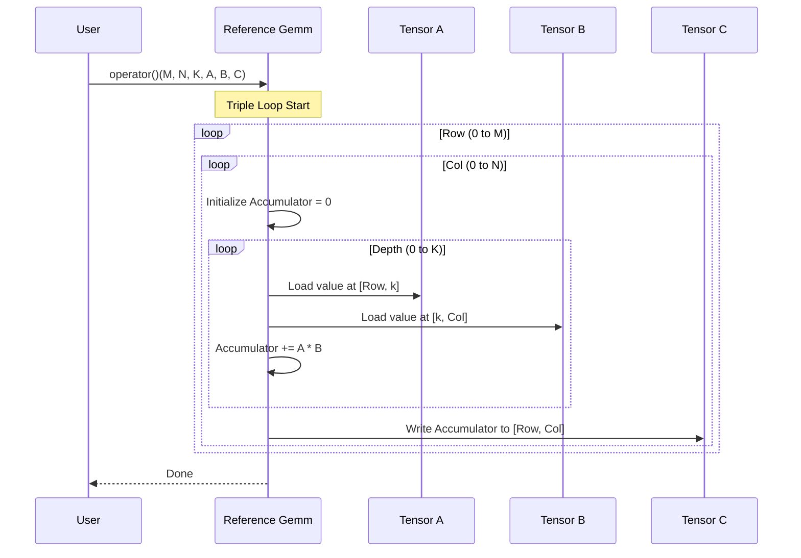

# Chapter 7: Reference GEMM Implementations

In the previous chapter, [Chapter 6: Host Tensor Utility](06_host_tensor_utility.md), we learned how to easily manage memory on both the CPU and GPU using `HostTensor`. We can now allocate memory and move data around.

But there is a critical question left unanswered: **How do we know our high-performance kernels are actually correct?**

If you write a complex, highly optimized matrix multiplication kernel that runs 100x faster but outputs the wrong numbers, it is useless.

This chapter introduces the **Reference GEMM Implementations**. These are simple, slow, and easy-to-read implementations of math operations that serve as the "Gold Standard" or ground truth for verification.

---

### Motivation: The "Hand Calculator" Analogy

Imagine you are building a super-computer to calculate taxes. It uses advanced parallel processing. To verify it works, you wouldn't build *another* super-computer. You would pick a few examples and calculate them manually with a **hand calculator** or a piece of paper.

*   **CUTLASS Optimized Kernels:** The Super-Computer. Extremely fast, complex code, hard to read, uses hardware tricks.
*   **Reference Implementation:** The Hand Calculator. Slow, standard C++ loops, very easy to read, definitely correct.

**Central Use Case:**
You just wrote a new FP16 GEMM kernel. You run it on a 128x128 matrix.
1.  Run the **Optimized Kernel**. Result: `Matrix_O`.
2.  Run the **Reference Implementation** on the same inputs. Result: `Matrix_R`.
3.  Check if `Matrix_O` is approximately equal to `Matrix_R`.

---

### Key Concepts

#### 1. Host Reference (`cutlass::reference::host`)
This implementation runs entirely on the **CPU**.
*   **Pros:** Easiest to debug. You can use `printf` or a debugger inside the loops.
*   **Cons:** Very slow. Only useful for small matrices (e.g., up to 128x128 or 256x256).
*   **Mechanism:** It uses standard C++ nested `for` loops (Triple Loop).

#### 2. Device Reference (`cutlass::reference::device`)
This implementation runs on the **GPU**, but it uses "naive" CUDA code.
*   **Pros:** Much faster than the CPU reference. Can verify larger matrices.
*   **Cons:** Harder to debug than CPU code.
*   **Mechanism:** It launches a simple CUDA kernel without complex tiling or pipeline optimization.

#### 3. The `TensorRef` Interface
Both reference implementations accept `TensorRef` or `TensorView` objects (which we get from `HostTensor`). They don't care about memory management; they just need a pointer and a stride to find the data.

---

### How to Use Reference Implementations

Let's look at how to run a CPU-based reference check. We assume you already have your `HostTensor` inputs prepared (from Chapter 6).

#### Step 1: Define the Reference Wrapper
The reference implementation is a template structure. We need to instantiate it with the types of our data.

```cpp
#include "cutlass/util/reference/host/gemm.h"

// Define a Reference GEMM for float data
// Input A: float, Column Major
// Input B: float, Column Major
// Output C: float, Column Major
// Math: float (accumulation)
using ReferenceGemm = cutlass::reference::host::Gemm<
    float, cutlass::layout::ColumnMajor,
    float, cutlass::layout::ColumnMajor,
    float, cutlass::layout::ColumnMajor,
    float, float
>;
```
**Explanation:** This definition creates a class that knows how to multiply `float` matrices stored in Column-Major layout.

#### Step 2: Create the Object and Run
Once defined, we create an instance and call it. It acts like a function object (functor).

```cpp
ReferenceGemm ref_gemm;

// Prepare data (alpha * A * B + beta * C)
float alpha = 1.0f;
float beta = 0.0f;

// Run the reference math on the CPU
ref_gemm(
    problem_size,      // GemmCoord(M, N, K)
    alpha,
    tensor_A.host_ref(), // Access CPU data
    tensor_B.host_ref(),
    beta,
    tensor_C.host_ref()  // Result stored here
);
```
**Explanation:**
*   `tensor_A.host_ref()` passes a lightweight view of the data on the CPU.
*   The `ref_gemm` object loops through the data and writes the correct answer into `tensor_C`.

#### Step 3: Device Reference (Optional)
If your matrix is huge (e.g., 4096 x 4096), the CPU version might take minutes. Use the device version instead.

```cpp
#include "cutlass/util/reference/device/gemm.h" // Note: "device" folder

// Usage is identical, just a different namespace
using DeviceReferenceGemm = cutlass::reference::device::Gemm< ... >;

DeviceReferenceGemm device_ref;

// Use device_ref() instead of host_ref()
device_ref(..., tensor_A.device_ref(), ...);
```

---

### Internal Implementation

What actually happens inside these reference implementations? It is surprisingly simple. It strips away all the complexity of the library to perform the raw definition of Matrix Multiplication:

$$C_{row, col} = \sum_{k=0}^{K} (A_{row, k} \times B_{k, col})$$

#### Sequence Diagram



#### Code Deep Dive: The Triple Loop

Let's look at `tools/util/include/cutlass/util/reference/host/gemm.h`. The core logic is inside a function usually called `compute_gemm`.

*Note: The code below is simplified for clarity.*

```cpp
// Inside cutlass/util/reference/host/gemm.h

// 1. Loop over M (Rows)
for (int row = 0; row < M; ++row) {
  
  // 2. Loop over N (Columns)
  for (int col = 0; col < N; ++col) {
    
    // Initialize sum
    ComputeType accum = 0;

    // 3. Loop over K (Depth/Dot Product)
    for (int k = 0; k < K; ++k) {
      
      // Fetch A and B using the TensorRef "at" method
      ElementA a = tensor_a.at(MatrixCoord(row, k));
      ElementB b = tensor_b.at(MatrixCoord(k, col));

      // Math
      accum += a * b;
    }

    // Write result
    tensor_d.at(MatrixCoord(row, col)) = accum;
  }
}
```
**Explanation:**
1.  **Loops:** Standard M-N-K loops. No tiling, no shared memory, no warp shuffles.
2.  **`at()`:** The `TensorRef` object handles the stride logic. You just ask for `(row, k)`, and it finds the memory address.
3.  **Correctness:** This is the mathematical definition of Matrix Multiplication. If this code compiles, it is almost certainly correct.

#### The Device Kernel

The GPU reference (`cutlass/util/reference/device/gemm.h`) does almost the exact same thing, but each thread handles one element of the output.

```cpp
// Inside cutlass/util/reference/device/kernel/gemm.h

__global__ void GemmKernel(...) {
  // Calculate global coordinates
  int row = blockIdx.x * blockDim.x + threadIdx.x;
  int col = blockIdx.y * blockDim.y + threadIdx.y;

  if (row < M && col < N) {
    // Each thread performs the 'K' loop for one pixel
    Accumulator accum = 0;
    
    for (int k = 0; k < K; ++k) {
       // ... load A and B ...
       accum += a * b;
    }
    
    // Write output
    tensor_c.at(MatrixCoord(row, col)) = accum;
  }
}
```
**Explanation:** This is often called "Naive GEMM." It's slow because it reads from global memory constantly, but it's very easy to verify.

---

### Summary

In this chapter, we learned:
1.  **Reference Implementations** are the "Gold Standard" used to verify correctness.
2.  **Host Reference** runs on CPU (slow, easy debug).
3.  **Device Reference** runs on GPU (faster, good for large sizes).
4.  Under the hood, they use simple **nested loops** that exactly match the mathematical definition of the problem.

Now we have all the tools we need:
*   We can configure the build.
*   We can create definitions and wrappers.
*   We can manage memory with HostTensor.
*   We can generate ground truth data with Reference GEMM.

It is finally time to put this all together into the rigorous testing framework that CUTLASS uses to ensure nothing breaks.

[Next Chapter: Core CuTe and Type Tests](08_core_cute_and_type_tests.md)

---

Generated by [Code IQ](https://github.com/adityasoni99/Code-IQ)