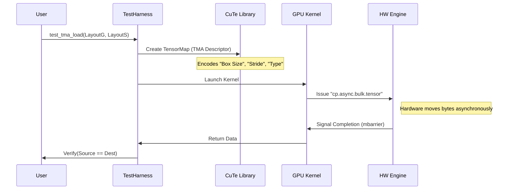

# Chapter 8: Core CuTe and Type Tests

In the previous chapter, [Chapter 7: Reference GEMM Implementations](07_reference_gemm_implementations.md), we built the "Gold Standard" to verify our math. We learned how to check if a matrix multiplication result is correct.

But before we can build a skyscraper (a massive GEMM kernel), we need to test the **bricks** and the **cranes**.

*   **The Bricks (Types):** Can we correctly represent and add numbers like `Half` (16-bit) or `FP8` (8-bit) in C++?
*   **The Cranes (Core CuTe & TMA):** On the new NVIDIA Hopper/Blackwell architecture, can we successfully move a block of data using the hardware accelerator?

This chapter explores the unit tests that verify these fundamental building blocks.

---

### Motivation: Why verify the basics?

You might think, "It's a computer; surely it knows how to add numbers!"

In High-Performance Computing (HPC) and AI, we often use "weird" number formats to save memory.
*   **FP16 (`half_t`):** Standard C++ doesn't always support this natively on the CPU. CUTLASS has to write a custom class for it.
*   **FP8 (`float_e4m3_t`):** A tiny 8-bit float. It behaves very differently from a standard `float`.

If our custom class for `FP8` is broken, our massive AI model will output garbage, even if the matrix math logic is perfect.

Furthermore, on **Hopper (SM90)** GPUs, we don't move memory with simple loops anymore. We use the **Tensor Memory Accelerator (TMA)**. This is a complex hardware engine. We need to verify we are giving it the correct instructions.

---

### Key Concept 1: Numeric Type Tests

CUTLASS provides C++ classes that mimic built-in types.

#### The Problem
C++ has `float` (32-bit). It doesn't natively have `cutlass::float_e4m3_t` (8-bit). We need to ensure that `FP8 + FP8` yields the correct result, and that casting `int -> FP8` works.

#### The Test Approach
The tests in `test/unit/core/` (like `half.cu` and `float8.cu`) perform basic sanity checks.

1.  **Conversion:** Can I turn an `int` (7) into an `FP8` and back?
2.  **Arithmetic:** Does `2.0_fp8 + 2.0_fp8` equal `4.0`?

#### Code Example: Testing FP8
Here is a simplified snippet from the `float8.cu` test. It verifies that we can define an FP8 number using a user-defined literal (like `7_fe4m3`) and cast it to an integer.

```cpp
// From test/unit/core/float8.cu
TEST(float_e4m3_t, host_conversion) {
  using FP8 = cutlass::float_e4m3_t;

  // 1. Initialize using a literal suffix
  FP8 val = 7_fe4m3; 

  // 2. Cast back to standard integer
  int result = static_cast<int>(val);

  // 3. Verify
  EXPECT_TRUE(result == 7);
}
```
**Explanation:**
*   `_fe4m3` is a custom literal. It tells C++ "Treat this number as an FP8 type."
*   If `static_cast` works correctly, our "brick" is solid.

---

### Key Concept 2: Core CuTe and Layouts

**CuTe** is the layout engine inside CUTLASS. It describes *where* data lives.

Imagine a chess board.
*   **Linear Memory:** Computer memory is just a long line of bytes (0, 1, 2, ... 63).
*   **Layout:** Logic that maps "Row 2, Column 3" to "Byte 19".

In CuTe, we define a layout using **Shape** (dimensions) and **Stride** (step size).

```cpp
// Shape: (8 rows, 8 columns)
// Stride: (1, 8) -> Column Major (contiguous in memory)
auto layout = make_layout(Shape<_8, _8>{}, Stride<_1, _8>{});
```

The tests verify that these layouts correctly calculate memory addresses before we try to use them in a kernel.

---

### Key Concept 3: TMA Loading (The Hopper Crane)

The **Tensor Memory Accelerator (TMA)** is a hardware feature on SM90+ (Hopper/Blackwell).

*   **Old Way (Threads):** 32 threads each load 1 number. They regroup.
*   **New Way (TMA):** One thread tells the TMA controller: "Copy this entire 128x128 box from Global Memory to Shared Memory." The threads go to sleep or do other work while the hardware moves the data.

The unit tests in `test/unit/cute/hopper/tma_load.cu` verify this machinery.

#### Central Use Case: Testing a TMA Load
We want to ensure the TMA can load a **Tile** of data correctly.

**The Test:**
1.  Define a **Global Memory Layout** (Source).
2.  Define a **Shared Memory Layout** (Destination).
3.  Trigger the TMA.
4.  Check if data arrived.

#### Code Example: TMA Load Test
This simplified snippet shows how the test is structured using the generic `test_tma_load` helper.

```cpp
// From test/unit/cute/hopper/tma_load.cu

TEST(SM90_CuTe_Hopper, Tma_Load_32x32_Col) {
  
  // 1. Define the Shared Memory (Destination) Layout
  // Shape: 32x32, Column Major
  Layout smem_layout = Layout<Shape<_32,_32>, Stride<_1,_32>>{};

  // 2. Define the Global Memory (Source) Layout
  Layout gmem_layout = smem_layout; // Same shape/stride

  // 3. Run the test for different data types
  test_tma_load<half_t>(gmem_layout, smem_layout);
  test_tma_load<float>(gmem_layout, smem_layout);
}
```
**Explanation:**
*   We don't write the CUDA kernel manually here. The test harness `test_tma_load` does that.
*   We just describe the **Geometry** (Layouts) and the **Type** (`half_t`).
*   The test checks if the TMA engine understands "32x32 Column Major."

---

### Internal Implementation

What happens inside `test_tma_load`? It bridges the gap between the host (CPU) setup and the device (GPU) execution.

#### Sequence Diagram



#### Code Deep Dive: The Swizzle

One of the most complex parts of TMA is **Swizzling**. To avoid "Bank Conflicts" in Shared Memory (where multiple threads try to access the same memory bank simultaneously), we shuffle (swizzle) the data layout.

The test file explicitly checks different "Swizzle Atoms."

```cpp
// From test/unit/cute/hopper/tma_load.cu

template <class T, template <typename> typename SWIZZLE_ATOM>
void test_tma_load_swizzle_atom_mn() {
  
  // Create a layout that uses a specific Swizzle Pattern (e.g., 128 bytes)
  auto smem_layout = SWIZZLE_ATOM<T>{};

  // Create a large Global Memory source
  Layout gmem_layout = make_layout(
      make_shape(2 * size<0>(smem_layout), 2 * size<1>(smem_layout)),
      GenColMajor{}
  );

  // Verify TMA works even with this complex shuffled destination
  test_tma_load<T>(gmem_layout, smem_layout);
}
```
**Why this matters:**
If you get the swizzle wrong, the TMA might write data to `Address X` but your math kernel reads from `Address Y`. The data is there, but scrambled. This test proves that the reader and writer agree on the scramble pattern.

### Advanced: Tensor Casting

The file `tma_load.cu` also tests "Internal Types." This checks if we can trick the TMA.

Example: Loading `complex<double>`.
The TMA doesn't know what a complex number is. But a `complex<double>` is just 128 bits (16 bytes). We can tell the TMA "Load 128-bit unsigned integers (`uint128_t`)" and then cast them back to complex numbers in software.

```cpp
// Loading Complex Doubles by pretending they are uint64_t
test_tma_load<complex<double>, uint64_t>(gmem_layout, smem_layout);
```
This flexibility allows CUTLASS to support future data types without waiting for new hardware.

---

### Summary

In this chapter, we learned:
1.  **Type Tests:** We must verify that custom types like `half_t` and `float_e4m3_t` behave like normal numbers (`core/half.cu`, `core/float8.cu`).
2.  **CuTe Layouts:** These describe the shape and stride of our data matrices.
3.  **TMA Tests:** We verify that the Hopper hardware accelerator can correctly move tiles of data, even with complex Swizzle patterns (`cute/hopper/tma_load.cu`).

These tests form the foundation. If the types work and the data movement works, we are ready to build the complex matrix multiplication logic on top of them.

In the next chapter, we will see how these components come together to test the full Dense GEMM on the new Blackwell architecture.

[Next Chapter: Blackwell Dense GEMM Tests](09_blackwell_dense_gemm_tests.md)

---

Generated by [Code IQ](https://github.com/adityasoni99/Code-IQ)