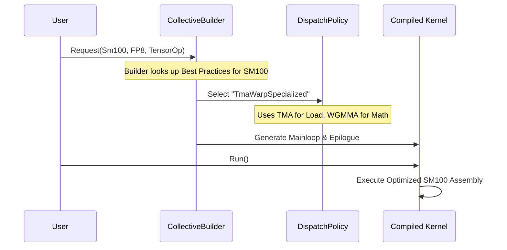

# Chapter 9: Blackwell Dense GEMM Tests

In the previous chapter, [Chapter 8: Core CuTe and Type Tests](08_core_cute_and_type_tests.md), we verified our "bricks" (custom types like FP8) and our "cranes" (TMA data movement). We proved that the fundamental components function correctly.

Now, it is time to build the skyscraper.

In this chapter, we explore **Blackwell Dense GEMM Tests**. We will combine the new hardware features of the NVIDIA Blackwell architecture (SM100/SM120) with the flexibility of CuTe to create high-performance Matrix Multiplication kernels.

### Motivation: The Need for Speed (and Less Memory)

As AI models grow larger, moving 32-bit (`float`) or even 16-bit (`half`) numbers takes too long and uses too much memory.

**The Solution:** Narrow Precision.
*   **FP8:** 8-bit floating point.
*   **FP4:** 4-bit floating point (New in SM120).

Blackwell is designed to crunch these tiny numbers at incredible speeds. However, writing a kernel for Blackwell is complex. You have to coordinate the **TMA** (memory mover) with the **Warp Specialized** math engines.

**Central Use Case:**
We want to verify a Matrix Multiplication ($D = A \times B + C$) where:
*   **A and B** are **FP8** (tiny inputs).
*   **Accumulation** is **Float32** (high precision math).
*   The hardware is **SM100 (Blackwell)**.

---

### Key Concepts

#### 1. Narrow Precision Types
Standard C++ doesn't have 4-bit types. CUTLASS defines them for us.
*   `cutlass::float_e4m3_t`: An 8-bit float (range approx +/- 448).
*   `cutlass::float_e2m1_t`: A 4-bit float (SM120 only).

#### 2. The `CollectiveBuilder`
In older CUTLASS versions, you had to manually plug together pipeline stages. In CUTLASS 3.x (and for Blackwell), we use the **Collective Builder**.

Think of the Builder as a **General Contractor**. You tell it:
*   "I want an SM100 Arch."
*   "I have FP8 data."
*   "I want a 128x128 tile."

The Builder figures out the best blueprint (Pipeline schedule, Kernel Schedule) for you.

#### 3. Tile and Cluster Shapes
Blackwell introduces **Clusters**—groups of Streaming Multiprocessors (SMs) that work together.
*   **Tile Shape:** The block of work one Thread Block does (e.g., 128x128).
*   **Cluster Shape:** How many Thread Blocks talk to each other (e.g., 4x1x1).

---

### Step-by-Step Implementation

Let's look at how a test is constructed in `test/unit/gemm/device/sm100_tensorop_gemm/`.

#### Step 1: Define the Geometry
First, we define the shape of the problem and the specific data types.

```cpp
// 1. Define the shapes
// The Tile size for the math instruction
using MmaTileShape = Shape<_64, _8, _128>; 
// The Cluster size (4 Thread Blocks working together)
using ClusterShape = Shape<_4, _1, _1>;

// 2. Define Types (Input A is FP8)
using ElementA = cutlass::float_e4m3_t;
using LayoutA  = cutlass::layout::RowMajor;

// Input B is also FP8
using ElementB = cutlass::float_e4m3_t;
using LayoutB  = cutlass::layout::ColumnMajor;
```
**Explanation:** We are setting up a math operation using 8-bit inputs. `Shape<_64, _8, _128>` implies the fundamental math instruction works on chunks of this size.

#### Step 2: The Epilogue Builder
The **Epilogue** handles writing the result to memory. We use the Builder to create it.

```cpp
using CollectiveEpilogue = typename cutlass::epilogue::collective::CollectiveBuilder<
    cutlass::arch::Sm100,             // Target Architecture
    cutlass::arch::OpClassTensorOp,   // Use Tensor Cores
    MmaTileShape, ClusterShape,       // Geometry
    cutlass::epilogue::collective::EpilogueTileAuto, // Auto-size output tile
    float, float,                     // Accumulator, Compute types
    void, LayoutC, 0,                 // Output C (Void means C=0)
    cutlass::bfloat16_t, LayoutD, 16  // Output D (BF16 result)
>::CollectiveOp;
```
**Explanation:** This massive template asks the builder: "Give me an Epilogue optimized for SM100 that takes float results, converts them to BF16, and stores them."

#### Step 3: The Mainloop Builder
The **Mainloop** handles reading data and doing the math ($A \times B$).

```cpp
using CollectiveMainloop = typename cutlass::gemm::collective::CollectiveBuilder<
    cutlass::arch::Sm100, cutlass::arch::OpClassTensorOp,
    ElementA, LayoutA, 16,            // Input A info
    ElementB, LayoutB, 16,            // Input B info
    float,                            // Accumulator type
    MmaTileShape, ClusterShape,
    // Auto-calculate shared memory usage
    cutlass::gemm::collective::StageCountAutoCarveout<sizeof(CollectiveEpilogue::SharedStorage)>,
    cutlass::gemm::KernelTmaWarpSpecialized1SmSm100  // Schedule Policy
>::CollectiveOp;
```
**Explanation:**
*   `OpClassTensorOp`: We are using the specialized Tensor Cores.
*   `KernelTmaWarpSpecialized...`: This is the secret sauce. It selects the specific Blackwell pipeline where the TMA engine feeds the WGMMA (Warpgroup Matrix Multiply Accumulate) instructions.

#### Step 4: Assemble and Run
Finally, we package these two "Collectives" into a kernel and run the test using the helpers we learned about in [Chapter 7: Reference GEMM Implementations](07_reference_gemm_implementations.md).

```cpp
// Combine Mainloop and Epilogue into a Kernel
using GemmKernel = cutlass::gemm::kernel::GemmUniversal<
    Shape<int,int,int,int>, // Problem size type
    CollectiveMainloop,
    CollectiveEpilogue
>;

// Wrap it for the testbed
using Gemm = cutlass::gemm::device::GemmUniversalAdapter<GemmKernel>;

// Run the test!
TEST(SM100, FP8_GEMM) {
    bool passed = test::gemm::device::TestAll<Gemm>();
    EXPECT_TRUE(passed);
}
```

---

### Internal Implementation

How does the `CollectiveBuilder` know what to do?

It relies on **Partial Template Specialization**. Inside the library, there are hundreds of specializations matching `arch::Sm100`.

#### Sequence Diagram: The Builder Process



#### Code Deep Dive: SM120 and FP4
For the absolute bleeding edge (SM120), we look at `test/unit/gemm/device/sm120_tensorop_gemm/`. The pattern is the same, but the types are smaller.

```cpp
// Inside sm120_gemm_f4_f4_f32_tensor_op.cu

// 4-bit Floating Point!
using ElementA = cutlass::float_e2m1_t; 
using ElementB = cutlass::float_e2m1_t;

// We still target SM120 architecture
using CollectiveMainloop = typename cutlass::gemm::collective::CollectiveBuilder<
      cutlass::arch::Sm120,    // <-- Specific SM120 Tag
      cutlass::arch::OpClassTensorOp,
      ElementA, LayoutA, AlignmentA,
      // ... same as before
>::CollectiveOp;
```

**Why this is cool:**
*   `float_e2m1_t` only has **16 possible values**.
*   This test proves that CUTLASS can pack two of these 4-bit numbers into a single byte, move them via TMA, unpack them in the Tensor Core, and get a correct Float32 result.

---

### Troubleshooting Common Issues

When running these tests, you might encounter issues:

1.  **Architecture Mismatch:**
    *   *Error:* `cudaErrorNoKernelImageForDevice`.
    *   *Reason:* You tried to run an SM100 test on an SM90 (Hopper) GPU.
    *   *Fix:* Check [Chapter 1: Build Configuration](01_build_configuration.md) to ensure you compiled for the correct arch, and ensure you are on a Blackwell GPU.

2.  **Compilation Time:**
    *   *Observation:* Compiling `sm100_tensorop_gemm` takes a long time.
    *   *Reason:* The `TestAll<Gemm>` helper instantiates the kernel for many different problem sizes (128x128, 256x256, etc.).
    *   *Fix:* Be patient, or use `TestSmall` for faster iteration.

### Summary

In this chapter, we learned:
1.  **Blackwell (SM100/SM120)** relies on **TMA** and **Warp Specialization** for maximum speed.
2.  **Narrow Types** like FP8 and FP4 are essential for modern AI, and CUTLASS supports them natively.
3.  **CollectiveBuilder** is the modern way to construct kernels. It abstracts away the complexity of choosing the right pipeline schedule.
4.  We verify these complex kernels using the standard `TestAll` helpers.

Now that we can run dense matrix multiplications, what if we want to squeeze even *more* precision out of small numbers? We can use **Block Scaling**.

[Next Chapter: Block Scaled GEMM Tests](10_block_scaled_gemm_tests.md)

---

Generated by [Code IQ](https://github.com/adityasoni99/Code-IQ)