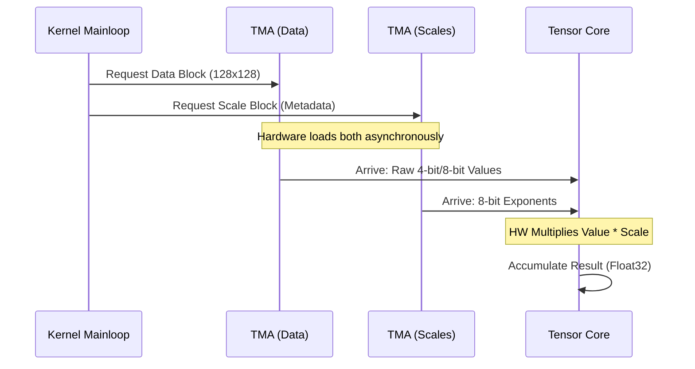

# Chapter 10: Block Scaled GEMM Tests

In the previous chapter, [Chapter 9: Blackwell Dense GEMM Tests](09_blackwell_dense_gemm_tests.md), we successfully ran high-performance matrix multiplications on the Blackwell architecture using standard narrow types like FP8.

However, as AI models get massive, even 8-bit numbers (FP8) are sometimes too big. We want to go smaller—to 6-bit or even 4-bit numbers.

**The Problem:**
If you shrink a number to 4 bits, you only have 16 possible values. You lose **Dynamic Range**. You can represent tiny numbers *or* huge numbers, but not both at the same time.

**The Solution:**
**Block Scaling.** Imagine a group of 32 numbers.
1.  **The Scale Factor:** One shared "multiplier" (exponent) for the whole group.
2.  **The Values:** 32 tiny 4-bit numbers relative to that multiplier.

This technique (standardized as OCP MXFP or NVIDIA NVFP) gives us the memory savings of 4-bit/6-bit integers with the dynamic range of floating point numbers.

This chapter explains how to verify these advanced **Block Scaled GEMMs**.

---

### Motivation: High Fidelity, Low Memory

**Central Use Case:**
You are deploying a massive Large Language Model (LLM) on an NVIDIA Blackwell GPU (SM100/SM120). You want to compress the weights to **4-bit** to fit the model in memory, but you don't want the model to become "stupid" due to precision loss.

To solve this, you use **Block Scaled GEMM**. You need to verify:
1.  The kernel correctly reads the **Data** vectors.
2.  The kernel correctly reads the **Scale Factors**.
3.  The kernel combines them to produce a high-precision FP32 output.

---

### Key Concepts

#### 1. The "Pair" Type
In standard GEMM, `ElementA` is just a number (e.g., `float`).
In Block Scaled GEMM, `ElementA` is a **concept**. It represents a tuple:
*   The raw low-precision data (e.g., `e2m1` = 4-bit float).
*   The format of the scaling factor (e.g., `ue8m0` = 8-bit unsigned exponent).

CUTLASS provides wrapper types like `mx_float8_t` or `nv_float4_t` to represent this pairing.

#### 2. OpClassBlockScaledTensorOp
In [Chapter 9](09_blackwell_dense_gemm_tests.md), we used `OpClassTensorOp`.
Here, we must tell the Builder we are doing something special. We use `OpClassBlockScaledTensorOp`. This instructs the compiler to generate the specific machine instructions that automatically apply the scale factors during the math operation.

#### 3. Epilogue Fusion
Since we are moving data so fast, we often want to do extra math at the end (Epilogue) for "free."
*   **Bias:** Add a vector to the result.
*   **Activation:** Apply ReLU, GELU, or Clamp.
*   **Fusion:** Doing both at once without writing to memory in between.

---

### Step-by-Step Implementation

Let's look at how to build a test for **SM120** using **4-bit** inputs (`nv_float4`) and **Fusion**.

#### Step 1: Define the Block Scaled Types
We don't just say "float." We define the composite types.

```cpp
// 1. Define the raw data type (4-bit Float: e2m1)
using ElementData = cutlass::float_e2m1_t;

// 2. Define the Pair (4-bit Data + Implicit Scale Factor info)
// nv_float4_t wraps the data and handles the block scaling logic
using ElementPairA = cutlass::nv_float4_t<ElementData>;
using ElementPairB = cutlass::nv_float4_t<ElementData>;
```
**Explanation:** `ElementPairA` tells CUTLASS, "I have 4-bit data, but treat it as a Block Scaled format."

#### Step 2: Define the Epilogue Fusion
We want to calculate $D = \text{ReLU}(\alpha \times \text{Acc} + \beta \times C + \text{Bias})$. This is complex, so we use a Fusion helper.

```cpp
// Define the fusion operation
// LinComb = Linear Combination (alpha*Acc + beta*C)
// PerRowBias = Add a bias vector
// EltAct = Element-wise Activation (ReLU)
using FusionOp = cutlass::epilogue::fusion::LinCombPerRowBiasEltAct<
      cutlass::epilogue::thread::ReLU, // The Activation
      float,                           // Output Type
      float,                           // Compute Type
      cutlass::bfloat16_t,             // Bias Type
      float                            // Accumulator
>;
```
**Explanation:** This single `using` statement replaces writing a custom CUDA kernel to add bias and ReLU. It defines the mathematical recipe for the end of the kernel.

#### Step 3: The Collective Builder
Now we assemble the kernel. Notice the specific `OpClassBlockScaledTensorOp`.

```cpp
using CollectiveMainloop = typename cutlass::gemm::collective::CollectiveBuilder<
      cutlass::arch::Sm120, 
      cutlass::arch::OpClassBlockScaledTensorOp, // <--- KEY DIFFERENCE
      ElementPairA, cutlass::layout::RowMajor, 16,
      ElementPairB, cutlass::layout::ColumnMajor, 16,
      float, // Accumulator
      Shape<_128,_128,_128>, // Tile Shape
      Shape<_1,_1,_1>,       // Cluster Shape
      cutlass::gemm::collective::StageCountAutoCarveout<...>,
      cutlass::gemm::KernelTmaWarpSpecializedCooperative
    >::CollectiveOp;
```
**Explanation:**
*   **Arch:** `Sm120` (Blackwell).
*   **OpClass:** `BlockScaledTensorOp`. This enables the hardware logic that multiplies the 4-bit data by its scale factor *before* accumulating.

#### Step 4: Run the Test
We use the `TestSmallFusion` helper, which knows how to generate random data for the matrix, the scale factors, and the bias vector.

```cpp
TEST(SM120, BlockScaled_4bit_ReLU) {
  // TestSmallFusion generates Inputs, Scale Factors, and Bias
  bool passed = test::gemm::device::TestSmallFusion<
      GemmDeviceType, 
      false, // Check exact equality? (No, usually approx)
      false  // Print debug?
  >(1.0, 0.5); // Alpha, Beta

  EXPECT_TRUE(passed);
}
```

---

### Internal Implementation

What actually happens inside the GPU when `OpClassBlockScaledTensorOp` is used?

Unlike standard GEMM where we just load Matrix A, here the kernel must coordinate **two** loads for every input.

#### Conceptual Flow



#### Code Dive: The Layouts
In the file `sm120_bs_gemm_mxf6_mxf8_f32_f32.cu`, you might notice alignment requirements are different.

```cpp
// From sm120_bs_gemm_mxf6_mxf8_f32_f32.cu

// Alignment calculation
// We need to ensure rows are aligned to 64 bytes for TMA
static constexpr int AlignmentA = 64 * 8 / cutlass::sizeof_bits<ElementA>::value; 
```

**Why is this hard?**
Because the "Scale Factor" data is usually stored separately or interleaved in a specific way.
*   **MXFP (OCP):** Scales are often blocked in groups of 32.
*   **NVFP (NVIDIA):** Scales are blocked in groups of 16 or 32 vectors.

The `CollectiveBuilder` handles the complex pointer arithmetic to find where the Scale Factor for `Row 5, Col 10` lives. You don't have to calculate offsets manually.

### Advanced: Epilogue Fusion Variants
The file `sm120_bs_gemm_nvf4_nvf4_f32_f32_epilogue_fusion.cu` shows how easy it is to swap operations.

**GELU Activation:**
```cpp
using FusionOperation = cutlass::epilogue::fusion::LinCombPerRowBiasEltAct<
      cutlass::epilogue::thread::GELU, ... >; // <--- Just change ReLU to GELU
```

**Clamp (Limit values):**
```cpp
using FusionOperation = cutlass::epilogue::fusion::LinCombPerRowBiasEltAct<
      cutlass::epilogue::thread::Clamp, ... >; // <--- Just change to Clamp
```

**Per-Column Bias:**
Sometimes bias is added to columns, not rows.
```cpp
using FusionOperation = cutlass::epilogue::fusion::LinCombPerColBiasEltAct< ... >;
```

### Summary

In this chapter, we learned:
1.  **Block Scaling** allows us to use tiny formats (4-bit/8-bit) while preserving dynamic range by sharing an exponent.
2.  **`OpClassBlockScaledTensorOp`** is the key tag that tells the Builder to use the special hardware support for this on Blackwell.
3.  **Composite Types** like `nv_float4_t` wrap the concept of "Data + Scale".
4.  **Epilogue Fusion** allows us to tack on Bias, ReLU, GELU, etc., efficiently at the end of the calculation.

Now that we have mastered Dense GEMMs (both standard and block scaled), we are ready to tackle the final frontier of matrix multiplication: what happens when the matrix is mostly empty?

[Next Chapter: Sparse and Stream-K Tests](11_sparse_and_stream_k_tests.md)

---

Generated by [Code IQ](https://github.com/adityasoni99/Code-IQ)