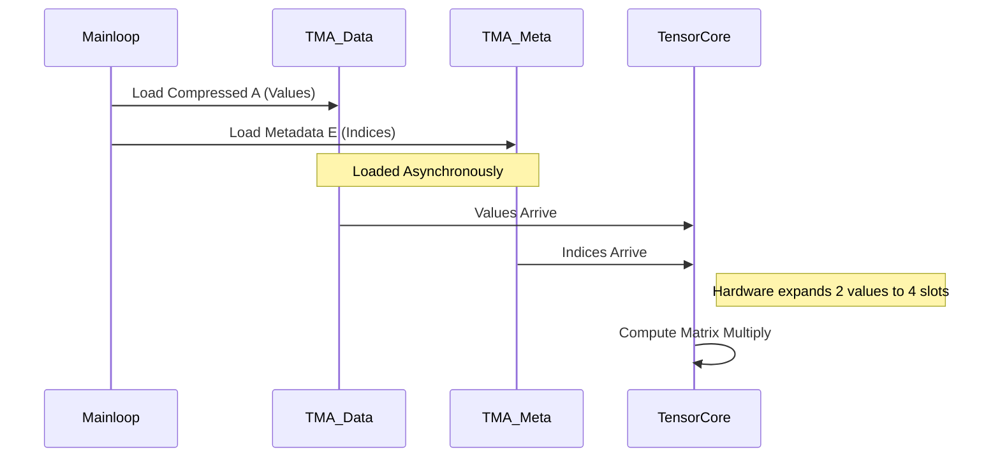

# Chapter 11: Sparse and Stream-K Tests

In the previous chapter, [Chapter 10: Block Scaled GEMM Tests](10_block_scaled_gemm_tests.md), we learned how to compress data values into tiny formats (like 4-bit) using Block Scaling.

Now, we will explore two advanced techniques to squeeze even more performance out of the Blackwell architecture:
1.  **Sparsity:** What if we could skip the math for zeros entirely?
2.  **Stream-K:** What if we could distribute work perfectly evenly, regardless of the matrix shape?

This chapter covers **Sparse and Stream-K Tests**, the cutting edge of efficiency in CUTLASS.

---

### Motivation: The Swiss Cheese and the Pizza Party

#### 1. The Swiss Cheese (Sparsity)
Imagine a matrix that is 50% zeros.
*   **Dense GEMM:** Multiplies every number, even `0 * 5`. It wastes energy calculating zero.
*   **Sparse GEMM:** Skips the zeros. It only stores and computes the non-zero data.

NVIDIA GPUs (Ampere and newer) support **2:4 Structured Sparsity**. This means in every block of 4 numbers, at least 2 must be zero. If you follow this rule, the hardware runs **2x faster**.

#### 2. The Pizza Party (Stream-K)
Imagine you have 100 slices of pizza (Work Tiles) and 8 people (SMs/Cores).
*   **Standard Tiled Split:** Everyone grabs 12 slices. 4 slices are left over. The first 4 people grab an extra slice (13 total). They finish late. Everyone else waits.
*   **Stream-K:** You mash all the pizza into one giant long line (Stream). You cut it into exactly 8 equal pieces. Everyone finishes at the exact same millisecond.

**Stream-K** ensures "perfect load balancing," which is critical when running odd-shaped matrix multiplications on massive GPUs.

---

### Key Concepts

#### 1. `OpClassSparseTensorOp`
This is the magic tag in the Builder. It tells the compiler: "I am providing compressed data. Please use the Sparse Tensor Cores."

#### 2. Metadata (The Map)
Since we removed the zeros, the remaining data is packed tight. The GPU needs a "map" (Metadata) to know where the original values belonged.
*   **A:** The compressed non-zero values.
*   **E:** The metadata (indices).

#### 3. Stream-K Scheduler
A scheduling algorithm that decouples the grid of thread blocks from the geometry of the matrix. It allows "partial tiles" where two different SMs work on the same output tile to balance the load.

---

### Central Use Case: The "Everything" Kernel

We want to build the ultimate efficient kernel for Blackwell (SM100) that combines:
1.  **Block Scaling:** Tiny 4-bit inputs (`nv_float4`).
2.  **Sparsity:** 2:4 structured pruning.
3.  **Stream-K:** Perfect load balancing.

We will walk through how to define this in a test.

---

### Step-by-Step Implementation

We will look at the file `sm100_bssp_gemm_nvf4_nvf4_f32_f16_nvf4_o_tnt_streamk.cu`.

#### Step 1: Define the Sparse Block-Scaled Types
We need to define our inputs. We use `nv_float4_t`, which we learned about in Chapter 10, but now we will use it in a sparse context.

```cpp
// Define the 4-bit float type
using ElementData = cutlass::float_e2m1_t;

// Define the Block Scaled Pair (Data + Scale)
// The "nv_float4_t" handles the 4-bit packing
using ElementPairA = cutlass::nv_float4_t<ElementData>;
using ElementPairB = cutlass::nv_float4_t<ElementData>;
```
**Explanation:** This sets up the data types. `nv_float4_t` is the NVIDIA-specific format for 4-bit block-scaled numbers.

#### Step 2: Configure the Sparse Architecture
This is the most critical step. We must choose the correct **Operation Class**.

```cpp
// Target Blackwell (SM100)
using ArchTag = cutlass::arch::Sm100;

// Tell the builder to use Block Scaled + Sparse hardware
using OpClassTag = cutlass::arch::OpClassBlockScaledSparseTensorOp;
```
**Explanation:**
*   If we used `OpClassTensorOp`, it would run a dense kernel.
*   `OpClassBlockScaledSparseTensorOp` enables **both** the scaling logic and the sparsity logic simultaneously.

#### Step 3: Build the Mainloop
We use the `CollectiveBuilder` to generate the code that loads the data.

```cpp
using CollectiveMainloop =
    typename cutlass::gemm::collective::CollectiveBuilder<
        ArchTag,
        OpClassTag,      // <--- Passed in here
        ElementPairA, LayoutA, 64, // Alignment is critical!
        ElementPairB, LayoutB, 32,
        float,           // Accumulator
        Shape<_128, _128, _256>, // Tile Shape
        Shape<_1, _1, _1>,       // Cluster Shape
        // ... stage counts ...
        // Use the specialized NVF4 Sparse Kernel Schedule
        cutlass::gemm::KernelSparseTmaWarpSpecialized1SmNvf4Sm100
    >::CollectiveOp;
```
**Explanation:** The builder takes the `OpClassTag` and the `ElementPair` types. It automatically generates a pipeline that:
1.  Loads Compressed Data (A).
2.  Loads Metadata (E).
3.  Loads Scales (S).
4.  Feeds them into the Sparse Tensor Core.

#### Step 4: Enable Stream-K Scheduling
Finally, when defining the Kernel, we swap the standard scheduler for Stream-K.

```cpp
using GemmKernel = cutlass::gemm::kernel::GemmUniversal<
    cute::Shape<int,int,int,int>,
    CollectiveMainloop,
    CollectiveEpilogue,
    // THE SCHEDULER:
    cutlass::gemm::StreamKScheduler
>;
```
**Explanation:** By passing `StreamKScheduler` as the last template argument, we change *how* the work is distributed to the GPU cores. The math (Mainloop/Epilogue) stays the same, but the orchestration changes.

---

### Internal Implementation

How does the GPU handle "missing" data?

#### Conceptual Flow: Sparse GEMM



#### Code Dive: The Sparse Tag
Inside the CUTLASS library, the `OpClassSparseTensorOp` triggers specific template specializations.

In the file `sm100_sparse_tensorop_gemm/sm100_sp_gemm...cu`, you will see:

```cpp
namespace cutlass3x_sm100_sptensorop... {
    // ...
    using CollectiveMainloop =
        typename cutlass::gemm::collective::CollectiveBuilder<
            cutlass::arch::Sm100, 
            cutlass::arch::OpClassSparseTensorOp, // <--- The Trigger
            // ...
            cutlass::gemm::KernelSparseTmaWarpSpecialized1SmSm100
        >::CollectiveOp;
}
```

This builder selects a "Sparse TMA" pipeline (`KernelSparseTma...`). This pipeline allocates extra shared memory specifically to hold the **Metadata** (often called `E` or `Meta`).

#### Code Dive: Stream-K Logic
When `StreamKScheduler` is used, the kernel launch logic changes.

1.  **Preprocessing:** Before the kernel runs, the CPU calculates exactly how much work (K-iterations) each SM should do.
2.  **Global Workspace:** The SMs communicate via a small global memory buffer (Peer-to-Peer reduction) to combine partial results for the "split" tiles.

---

### How to Run the Tests

Running these tests requires specific hardware (SM100/SM120) because older GPUs do not understand the `float_e2m1` types or the specific Blackwell sparse instructions.

```cpp
// Example Test Execution (from the file)
TEST(SM100, Sparse_BlockScaled_StreamK) {
  // Define the GEMM type we built above
  using Gemm = cutlass::gemm::device::GemmUniversalAdapter<GemmKernel>;

  // Use the TestSmall helper
  // It generates random compressed data and metadata for you!
  EXPECT_TRUE(test::gemm::device::TestSmall<Gemm>(...));
}
```
**Note:** The `TestSmall` helper is very smart. For sparse tests, it automatically generates a valid 2:4 sparse matrix on the CPU, compresses it, generates the metadata, and sends it to the GPU for the test.

---

### Summary

In this chapter, we learned:
1.  **Sparsity** allows us to skip zeros, doubling theoretical performance. We use `OpClassSparseTensorOp` to enable it.
2.  **Metadata** is required to map compressed values back to their positions.
3.  **Stream-K** is a scheduling strategy that splits work by total volume, not just tile geometry, ensuring perfect load balance.
4.  **Blackwell (SM100)** can combine Sparsity, Block Scaling, and Stream-K into a single, highly efficient kernel.

You might be wondering: "The test helper generated the metadata for me. But in a real application, how do I take a dense matrix and turn it into the compressed format and metadata required by these kernels?"

That requires a **Sparse Compressor**.

[Next Chapter: Sparse Compressor Test](12_sparse_compressor_test.md)

---

Generated by [Code IQ](https://github.com/adityasoni99/Code-IQ)