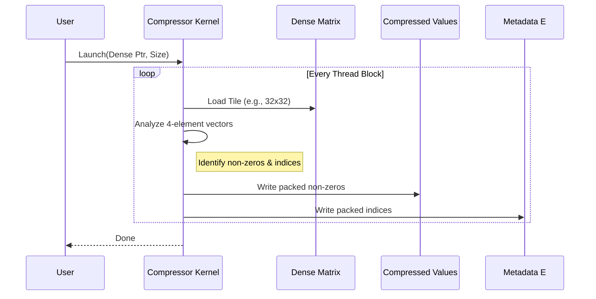

# Chapter 12: Sparse Compressor Test

In the previous chapter, [Chapter 11: Sparse and Stream-K Tests](11_sparse_and_stream_k_tests.md), we explored the cutting-edge feature of **Sparsity**. We learned that if a matrix has enough zeros, we can skip the math for them and run 2x faster.

However, we skipped a crucial step. We assumed the data was already in the "Magical Compressed Format" that the GPU expects.

**But real data starts as a normal dense matrix.**

This chapter introduces the **Sparse Compressor Test**. This tool tests the machinery that takes a normal matrix (with zeros) and "vacuum packs" it into the compressed format required by NVIDIA's Blackwell (SM100) Sparse Tensor Cores.

### Motivation: The "Vacuum Packing" Problem

Imagine you are packing clothes for a trip.
1.  **Dense Matrix:** Your clothes are scattered all over the bed. Some spots are empty (zeros), some have shirts (values).
2.  **Hardware Requirement:** The suitcase (GPU Core) is tiny. It only accepts a vacuum-sealed bag containing *only* the shirts, plus a small checklist telling it which shirt came from where.

If you try to shove the messy bed (Dense Matrix) into the suitcase, it won't fit. You need a **Compressor**.

**Central Use Case:**
You have a trained AI model with weights in **FP4** (4-bit float). You pruned it so 50% of the weights are zero. You now need to convert this into the **Compressed Values** and **Metadata** arrays so the Blackwell GPU can execute it efficiently.

---

### Key Concepts

#### 1. Structured Sparsity (2:4)
The hardware doesn't just support random zeros. It requires structure. Usually, in every group of 4 numbers, **2 must be zero** and **2 must be non-zero**.
The compressor analyzes the dense data to ensure it fits this rule (or selects the best values) and packs them.

#### 2. The Two Outputs
The compressor takes one input (Dense `D`) and produces two outputs:
*   **Compressed A:** A list of the non-zero values (half the size of the original).
*   **Metadata E:** A tiny array of indices (2 bits per value) telling the GPU where the values originally belonged.

#### 3. `Sm1xxGemmSparseConfig`
This is the "instruction manual" for the compressor. It tells CUTLASS exactly how the bits are arranged in the hardware registers for the SM100 architecture.

---

### Step-by-Step Implementation

We will look at how to set up a test for compressing **4-bit Floating Point (FP4)** data on an SM100 GPU.

#### Step 1: Define the Input Data Type
First, we define what our dense data looks like. Here we use `float_e2m1_t`, which is the technical name for **FP4**.

```cpp
// Define the data type: 4-bit float (e2m1)
using ElementA = cutlass::float_e2m1_t;

// Define the layout: Row Major
using LayoutATag = cutlass::layout::RowMajor;
```
**Explanation:** This is the format of the "clothes on the bed" before compression.

#### Step 2: Define the Hardware Config
This is where we map our data to the hardware's internal storage units.

```cpp
// Hardware Internal Types (Cute DSL)
// "4 bits per element, stored in uint8_t container"
using ElementAMma = cute::sparse_elem<4, uint8_t>;

// Metadata type: "2 bits per element => 16 elements per byte"
using ElementEMma = cute::sparse_elem<16, uint8_t>;

// The Configuration Object
using Sm1xxSparseConfig = cutlass::Sm1xxGemmSparseConfig<
    ElementAMma, LayoutATag, ElementEMma
>;
```
**Explanation:** `Sm1xxSparseConfig` connects the dots. It says: "We are taking 4-bit inputs and generating metadata that packs 16 indices into a single byte."

#### Step 3: Define the Compressor Kernel
Now we define the actual GPU kernel that performs the work.

```cpp
using CompressorKernel = cutlass::transform::kernel::StructuredSparseCompressor<
    cute::Shape<int, int, int, int>, // Problem Size (Dynamic)
    ElementA,                        // Input Type
    LayoutATag,                      // Layout
    Sm1xxSparseConfig,               // The Hardware Config
    cutlass::arch::Sm100             // Architecture
>;
```
**Explanation:** `StructuredSparseCompressor` is the worker. It reads `ElementA` and uses `Sm1xxSparseConfig` to write the compressed outputs.

#### Step 4: Wrap and Run
Just like in previous chapters, we wrap the kernel in an adapter and use a testbed to verify it.

```cpp
// Wrap the kernel for easy launching
using Compressor = cutlass::transform::device::
    TransformUniversalAdapter<CompressorKernel>;

// Run the test
TEST(SM100_Compressor, FP4_Test) {
  test::transform::device::TestbedSparseGemmCompressor<Compressor> testbed;
  
  // The testbed generates random sparse data, compresses it, 
  // and verifies the output matches the 2:4 rule.
  EXPECT_TRUE(testbed.run_auto());
}
```

---

### Internal Implementation

What happens inside the `StructuredSparseCompressor`? It acts as a parallel filter.

#### Sequence Diagram



#### Code Deep Dive: The Logic

The compressor logic is heavily templated to handle different bit-widths (4-bit, 8-bit, 16-bit).

**1. Reordering (Swizzling)**
The raw compressed data isn't just written linearly. The SM100 Tensor Cores expect data in a specific "Swizzled" pattern to maximize memory bandwidth. The `Sm1xxSparseConfig` handles this calculation.

**2. Dynamic Types**
You might notice a test case for `cutlass::type_erased_dynamic_float4_t`.

```cpp
// From sm100_sparse_gemm_compressor_f4_omma.cu
using ElementA = cutlass::type_erased_dynamic_float4_t;
```

This allows the compressor to handle data types that are only known at runtime (e.g., loaded from a Python script), rather than fixed at compile time. This is essential for frameworks like PyTorch.

### Why is this distinct from GEMM?
In [Chapter 9: Blackwell Dense GEMM Tests](09_blackwell_dense_gemm_tests.md), the kernels did *Math* (Multiply-Add).
Here, the `Compressor` does *Transform* (Rearrange-Pack).

This operation is usually run **offline** (once, before training/inference starts) to prepare the weights. That is why it is in the `cutlass/transform` directory, not `cutlass/gemm`.

---

### Summary

In this chapter, we learned:
1.  **Sparse Compressor:** A utility to convert standard dense matrices into the specific compressed format required by Blackwell.
2.  **Configuration:** We must tell the compressor exactly how many bits represent the data (e.g., 4-bit) and the metadata.
3.  **Two Outputs:** The process splits one matrix into "Values" and "Metadata".
4.  **Offline Preparation:** This step usually happens before the high-speed GEMM kernel runs.

Now we have covered the entire modern pipeline: building, defining, profiling, and running advanced Sparse/Dense kernels on the latest hardware.

But what about the older hardware? CUTLASS is backwards compatible. The next chapter explores how to test architectures that came before Blackwell and Hopper.

[Next Chapter: Legacy Architecture Tests](13_legacy_architecture_tests.md)

---

Generated by [Code IQ](https://github.com/adityasoni99/Code-IQ)