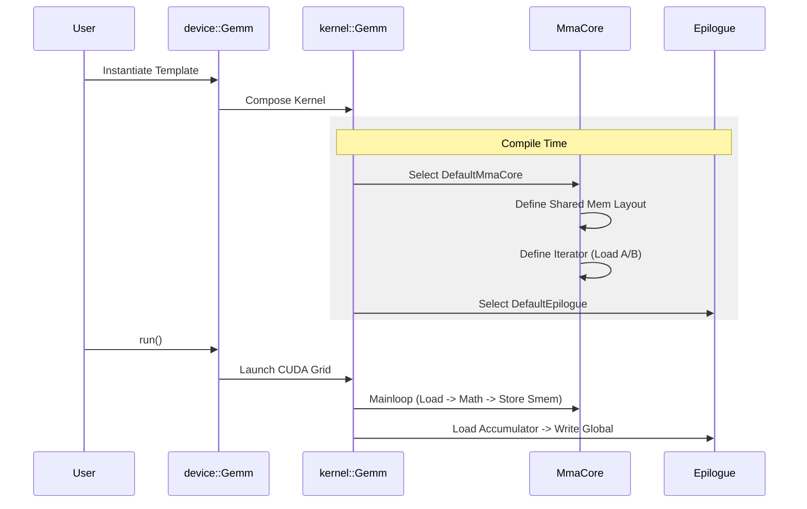

# Chapter 13: Legacy Architecture Tests

In the previous chapter, [Chapter 12: Sparse Compressor Test](12_sparse_compressor_test.md), we explored the cutting-edge world of structured sparsity on the newest hardware.

But the world isn't made entirely of the latest GPUs. Millions of systems still run on **Ampere (A100)**, **Volta (V100)**, or even older **Maxwell/Pascal** cards.

CUTLASS is backwards compatible. This chapter covers **Legacy Architecture Tests**. We will learn how CUTLASS tests the "Classic" kernels that powered the AI revolution before the arrival of the `CollectiveBuilder` and Hopper TMA.

---

### Motivation: The "Classic Car" Restoration

If [Chapter 9: Blackwell Dense GEMM Tests](09_blackwell_dense_gemm_tests.md) was about flying a spaceship, this chapter is about driving a reliable muscle car.

The logic for older GPUs is different:
1.  **No TMA:** Threads must manually carry data from Global Memory to Shared Memory.
2.  **Explicit Pipelines:** You must manually select how many "stages" of buffering to use.
3.  **Monolithic Templates:** Instead of a dynamic "Builder," we use large, static C++ templates to define the kernel.

**Central Use Case:**
You want to verify a standard **FP16 Matrix Multiplication** on an NVIDIA **A100 (Sm80)** or a **GTX 1080 (Sm61/50)**.

---

### Key Concept 1: The Monolithic `Gemm` Template

In modern CUTLASS (3.x+), we use a Builder. In legacy CUTLASS (2.x), we use the `device::Gemm` template. It takes many arguments to fully define the "engine."

```cpp
using Gemm = cutlass::gemm::device::Gemm<
    ElementA, LayoutA,             // Input A
    ElementB, LayoutB,             // Input B
    ElementC, LayoutC,             // Output C
    ElementAccumulator,            // Math Type (e.g., float)
    OpClass,                       // TensorOp vs SIMT
    ArchTag,                       // SM80, SM70, SM50
    ThreadblockShape,              // Tile Size (128x128x32)
    WarpShape,                     // Warp Size (64x64x32)
    InstructionShape,              // Tensor Core Instruction
    EpilogueOp,                    // Alpha/Beta logic
    Swizzle,                       // Grid Organization
    Stages                         // Pipeline Depth
>;
```
It looks scary, but it gives you total control over the legacy hardware pipeline.

---

### Key Concept 2: TensorOp vs. SIMT

This is the most important distinction in legacy tests.

1.  **`OpClassTensorOp`**: Uses **Tensor Cores**.
    *   Available on Volta (SM70), Ampere (SM80), etc.
    *   Performs matrix-multiply instructions ($D = A \times B + C$) in one go.

2.  **`OpClassSimt`**: Uses **CUDA Cores**.
    *   Available on **all** GPUs, including old Maxwell (SM50) and Pascal (SM60).
    *   Performs scalar math ($a \times b + c$) in a loop.
    *   *Why test this?* It ensures CUTLASS runs on laptops and embedded devices without Tensor Cores.

---

### Use Case 1: The Standard Ampere GEMM

Let's look at a test file like `gemm_f16n_f16t_f32t_tensor_op_f32_sm80.cu`. This tests a standard Half-precision GEMM on an A100.

#### Step 1: Define the Shapes
We manually define the hierarchy of tiles.

```cpp
// 1. How big is the block computed by the whole Thread Block?
using ThreadblockShape = cutlass::gemm::GemmShape<128, 256, 64>;

// 2. How big is the block computed by one Warp (32 threads)?
using WarpShape = cutlass::gemm::GemmShape<64, 64, 64>;

// 3. What is the size of the hardware instruction (Tensor Core)?
using InstructionShape = cutlass::gemm::GemmShape<16, 8, 16>;
```

#### Step 2: Instantiate the Kernel
We plug these shapes into the main template. Note `OpClassTensorOp` and `Sm80`.

```cpp
using Gemm = cutlass::gemm::device::Gemm<
    cutlass::half_t, cutlass::layout::ColumnMajor, // A
    cutlass::half_t, cutlass::layout::RowMajor,    // B
    float, cutlass::layout::RowMajor,              // C
    float,                                         // Accumulator
    cutlass::arch::OpClassTensorOp,                // Use Tensor Cores
    cutlass::arch::Sm80,                           // Ampere Arch
    ThreadblockShape, WarpShape, InstructionShape, // Shapes
    EpilogueOp,                                    // Epilogue
    cutlass::gemm::threadblock::GemmIdentityThreadblockSwizzle<>,
    3                                              // 3 Pipeline Stages
>;
```

#### Step 3: Run the Test
We use the `TestAllGemm` helper, which works exactly like the one in [Chapter 9](09_blackwell_dense_gemm_tests.md).

```cpp
// Run the test across various problem sizes
EXPECT_TRUE(test::gemm::device::TestAllGemm<Gemm>());
```

---

### Use Case 2: The Ancient Maxwell (SIMT) GEMM

Now let's look at `simt_sgemm_nn_sm50.cu`. This targets GPUs from ~2014.

Notice the differences:
1.  **OpClass:** `OpClassSimt`.
2.  **Arch:** `Sm50`.
3.  **Instruction Shape:** `1x1x1`. Because scalar cores process one element at a time, there is no "matrix instruction size."

```cpp
using Gemm = cutlass::gemm::device::Gemm<
    float, cutlass::layout::ColumnMajor,
    float, cutlass::layout::ColumnMajor,
    float, cutlass::layout::RowMajor,
    float,
    cutlass::arch::OpClassSimt,    // <--- Key Difference: Scalar Math
    cutlass::arch::Sm50,           // <--- Key Difference: Old Arch
    ThreadblockShape, WarpShape, 
    cutlass::gemm::GemmShape<1, 1, 1>, // <--- Instruction is scalar
    EpilogueOutputOp,
    cutlass::gemm::threadblock::GemmIdentityThreadblockSwizzle<>,
    2 
>;
```

---

### Use Case 3: Planar Complex GEMM

In scientific computing, complex numbers ($a + bi$) are common.
*   **Interleaved:** Real/Imag parts are next to each other in memory.
*   **Planar:** All Real parts are in Matrix A. All Imaginary parts are in Matrix A'.

The file `gemm_planar_complex...sm80.cu` tests this specific memory layout.

```cpp
// A universal kernel that handles Planar Complex math
using GemmKernel = cutlass::gemm::kernel::DefaultGemmPlanarComplexUniversal<
  cutlass::half_t, cutlass::layout::RowMajor,   // Real Part Layout
  cutlass::ComplexTransform::kNone,             // Transform (e.g., Conjugate)
  8,                                            // Alignment
  // ... (Repeats for Imaginary Part) ...
  cutlass::arch::OpClassTensorOp,
  cutlass::arch::Sm80
>::GemmKernel;
```
**Explanation:** This kernel performs 4 internal matrix multiplications (Real*Real, Imag*Imag, etc.) and combines them to produce the correct complex result ($D = A \times B$).

---

### Use Case 4: Convolution (Implicit GEMM)

Convolution (used in Vision Models like ResNet) can be calculated as a matrix multiplication. The file `conv2d_fprop...sm80.cu` tests this.

It uses **Implicit GEMM**. Instead of physically reshaping the image into a matrix (which is slow and uses memory), the kernel calculates the addresses on-the-fly to *pretend* the image is a matrix.

```cpp
using Conv2dFpropKernel = typename cutlass::conv::kernel::DefaultConv2dFprop<
    cutlass::half_t, cutlass::layout::TensorNHWC, // Activation (Image)
    cutlass::half_t, cutlass::layout::TensorNHWC, // Filter (Weights)
    // ...
    cutlass::arch::OpClassTensorOp,
    cutlass::arch::Sm80,
    // ...
    cutlass::conv::IteratorAlgorithm::kOptimized  // <--- Magic Iterator
>::Kernel;
```
**Explanation:** `kOptimized` tells the iterator to pre-compute indices to traverse the image data as if it were a column in a matrix.

---

### Internal Implementation

How does the legacy engine work compared to the modern Builder?

The Legacy architecture uses a strict hierarchy of **Core Components**.



#### Code Dive: The `DefaultMma`
In the legacy world, you don't build the pipeline yourself. You rely on `DefaultMma`. This meta-template looks at your architecture (`Sm80`) and your types (`float16`) and picks the best hand-tuned pipeline.

This logic is often found implicitly in the test instantiation:

```cpp
// From gemm/threadblock/mma_pipelined_sm80.cu

using MmaCore = typename cutlass::gemm::threadblock::DefaultMmaCore<
      ThreadblockShape, WarpShape, InstructionShape, 
      ElementA, LayoutA,
      ElementB, LayoutB, 
      ElementC, LayoutC,
      cutlass::arch::OpClassTensorOp  // <--- The key selector
>;
```

If you change `OpClassTensorOp` to `OpClassSimt`, `DefaultMmaCore` swaps the entire internal engine from Warp-synchronous Tensor operations to thread-level FMA (Fused Multiply Add) instructions.

---

### Summary

In this chapter, we learned:
1.  **Backwards Compatibility:** CUTLASS isn't just for H100s. It supports GPUs back to Maxwell (2014).
2.  **`device::Gemm`:** The monolithic template used for legacy kernels.
3.  **OpClass:** The switch between `OpClassTensorOp` (Tensor Cores) and `OpClassSimt` (CUDA Cores).
4.  **Implicit GEMM:** How Convolution is tested by tricking the GEMM engine with smart iterators.

We have now covered the full spectrum of matrix multiplication: from the newest Blackwell Block-Scaled Sparse kernels down to the legacy Maxwell scalar kernels.

But how do we create these thousands of kernel variants without writing thousands of C++ files by hand? We use **Code Generation**.

[Next Chapter: C++ Code Generators](14_c___code_generators.md)

---

Generated by [Code IQ](https://github.com/adityasoni99/Code-IQ)