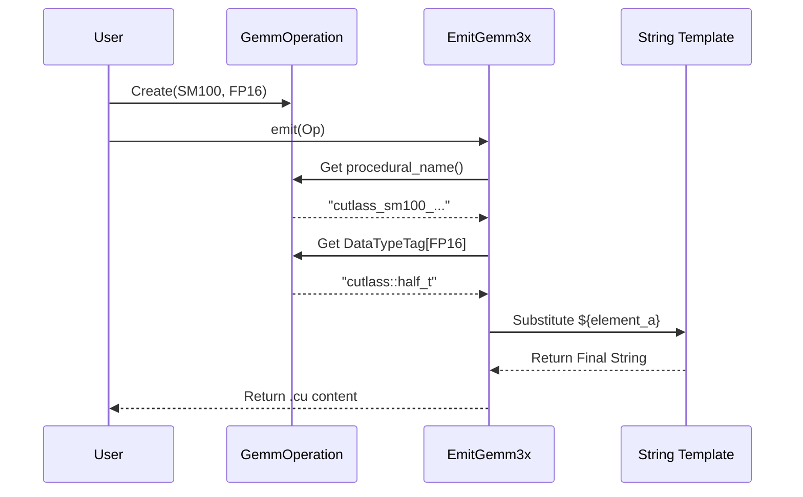

# Chapter 14: C++ Code Generators

In the previous chapter, [Chapter 13: Legacy Architecture Tests](13_legacy_architecture_tests.md), we looked at how to manually write C++ templates for older GPUs. You might have noticed that defining a single kernel required 20-30 lines of complex C++ code.

Now imagine you need to support:
*   5 Data Types (F16, BF16, F32, TF32, FP8)
*   4 Layout combinations (Row/Col major)
*   10 Tile Sizes
*   3 Architectures

That is $5 \times 4 \times 10 \times 3 = 600$ kernels. Writing 600 C++ files by hand is impossible to maintain.

This chapter introduces the **C++ Code Generators**. These are Python scripts that write the C++ code for us.

---

### Motivation: The "Mad Libs" of Programming

Do you remember the game "Mad Libs"? You have a story with blanks, and you fill in the blanks with words to create a sentence.

*   **Template:** "The `${color}` fox jumps over the `${adjective}` dog."
*   **Input:** Color="Quick", Adjective="Lazy"
*   **Result:** "The Quick fox jumps over the Lazy dog."

CUTLASS uses this exact same logic.
1.  **The Template:** A string containing C++ code with `${placeholders}`.
2.  **The Input:** A Python object describing the kernel (e.g., "SM100, 128x128 tile").
3.  **The Result:** A valid `.cu` file that can be compiled.

**Central Use Case:**
We want to generate the C++ code for a **Blackwell (SM100) GEMM** using the **Epilogue Visitor Tree (EVT)** without manually writing the confusing nested templates.

---

### Key Concepts

#### 1. The `GemmOperation` Object
This is a Python class that acts as the "Blueprint." It holds all the metadata about a specific kernel but contains no C++ code itself.
*   **What it knows:** "I am an SM100 kernel, my tile size is 128x128, and I use FP16."

#### 2. The Emitter (`EmitGemm...`)
This is the "Printer." It takes a `GemmOperation` blueprint and knows which C++ template string to use. It performs the text substitution.

#### 3. Epilogue Visitor (EVT) Emitter
For the new Blackwell architecture, the Epilogue (what happens after the matrix multiply) is very complex. The `Sm100Emitter` specializes in generating the C++ code for fused operations like `ReLU(Bias + (A*B))`.

---

### Step-by-Step Use Case

Let's see how we use Python to generate the C++ code for a specific operation.

#### Step 1: Define the Operation in Python
We create an instance of `GemmOperationUniversal`. This is purely Python code.

```python
# Conceptual Python code (simplified)
from cutlass_cppgen.backend import GemmOperationUniversal

# 1. Define the Blueprint
operation = GemmOperationUniversal(
    arch=100,           # Target SM100 (Blackwell)
    tile_description=..., 
    A=TensorDescription(element=DataType.f16, layout=LayoutType.RowMajor),
    B=TensorDescription(element=DataType.f16, layout=LayoutType.ColumnMajor),
    C=TensorDescription(element=DataType.f32, layout=LayoutType.ColumnMajor),
    epilogue_functor=...
)
```

#### Step 2: Select the Emitter
Based on the architecture (SM100) and API version (3.x), the system selects the correct emitter class.

```python
# Inside the backend logic
from cutlass_cppgen.backend.gemm_operation import EmitGemmUniversalInstance3x

# Create the emitter for CUTLASS 3.x
emitter = EmitGemmUniversalInstance3x(operation_suffix="_sm100")
```

#### Step 3: Emit the Code
We call the `emit` method. This functions like the "Print" button.

```python
# Generate the string
cpp_code = emitter.emit(operation)

# Print it to see the result
print(cpp_code)
```

**The Output (Simplified C++):**
```cpp
// Auto-generated C++ code
using cutlass_sm100_tensorop_f16_s128x128_row_col_align8 = 
  cutlass::gemm::kernel::GemmUniversal<
    Shape<int,int,int,int>,
    CollectiveMainloop, // ... configured for f16 ...
    CollectiveEpilogue  // ... configured for f16 ...
>;
```

---

### Internal Implementation

How does the text substitution actually work? It uses a dictionary of values mapping key names to C++ snippets.

#### Sequence Diagram



#### Deep Dive: The Template String
In `python/cutlass_cppgen/backend/gemm_operation.py`, the class `EmitGemmUniversalInstance3x` defines the raw C++ template.

```python
# From python/cutlass_cppgen/backend/gemm_operation.py

self.gemm_template_kernel = """
using CollectiveMainloop =
  typename cutlass::gemm::collective::CollectiveBuilder<
    ${arch}, ${opcode_class},
    ${element_a}, ${layout_a}, ${align_a},
    ${element_b}, ${layout_b}, ${align_b},
    // ...
  >::CollectiveOp;
"""
```
**Explanation:** Notice the `${...}` markers. These are the blanks in our "Mad Libs" game.

#### Deep Dive: The Substitution Logic
The `emit` method creates a Python dictionary mapping those markers to actual C++ types.

```python
# Inside emit() method
values = {
    "arch": "cutlass::arch::Sm%d" % operation.arch,
    "element_a": DataTypeTag[operation.A.element], # e.g., "cutlass::half_t"
    "layout_a": LayoutTag[operation.A.layout],     # e.g., "cutlass::layout::RowMajor"
    # ...
}

# The magic function that replaces the text
return SubstituteTemplate(self.gemm_template_kernel, values)
```

---

### The SM100 Epilogue Emitter

For the Blackwell architecture (SM100), the Epilogue is treated differently. We use a **Visitor Tree** pattern (covered in [Chapter 2](02_documentation.md) via DSL, but here is the generator backend).

The file `python/cutlass_cppgen/backend/evt/backend/sm100_emitter.py` handles this.

#### Why is it special?
Blackwell supports advanced fusion (e.g., `GELU(LinearCombination)`). The generator must analyze the graph of operations and emit a C++ descriptor.

```python
# From python/cutlass_cppgen/backend/evt/backend/sm100_emitter.py

class Sm100CollectiveEpilogue:
    def emit(self):
        # ... logic to calculate stride strings ...
        
        # Returns a C++ type definition
        return f"""
        using EpilogueDescriptor = 
          cutlass::epilogue::collective::detail::Sm100EpilogueDescriptor<
            {OpcodeClassTag[self.opclass]},
            {self.CtaTileMNK}, 
            {self.EpilogueTileType},
            // ...
          >;
        """
```
**Explanation:**
*   `CtaTileMNK`: The Python script calculates the thread block shape (e.g., `Shape<_128,_128,_64>`) and injects it into the string.
*   This generates the specific C++ type `Sm100EpilogueDescriptor` which connects the generated kernel to the hardware features we learned about in [Chapter 9: Blackwell Dense GEMM Tests](09_blackwell_dense_gemm_tests.md).

---

### Summary

In this chapter, we learned:
1.  **Automation:** We don't write C++ directly; we define blueprints in Python.
2.  **Templates:** The generator uses string templates with `${placeholders}`.
3.  **Emitters:** Specific classes (like `EmitGemmUniversalInstance3x`) handle the logic of translating Python objects into C++ syntax.
4.  **Blackwell Specifics:** The `Sm100Emitter` handles the complex generation required for new Epilogue features.

This system allows CUTLASS to publish thousands of highly optimized kernels without a human having to type them out.

Now that we understand how the library generates the underlying C++ code, we can move up a level of abstraction. What if you want to write your own kernels using a high-level Python syntax?

[Next Chapter: CuTe DSL Pipelines](15_cute_dsl_pipelines.md)

---

Generated by [Code IQ](https://github.com/adityasoni99/Code-IQ)