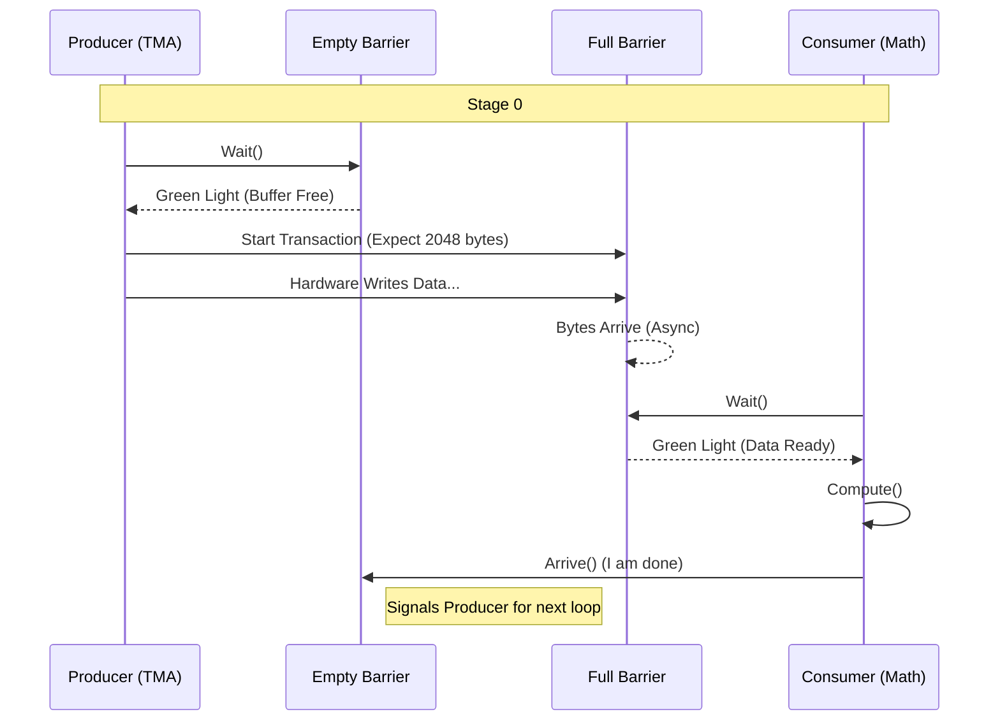

# Chapter 15: CuTe DSL Pipelines

In the previous chapter, [Chapter 14: C++ Code Generators](14_c___code_generators.md), we learned how to use Python to fill in "Mad Libs" style templates to generate C++ kernels.

But what if you want to change the *logic* of the kernel, not just the data types? What if you want to define exactly how data flows through the GPU's memory stages?

On the NVIDIA Blackwell (SM100) architecture, managing data movement is a high-stakes coordination game. You have the **TMA** (Tensor Memory Accelerator) moving massive blocks of memory, and the **UMMA** (Unified Math Multiply Accumulate) engines crunching numbers. If they get out of sync, the GPU stalls or produces wrong results.

This chapter introduces **CuTe DSL Pipelines**—Python objects that act as "Traffic Controllers" for your kernel, managing the complex synchronization between producers and consumers.

---

### Motivation: The "Chef and Shopper" Problem

Imagine a busy restaurant kitchen:
1.  **The Shopper (Producer):** Goes to the store (Global Memory) and brings ingredients to the pantry (Shared Memory).
2.  **The Chef (Consumer):** Takes ingredients from the pantry and cooks the meal (Registers).

**The Challenge:**
*   If the Shopper is too slow, the Chef stands around doing nothing (Stall).
*   If the Shopper is too fast, the pantry overflows (Data Corruption).
*   They need to signal each other: "Pantry has space!" or "Ingredients are ready!"

On Blackwell GPUs, we perform these signals using **Asynchronous Pipelines**. Writing the raw assembly commands for this is extremely difficult. **CuTe DSL Pipelines** wraps this logic in friendly Python classes.

**Central Use Case:**
We want to coordinate a **TMA Load** (Shopper) and a **Tensor Core Math** operation (Chef) using a 3-stage buffer pipeline.

---

### Key Concepts

#### 1. The Pipeline Object
A Python object that represents the synchronization state. It manages:
*   **Barriers:** The "Traffic Lights" (Red/Green).
*   **Stages:** How many "shelves" are in the pantry (usually 2, 3, or 4).

#### 2. Producer vs. Consumer
*   **Producer:** The agent generating data (e.g., TMA loading from Global Mem).
*   **Consumer:** The agent using data (e.g., Math unit reading Shared Mem).

#### 3. Full vs. Empty
*   **Wait for Empty:** The Producer waits until there is space to write.
*   **Wait for Full:** The Consumer waits until the data is valid to read.

---

### How to Use Pipelines

Let's look at how to define this coordination in CuTe DSL. We will use the `PipelineTmaUmma` class, designed specifically for Blackwell's Load-then-Compute pattern.

#### Step 1: Define the Agents
First, we tell the pipeline who is doing the work. In DSL, we use `CooperativeGroup` to represent threads.

```python
from cutlass.pipeline import CooperativeGroup, PipelineOp

# 1. The TMA engine (Hardware unit, effectively 1 "thread")
producer = CooperativeGroup(PipelineOp.TmaLoad, 1)

# 2. The Math Threads (e.g., 128 threads per block)
consumer = CooperativeGroup(PipelineOp.TCGen05Mma, 128)
```
**Explanation:** `TCGen05Mma` is the internal name for the Blackwell Tensor Core math operation.

#### Step 2: Create the Pipeline
We instantiate the pipeline object. This calculates the required shared memory for the barriers.

```python
from cutlass.pipeline.sm100 import PipelineTmaUmma

# Create a 3-stage pipeline
pipeline = PipelineTmaUmma.create(
    num_stages=3,
    producer_group=producer,
    consumer_group=consumer,
    tx_count=2048, # How many bytes per stage?
    barrier_storage=smem_ptr # Pointer to Shared Memory
)
```
**Explanation:** `tx_count` is crucial. The hardware barrier needs to know: "I turn green only after receiving exactly 2048 bytes."

#### Step 3: The Producer Logic (The Shopper)
In your kernel loop, the Producer (TMA) asks: "Is there space?"

```python
# Inside the Main Loop
def producer_loop(state):
    # 1. Wait for space in the buffer
    pipeline.producer_acquire(state)

    # 2. Issue the TMA Load command (The hardware moves data)
    # copy_data(...) 

    # 3. Note: No explicit "commit" needed for TMA on SM100!
    # The TMA hardware automatically tickles the barrier when done.
```
**Explanation:** `producer_acquire` will pause the thread until the "Empty" barrier for the current stage is signaled.

#### Step 4: The Consumer Logic (The Chef)
The Consumer (Math Threads) asks: "Is the data ready?"

```python
def consumer_loop(state):
    # 1. Wait for data to arrive
    pipeline.consumer_wait(state) # Implied in higher-level DSL

    # 2. Do the math
    gemm_math(...)

    # 3. Tell Producer we are done with this buffer
    pipeline.consumer_release(state)
```
**Explanation:** `consumer_release` signals the "Empty" barrier, letting the Producer know it can overwrite this shelf in the pantry.

---

### Internal Implementation

How does this Python code translate to the complex hardware of SM100?

The pipeline manages a circular buffer of **mbarrier** objects (hardware memory barriers).

1.  **Sync Object Full:** Tracks if the buffer has data.
2.  **Sync Object Empty:** Tracks if the buffer is free to write.

#### Sequence Diagram: The Handshake



#### Code Dive: The `PipelineTmaUmma` Class

Let's look inside `python/CuTeDSL/cutlass/pipeline/sm100.py`.

**1. Making the Sync Objects**
The `create` method initializes two sets of barriers.

```python
# from cutlass/pipeline/sm100.py

sync_object_full = PipelineTmaUmma._make_sync_object(
    barrier_storage.align(min_align=8),
    num_stages,
    producer, # TMA
    tx_count  # Bytes expected
)
sync_object_empty = PipelineTmaUmma._make_sync_object(
    ..., consumer # Math
)
```
**Explanation:** `sync_object_full` is configured with `tx_count`. This tells the hardware mbarrier to count bytes. `sync_object_empty` is a simple counter barrier.

**2. Producer Acquire**
When the producer wants to start, it waits on the `empty` object.

```python
def producer_acquire(self, state, ...):
    # Wait until the consumer has released this stage
    self.sync_object_empty.wait(
        state.index, state.phase
    )
    
    # If using Clusters, we might need to signal neighbors here
    if_generate(self.is_leader_cta, lambda: ...)
```
**Explanation:** The DSL generates C++ code that calls `mbarrier.try_wait`. It handles the `phase` bit (which toggles every time we wrap around the circular buffer).

**3. Multicast Magic (Advanced)**
On Blackwell, Thread Blocks work in **Clusters** (e.g., groups of 4). One TMA load can broadcast data to all 4 blocks.

The code automatically calculates "Multicast Masks":

```python
# Inside _compute_mcast_arrival_mask
tma_mcast_mask_a = cute.nvgpu.cpasync.create_tma_multicast_mask(...)
```
**Why this matters:** When the TMA finishes loading data, it doesn't just signal *my* barrier. It signals the barriers of my neighbors in the cluster too. The Python class handles this complexity so you don't have to calculate bitmasks manually.

### Other Pipeline Types

The file `sm100.py` contains other pipelines for different scenarios:

1.  **`PipelineAsyncUmma`:**
    *   *Use Case:* Loading data from Registers to Shared Memory (e.g., fusing inputs).
    *   *Difference:* The Producer is a thread, not the TMA hardware.

2.  **`PipelineUmmaAsync`:**
    *   *Use Case:* The Epilogue. Moving results from Math (UMMA) to Global Memory.
    *   *Difference:* The Math engine is the Producer, and the Store unit is the Consumer.

### Summary

In this chapter, we learned:
1.  **Traffic Control:** Pipelines manage the synchronization between asynchronous hardware units (TMA and UMMA).
2.  **Stages:** We use multi-stage buffering to hide latency (Producer works on Stage 1 while Consumer works on Stage 0).
3.  **Abstraction:** The `PipelineTmaUmma` Python class hides the complexity of `mbarrier` initialization, byte counting, and cluster multicasting.
4.  **Usage:** The Producer `acquires` space, and the Consumer `releases` it when done.

We have now covered how to define the *logic* of our kernels using Python DSL pipelines. But how does this Python code actually interface with the rest of the CUTLASS library?

[Next Chapter: DSL Infrastructure](16_dsl_infrastructure.md)

---

Generated by [Code IQ](https://github.com/adityasoni99/Code-IQ)