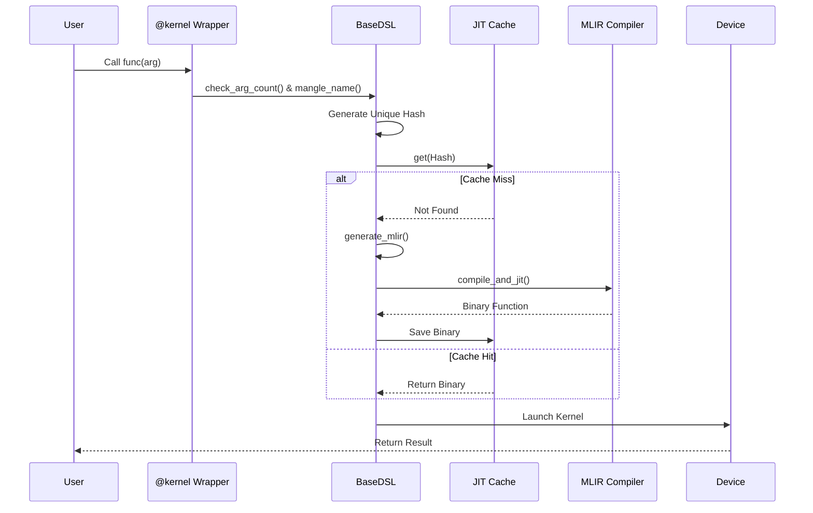

# Chapter 16: DSL Infrastructure

In the previous chapter, [Chapter 15: CuTe DSL Pipelines](15_cute_dsl_pipelines.md), we learned how to define high-level traffic control logic for data movement using Python objects. We described *what* the data should do.

Now, we must answer the final question: **How does Python code actually become a high-performance GPU binary?**

This chapter covers the **DSL Infrastructure**. This is the engine room of the Python interface. It handles the translation from user-friendly Python functions into the raw machine code that runs on the GPU, handling type checking, caching, and kernel launching along the way.

---

### Motivation: The Universal Translator

Imagine you are a diplomat (the User) trying to give instructions to a foreign engineer (the GPU). You speak Python. The engineer speaks SASS/PTX (Assembly).

If you just yell Python code at the GPU, it won't understand. You need a **Universal Translator**.

1.  **Interpretation:** The translator listens to your Python words (`def kernel(a, b)`).
2.  **Context:** They look at what you are holding (Are `a` and `b` floats? integers? tensors?).
3.  **Translation:** They write down the instructions in the engineer's language.
4.  **Memory:** If you say the exact same sentence again tomorrow, they don't re-translate it; they just hand over the paper they wrote yesterday (**Caching**).

**Central Use Case:**
You write a simple Python function decorated with `@kernel`. You call it with two Tensors. The infrastructure automatically compiles a custom CUDA kernel for those specific tensor types and launches it.

---

### Key Concept 1: The Singleton Manager (`BaseDSL`)

The core of the infrastructure is the `BaseDSL` class. It uses a **Singleton Pattern**, meaning there is only one "Manager" active at a time.

This Manager holds the global state:
*   Which GPU architecture are we targeting? (e.g., SM90, SM100)
*   Where is the compiler located?
*   What kernels have we already compiled?

```python
# python/CuTeDSL/cutlass/base_dsl/dsl.py

# The Singleton Metaclass ensures only one instance exists
class DSLSingletonMeta(type):
    _instances: ClassVar[dict] = {}

    def __call__(cls, *args, **kwargs):
        # If instance exists, return it. If not, create it.
        if cls not in cls._instances:
             cls._instances[cls] = super().__call__(*args, **kwargs)
        return cls._instances[cls]
```
**Explanation:** When you import the library, this logic ensures you don't accidentally create two conflicting compiler configurations.

---

### Key Concept 2: The Decorators (`@jit` and `@kernel`)

To tell the Manager "Translate this!", we use **Decorators**.

*   **`@jit`**: Compiles code that runs on the **Host (CPU)** but interacts with the DSL.
*   **`@kernel`**: Compiles code that runs on the **Device (GPU)**.

```python
# Conceptual usage
@impl.kernel
def my_gpu_function(A, B):
    # This logic will be translated to GPU code
    ...

# The infrastructure intercepts this call!
my_gpu_function(tensor_a, tensor_b)
```

When you call `my_gpu_function`, you aren't running the Python code directly. You are running a "Wrapper" generated by the DSL infrastructure.

---

### Key Concept 3: Argument Processing & Name Mangling

C++ is strict about types. Python is not. The DSL infrastructure bridges this gap.

When you call the function, the DSL inspects the arguments. It generates a unique name for the kernel based on these arguments, a process called **Name Mangling**.

*   Call with `float`: Generates kernel `my_func_f32`.
*   Call with `int`: Generates kernel `my_func_i32`.

```python
# python/CuTeDSL/cutlass/base_dsl/dsl.py

def mangle_name(self, function_name, args, args_spec):
    # Loop through arguments to build a unique string
    for arg in args:
        if isinstance(arg, (list, tuple)):
            # Append shape/values to name
            function_name = f"{function_name}_{'_'.join(map(str, arg))}"
        else:
             # Append type/value to name
            function_name = f"{function_name}_{arg}"
    
    # Clean up special characters
    return function_name.replace(" ", "_")
```
**Explanation:** This ensures that if you call the same kernel with different data shapes, the system treats them as different programs and compiles them separately.

---

### Key Concept 4: JIT Caching

Compiling code takes time (seconds). We don't want to wait every time we run a loop.

The DSL uses a **Just-In-Time (JIT) Cache**.
1.  Calculate a "Hash" (Fingerprint) of the kernel logic + arguments.
2.  Check if this Hash exists in the cache.
3.  **Hit:** Return the already-compiled binary immediately.
4.  **Miss:** Compile it, save it, then run it.

---

### Use Case: Running a Custom Kernel

Let's trace what happens when you run a function.

#### Step 1: The Decorator
You define the function.

```python
@impl.kernel
def add_one(a):
    return a + 1
```

#### Step 2: The Call
You call it with a specific input.

```python
val = 10.0 # Float
add_one(val)
```

#### Step 3: Under the Hood (Infrastructure)
The DSL wrapper wakes up.
1.  It sees input `10.0` (float).
2.  It mangles the name to `add_one_float`.
3.  It checks the cache. "Have I compiled `add_one_float`?"
4.  If no, it generates MLIR (Intermediate Code), calls the backend compiler, and gets a binary.
5.  It launches the binary on the GPU.

---

### Internal Implementation

How does the code flow through `base_dsl/dsl.py`?

#### Sequence Diagram



#### Code Dive: The Compilation Loop
The method `compile_and_cache` orchestrates the heavy lifting.

```python
# python/CuTeDSL/cutlass/base_dsl/dsl.py

def compile_and_cache(self, module, module_hash, ...):
    
    # 1. Check Memory Cache
    cached_func = self.jit_cache.get(module_hash)

    if cached_func is None:
        # 2. Cache Miss: Compile!
        log().info("JIT cache miss: Compiling...")
        
        # Calls the backend compiler provider
        engine = self.compile_and_jit(module, ...)
        
        # 3. Store result
        fn = JitCompiledFunction(..., engine, ...)
        self.jit_cache.set(module_hash, fn)
        
        return fn
    else:
        # 4. Cache Hit
        return cached_func
```
**Explanation:** This function is the gatekeeper. It ensures we only pay the compilation cost once per unique configuration.

#### Code Dive: Argument Generation
Before compiling, the DSL must convert Python objects into "JIT Arguments" that the lower-level compiler understands.

```python
# python/CuTeDSL/cutlass/base_dsl/dsl.py

def _generate_jit_func_args(self, args, ...):
    jit_exec_args = []
    
    for arg in args:
        # Try to adapt known types (like numpy arrays)
        adapter = JitArgAdapterRegistry.get_registered_adapter(type(arg))
        
        if adapter:
            # Convert python obj -> C-compatible pointer/struct
            arg = adapter(arg)
            
        # Collect pointers for the C++ kernel
        jit_exec_args.extend(get_c_pointers(arg))

    return jit_exec_args
```
**Explanation:** This converts user-friendly objects (like a PyTorch tensor) into raw memory pointers (`void*`) that the compiled C++/CUDA kernel can read.

---

### Summary

In this final chapter of the tutorial, we explored the **DSL Infrastructure**:
1.  **Singleton Manager:** `BaseDSL` ensures a unified configuration.
2.  **Decorators:** `@kernel` and `@jit` mark the boundaries between Python and GPU code.
3.  **Name Mangling:** Generates unique kernel names based on argument types to support polymorphism.
4.  **Caching:** Drastically speeds up execution by reusing compiled binaries.

This infrastructure is the foundation that allows **CuTe DSL** (Chapter 15) and the generated **C++ Code** (Chapter 14) to work seamlessly together, providing a Pythonic experience for writing high-performance CUDA kernels.

**Congratulations!** You have completed the CUTLASS Tutorial. You have journeyed from basic Build Configuration to writing high-performance GEMM kernels, understanding the Blackwell architecture, and finally seeing how the Python DSL orchestrates it all.

Happy Coding!

---

Generated by [Code IQ](https://github.com/adityasoni99/Code-IQ)