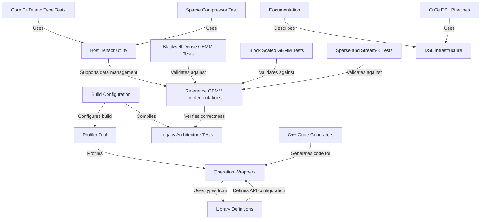

# Tutorial: cutlass

**CUTLASS** is a high-performance **CUDA C++ template library** for implementing matrix-matrix multiplication (**GEMM**) and related linear algebra primitives. It provides hierarchical abstractions to efficiently target NVIDIA GPUs, from *Volta* to the latest **Blackwell** architecture, handling complex operations like **sparse GEMM**, **block scaling**, and **Stream-K** scheduling. The project includes a **Profiler** for benchmarking, extensive unit tests, and a Python-based **CuTe DSL** for developing kernels with rapid iteration.

**Source Repository:** [https://github.com/NVIDIA/cutlass](https://github.com/NVIDIA/cutlass)

## Chapters

1. [Build Configuration](01_build_configuration.md)
2. [Documentation](02_documentation.md)
3. [Library Definitions](03_library_definitions.md)
4. [Operation Wrappers](04_operation_wrappers.md)
5. [Profiler Tool](05_profiler_tool.md)
6. [Host Tensor Utility](06_host_tensor_utility.md)
7. [Reference GEMM Implementations](07_reference_gemm_implementations.md)
8. [Core CuTe and Type Tests](08_core_cute_and_type_tests.md)
9. [Blackwell Dense GEMM Tests](09_blackwell_dense_gemm_tests.md)
10. [Block Scaled GEMM Tests](10_block_scaled_gemm_tests.md)
11. [Sparse and Stream-K Tests](11_sparse_and_stream_k_tests.md)
12. [Sparse Compressor Test](12_sparse_compressor_test.md)
13. [Legacy Architecture Tests](13_legacy_architecture_tests.md)
14. [C++ Code Generators](14_c___code_generators.md)
15. [CuTe DSL Pipelines](15_cute_dsl_pipelines.md)
16. [DSL Infrastructure](16_dsl_infrastructure.md)

---

Generated by [Code IQ](https://github.com/adityasoni99/Code-IQ)