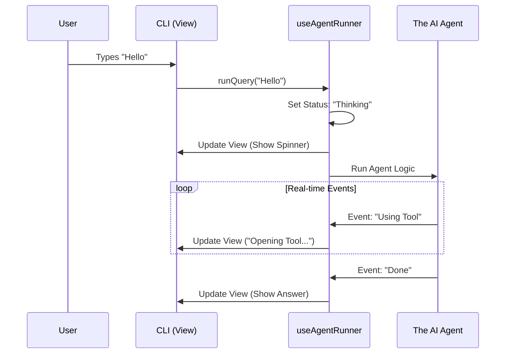

# Chapter 1: Interactive CLI & State Management

Welcome to **Dexter**! If you are building an autonomous AI agent, you need a way to talk to it and see what it is doing.

This chapter focuses on the **Cockpit Dashboard**. Even if you have the world's fastest engine (the AI), you still need dials, lights, and a steering wheel to fly the plane. In Dexter, this dashboard is our **Interactive CLI**.

### The Motivation
Imagine you ask your agent: *"What is the stock price of Apple?"*

Without a good CLI (Command Line Interface) and State Management system, you would stare at a blinking cursor for 10 seconds, wondering if the program crashed. Then, suddenly, the answer would pop up.

**We want a better experience:**
1. You type a command.
2. You see a "Thinking..." indicator immediately.
3. You see "Opening Financial Tool..." as it works.
4. You see the final answer clearly.

This chapter explains how `src/cli.tsx` and `src/hooks/useAgentRunner.ts` work together to create this real-time feedback loop.

---

### Key Concepts

We use a library called **Ink**. It allows us to build terminal interfaces using **React**. If you know React (components, hooks, state), you already know how to build this CLI!

#### 1. The View (`CLI`)
This is what you look at. It is a React component that renders text, boxes, and colors to your terminal. It doesn't do the heavy lifting; it just displays data.

#### 2. The Bridge (`useAgentRunner`)
This is a custom React Hook. It connects the "View" to the "Brain" (the Agent). It manages the **State** of the conversation.

*   **Idle:** Waiting for you to type.
*   **Thinking:** The agent is planning.
*   **Tool Usage:** The agent is executing code (like searching the web).
*   **Answering:** The agent is writing the final response.

---

### Solving the Use Case: The Dashboard

Let's look at how we build the dashboard in `src/cli.tsx`.

#### The Main Layout
The CLI is just a column of components. It shows the history of the chat, any errors, a working indicator (if busy), and the input box.

```tsx
// src/cli.tsx (Simplified)
export function CLI() {
  // 1. Get the state from our custom hook
  const { history, workingState, isProcessing, runQuery } = useAgentRunner(/*...*/);

  return (
    <Box flexDirection="column">
      {/* 2. Show the chat history */}
      {history.map(item => (
        <HistoryItemView key={item.id} item={item} />
      ))}

      {/* 3. Show "Thinking..." or Tool progress if busy */}
      {isProcessing && <WorkingIndicator state={workingState} />}

      {/* 4. The input box for user typing */}
      <Input onSubmit={(query) => runQuery(query)} />
    </Box>
  );
}
```
**Explanation:**
This looks exactly like a web app! We map over a list of messages (`history`) to display them. If `isProcessing` is true, we show the loading spinner (`WorkingIndicator`).

#### Handling User Input
When the user hits "Enter" in the `<Input />` component, we need to capture that text and start the engine.

```tsx
// src/cli.tsx (Inside CLI component)
const handleSubmit = useCallback(async (query: string) => {
  // If user types 'exit', close the app
  if (query.toLowerCase() === 'exit') {
    exit(); 
    return;
  }
  
  // Otherwise, send the text to the agent runner
  await runQuery(query);
}, [exit, runQuery]);
```
**Explanation:**
We check for basic commands like "exit". If it's a real question, we pass it to `runQuery`. This function comes from our state manager, which we will look at next.

---

### Internal Implementation: The State Manager

The visual component is simple because the logic is hidden inside `src/hooks/useAgentRunner.ts`. This hook manages the heartbeat of the application.

#### How it works (Sequence Diagram)
Before looking at the code, let's visualize the flow when a user asks a question.



#### The `useAgentRunner` Code
This hook listens to the Agent and updates React state variables. This causes the CLI to re-render, showing the user what is happening.

**1. Setting up State**
First, we define the boxes where we store information.

```typescript
// src/hooks/useAgentRunner.ts
export function useAgentRunner(agentConfig, chatHistoryRef) {
  // The list of all messages (User query + Agent answer)
  const [history, setHistory] = useState<HistoryItem[]>([]);
  
  // What is the agent doing right NOW? (Thinking, Tool, Idle)
  const [workingState, setWorkingState] = useState<WorkingState>({ status: 'idle' });
  
  // Any errors?
  const [error, setError] = useState<string | null>(null);

  // ...
```
**Explanation:**
`history` stores the conversation. `workingState` stores the current status (e.g., "Scanning database...").

**2. Handling Real-time Events**
The Agent sends "events" back to us. We need to catch them and update the UI.

```typescript
// src/hooks/useAgentRunner.ts
const handleEvent = useCallback((event: AgentEvent) => {
  switch (event.type) {
    case 'thinking':
      // Update state to show the user we are thinking
      setWorkingState({ status: 'thinking' });
      break;
      
    case 'tool_start':
      // Show which tool is being used
      setWorkingState({ status: 'tool', toolName: event.tool });
      break;

    // ... handle other events
  }
}, []);
```
**Explanation:**
This switch statement determines what the user sees. If the agent says `tool_start`, we tell the UI: *"Change the spinner text to show the tool name."*

**3. The Main Loop (`runQuery`)**
This is the function called when you hit Enter. It starts the Agent and watches the stream of events.

```typescript
// src/hooks/useAgentRunner.ts
const runQuery = async (query: string) => {
  // 1. Update UI immediately
  setWorkingState({ status: 'thinking' });
  
  // 2. Create the Agent
  const agent = await Agent.create(agentConfig);
  const stream = agent.run(query, chatHistoryRef.current);
  
  // 3. Listen to the stream of events
  for await (const event of stream) {
    handleEvent(event); // Update UI for every small step
  }
};
```
**Explanation:**
This uses a generic `Agent` class (which we will build in the next chapter). The `for await` loop is magic—it allows the Agent to send multiple updates (Thinking -> Tool -> Thinking -> Done) for a single question.

---

### Summary

In this chapter, we built the **Cockpit**:
1.  **CLI (`cli.tsx`):** A React/Ink interface that displays what is happening.
2.  **State Manager (`useAgentRunner.ts`):** A hook that captures "events" from the agent and updates the UI in real-time.

We have a beautiful dashboard, but currently, it connects to a generic `Agent` placeholder. We need to build the actual engine that thinks, reasons, and decides what to do.

In the next chapter, we will build that engine.

**Next Chapter:** [The Recursive Agent Loop](02_the_recursive_agent_loop.md)

---

Generated by [Code IQ](https://github.com/adityasoni99/Code-IQ)