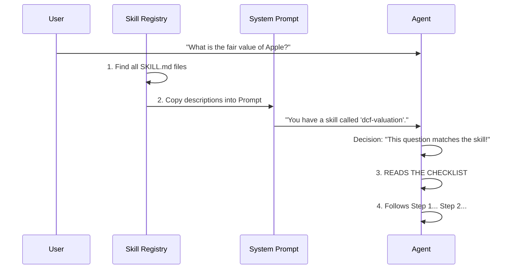

# Chapter 3: Skills System

In the previous chapter, [The Recursive Agent Loop](02_the_recursive_agent_loop.md), we built the "Brain" of our agent. We gave it a loop that allows it to Think, Act, and Observe.

However, a brain without knowledge is just potential.

If you ask the agent to perform a complex financial task—like a **DCF (Discounted Cash Flow) Valuation**—it might try its best, but it will likely miss steps, make up formulas, or give a shallow answer.

It needs a **Manual**. In Dexter, we call these **Skills**.

---

### The Motivation: The Pilot Analogy

Think of your Agent like a commercial airline pilot.
*   **Generic Intelligence:** The pilot knows how to fly planes generally (lift, drag, thrust).
*   **The Problem:** Suddenly, an engine catches fire. The pilot shouldn't rely on "general intuition" to fix it.
*   **The Solution (The Skill):** The pilot pulls out the **Emergency Checklist**. It is a strict, step-by-step guide: *1. Cut fuel. 2. Close intake. 3. Fire extinguisher.*

**Skills in Dexter work the same way.**
Instead of writing complex code to force the agent to behave, we simply give it a checklist written in plain English (Markdown).

---

### Key Concept: Skills are Text, Not Code

This is the most important part of this chapter: **You do not need to be a programmer to teach Dexter a new skill.**

A Skill is just a Markdown (`.md`) file. It contains:
1.  **Metadata:** Name and Description (so the Agent knows *when* to use it).
2.  **The Checklist:** The step-by-step instructions.

Because we are using Large Language Models (LLMs), they understand English instructions perfectly.

### Solving the Use Case: DCF Valuation

Let's look at a real example used in Dexter to calculate the intrinsic value of a stock.

#### The Skill File (`src/skills/dcf/SKILL.md`)

This file acts as the "SOP" (Standard Operating Procedure).

```markdown
---
name: dcf-valuation
description: Triggers when user asks for fair value, intrinsic value, or "what is X worth".
---

# DCF Valuation Skill

## Workflow Checklist
- [ ] Step 1: Gather financial data (Cash Flow, Metrics, Balance Sheet)
- [ ] Step 2: Calculate FCF growth rate
- [ ] Step 3: Estimate WACC (Discount Rate)
- [ ] Step 4: Project future cash flows
- [ ] Step 5: Calculate fair value per share
```

**Explanation:**
*   The top section (between `---`) is the **Frontmatter**. It tells the system: "If the user asks about 'fair value', load this skill."
*   The bottom section is the **Instruction Manual**. The Agent reads this and thinks: *"Okay, I cannot skip Step 1. I must get the Balance Sheet first."*

---

### Internal Implementation: How It Works

How does a text file in a folder get into the Agent's brain?

We built a **Skill Registry**. It scans your folder, reads the files, and injects them into the **System Prompt** (the agent's core instructions).

#### Visualizing the Flow



---

### The Code: The Skill Registry

Let's look at `src/skills/index.ts`. This code is responsible for finding the skills.

#### 1. Discovering Skills
We need a function to look through our folders and find the `.md` files.

```typescript
// src/skills/index.ts
export function discoverSkills(): Skill[] {
  // 1. Find all folders in the 'skills' directory
  const skillDirs = fs.readdirSync(SKILLS_DIR);

  // 2. Loop through them and read the SKILL.md file
  return skillDirs.map(dir => {
    const content = fs.readFileSync(
      path.join(SKILLS_DIR, dir, 'SKILL.md'), 'utf-8'
    );
    return parseSkill(content); // Extracts name/description
  });
}
```
**Explanation:** This acts like a librarian. It walks to the bookshelf (`SKILLS_DIR`), pulls out every book, and reads the cover.

#### 2. Injecting into the Prompt
In Chapter 2, we saw `buildSystemPrompt`. Now we update it to include our skills.

```typescript
// src/agent/prompts.ts
function buildSkillsSection(): string {
  const skills = discoverSkills();
  
  // Create a list of available skills for the AI to read
  const skillList = skills.map(s => 
    `- **${s.name}**: ${s.description}`
  ).join('\n');

  return `## Available Skills\n${skillList}`;
}
```
**Explanation:**
This function generates a text block like:
> **Available Skills**
> - **dcf-valuation:** Triggers when user asks for fair value...

When the Agent starts (Concept from Ch2), it reads this list. If the user's question matches a description, the Agent "activates" that mode.

---

### Why is this powerful?

1.  **Reliability:** The Agent won't forget to check the Balance Sheet, because Step 1 explicitly says so.
2.  **Scalability:** You can add a `competitor-analysis` skill or a `risk-assessment` skill just by adding a Markdown file. You don't need to change the core code.
3.  **Transparency:** You can read the Markdown file and know exactly how the agent is supposed to behave.

---

### Summary

In this chapter, we added **Specialized Knowledge** to our Agent.
1.  **Skills** are Markdown checklists.
2.  **The Registry** finds these files.
3.  **The Prompt** tells the Agent they exist.

Now our Agent has a Brain (Ch2) and an Instruction Manual (Ch3). It knows *what* to do. But to actually *do* it—to fetch that stock price or calculate that math—it needs **Tools**.

In the next chapter, we will build the functions that actually connect to the outside world.

**Next Chapter:** [Tool Registry & Execution](04_tool_registry___execution.md)

---

Generated by [Code IQ](https://github.com/adityasoni99/Code-IQ)