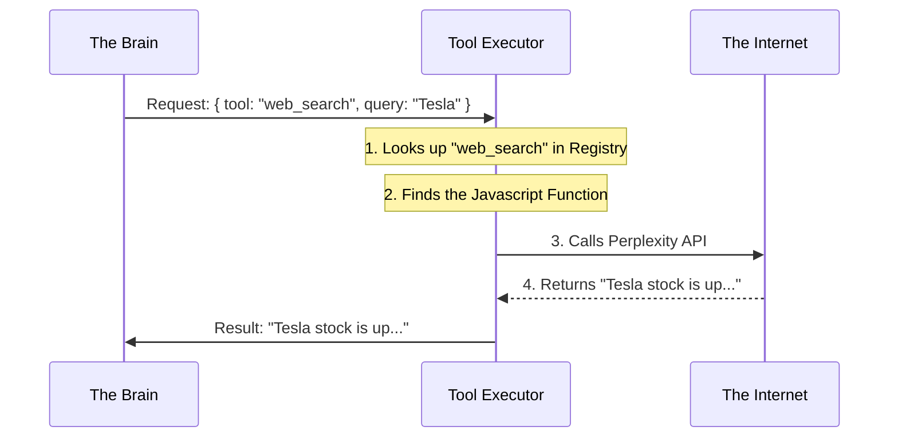

# Chapter 4: Tool Registry & Execution

In the previous chapter, [Skills System](03_skills_system.md), we gave our agent a "Manual." It knows *what* steps to take to solve a problem (like a DCF Valuation).

However, knowing the steps isn't enough. If the manual says "Step 1: Get the current stock price," the agent is stuck. An LLM is just a text engine; it is a brain in a jar. It cannot natively browse the web, check bank accounts, or run math calculations.

It needs "Hands."

In Dexter, we call these **Tools**. This chapter explains how we organize these tools (the **Registry**) and how the agent uses them (the **Executor**).

---

### The Motivation: The Utility Belt

Imagine Batman without his utility belt. He might know exactly how to scale a building (the Skill), but without a grappling hook (the Tool), he isn't going anywhere.

**The Problem:**
You ask: *"What is the latest news on Tesla?"*
The LLM thinks: *"I need to search the web."*
But the LLM cannot connect to Wi-Fi. It can only output text.

**The Solution:**
1.  **The Registry:** We give the LLM a menu of tools: `["web_search", "calculator", "stock_price"]`.
2.  **The Request:** The LLM outputs text: `"I want to use web_search for 'Tesla'"`.
3.  **The Executor:** Our code sees this text, actually connects to the internet, gets the result, and feeds it back to the LLM.

---

### Key Concept: What is a Tool?

In our code, a tool isn't magic. It's just a JavaScript function wrapped in a definition that the AI can understand.

It has three parts:
1.  **Name:** e.g., `web_search`.
2.  **Description:** A sentence telling the AI *when* to use it.
3.  **Schema:** What inputs it needs (e.g., "query": string).

#### Solving the Use Case: Connecting to the Web

Let's look at how we wrap the **Perplexity API** (a search engine) into a tool the agent can hold.

```typescript
// src/tools/search/perplexity.ts (Simplified)

export const perplexitySearch = new DynamicStructuredTool({
  name: 'web_search',
  description: 'Search the web for current information.',
  
  // This tells the AI: "You must provide a 'query' string"
  schema: z.object({
    query: z.string().describe('The search query'),
  }),

  // This is the actual code that runs
  func: async ({ query }) => {
    const results = await callPerplexityAPI(query);
    return results; // Returns the search results as text
  },
});
```

**Explanation:**
We use a library called LangChain. We define the `name` and `description` so the LLM knows this tool exists. The `func` contains the actual hard work (fetching data from an API).

---

### Internal Implementation: The Tool Registry

We have many tools: Google Search, Financial Data, File Readers, etc. We need a central place to store them. This is the **Tool Registry**.

Think of this as stocking the utility belt before the mission starts.

```typescript
// src/tools/registry.ts (Simplified)

export function getToolRegistry(model: string): RegisteredTool[] {
  const tools = [];

  // 1. Add our basic browser tool
  tools.push({
    name: 'browser',
    tool: browserTool, 
    description: 'Use this to visit specific websites.'
  });

  // 2. Conditionally add search if we have an API Key
  if (process.env.PERPLEXITY_API_KEY) {
    tools.push({
      name: 'web_search',
      tool: perplexitySearch,
      description: 'Search the web for topics.'
    });
  }

  return tools;
}
```

**Explanation:**
This function checks our environment setup (API keys). If we have a key for Perplexity, it adds the search tool to the list. If not, the agent simply won't know that searching is an option.

---

### Internal Implementation: The Executor

This is the most critical part of this chapter.

When the Brain (Chapter 2) decides "I need to search," it doesn't run the search itself. It pauses and hands a "ticket" to the **Executor**. The Executor runs the code and reports back.

#### Visualizing the Flow



#### The Code: `AgentToolExecutor`

Let's look at `src/agent/tool-executor.ts`. This class handles the heavy lifting.

**1. Finding and Running the Tool**

```typescript
// src/agent/tool-executor.ts

// The LLM gives us a list of tools it wants to call
async *executeAll(response, ctx) {
  for (const toolCall of response.tool_calls) {
    
    // "web_search"
    const name = toolCall.name;
    // { query: "Tesla" }
    const args = toolCall.args; 

    // Run it!
    yield* this.executeSingle(name, args, ctx);
  }
}
```

**Explanation:**
Sometimes the Agent wants to do two things at once (e.g., search for "Tesla" AND "Ford"). We loop through every request the LLM made.

**2. executingSingle: Safety and Progress**

We wrap the execution in a `try/catch` block so that if the tool crashes, the whole agent doesn't crash.

```typescript
// src/agent/tool-executor.ts (Inside executeSingle)

try {
  // 1. Get the actual code from the map
  const tool = this.toolMap.get(toolName);
  
  if (!tool) throw new Error("Tool not found!");

  // 2. Tell the UI (Chapter 1) we are starting
  yield { type: 'tool_start', tool: toolName, args };

  // 3. Actually run the function!
  const result = await tool.invoke(toolArgs);

  // 4. Tell the UI we are done
  yield { type: 'tool_end', tool: toolName, result };

} catch (error) {
  // If it fails, report the error to the agent so it can try again
  yield { type: 'tool_error', tool: toolName, error: error.message };
}
```

**Explanation:**
1.  **Safety:** If the LLM hallucinates a tool name that doesn't exist, we throw an error.
2.  **Feedback:** Notice the `yield` statements? These send messages back to the **CLI** we built in [Interactive CLI & State Management](01_interactive_cli___state_management.md). This is how the spinner knows to say "Searching web..."
3.  **Result:** The final `result` is text. We send this text back to the Brain loop (Chapter 2), which adds it to the conversation history.

---

### Putting it together

1.  **Registry:** We define `web_search` in `registry.ts`.
2.  **Brain:** The agent (Chapter 2) sees this tool in its system prompt.
3.  **Decision:** The agent outputs `call: web_search`.
4.  **Executor:** The code in `tool-executor.ts` runs the function.
5.  **Output:** The text result is fed back to the agent.

Now our agent can interact with the world! It has a brain, a manual, and hands.

But for a financial agent, generic web search isn't enough. We need reliable, structured financial data (Balance Sheets, Cash Flow Statements) that we can trust, not just random blog posts from a search engine.

In the next chapter, we will build a dedicated layer for handling complex financial data.

**Next Chapter:** [Financial Data Layer](05_financial_data_layer.md)

---

Generated by [Code IQ](https://github.com/adityasoni99/Code-IQ)