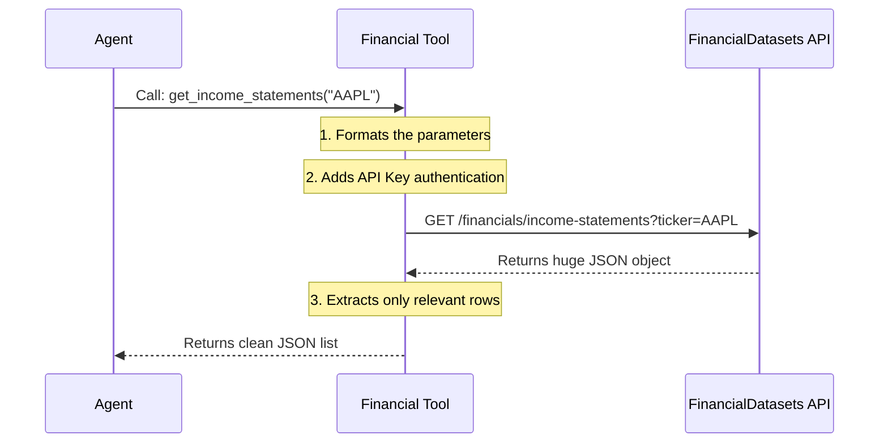

# Chapter 5: Financial Data Layer

In the previous chapter, [Tool Registry & Execution](04_tool_registry___execution.md), we gave our agent "hands" (Tools) and a way to use them (The Executor). We taught it how to connect to the outside world.

However, a financial agent needs more than just a Google Search. If you ask for "Apple's Balance Sheet," a generic search might give you a blog post from 2021 or a paywalled news article.

We need **Truth**.

This chapter explains the **Financial Data Layer**. This is a specialized set of tools that connects Dexter directly to a professional financial database (`financialdatasets.ai`).

---

### The Motivation: The Research Librarian

Imagine you are writing a research paper. You could run around the library pulling random books off shelves (Generic Web Search), or you could ask the **Specialized Research Librarian**.

You ask: *"I need Apple's 2023 debt numbers."*
The Librarian knows:
1.  Go to the "SEC Archives" section.
2.  Find the "10-K" binder for Apple.
3.  Turn to the "Balance Sheet" page.
4.  Copy the specific row.

**The Financial Data Layer is that Librarian.** It hides the complexity of API URLs, authentication, and JSON filtering, so the Agent just has to ask for what it wants.

---

### Use Case: "Analyze Apple's Profitability"

Let's look at the problem we are solving.

**User Query:** *"How has Apple's profit changed over the last year?"*

**Without this layer:**
The Agent might search the web and find three different numbers from three different sources. It gets confused.

**With this layer:**
1.  The Agent calls `get_income_statements({ ticker: "AAPL", period: "annual" })`.
2.  The layer connects to the database.
3.  It returns a clean, structured table of data.
4.  The Agent calculates the change perfectly.

---

### Key Concepts

We divide financial data into two main categories.

#### 1. Fundamentals (The Numbers)
These are the hard stats found in spreadsheets.
*   **Income Statement:** Revenue, Profit, Expenses.
*   **Balance Sheet:** Cash, Debt, Assets.
*   **Cash Flow:** How much actual money moved in/out.

#### 2. Filings (The Text)
These are the legal documents companies file with the SEC (Securities and Exchange Commission).
*   **10-K:** The Annual Report (The big summary).
*   **10-Q:** The Quarterly Report (The update).
*   **8-K:** Major Events (e.g., "We just fired our CEO").

---

### Internal Implementation: How it Works

Let's visualize the flow when the Agent asks for data.



---

### The Code: Handling Fundamentals

Let's look at `src/tools/finance/fundamentals.ts`. This file wraps the API calls for the "Numbers."

#### 1. Defining the Rules (Schema)
First, we use **Zod** to define exactly what the Agent must provide. This prevents the Agent from asking for "Apple" (the fruit) instead of "AAPL" (the ticker).

```typescript
// src/tools/finance/fundamentals.ts
const FinancialStatementsInputSchema = z.object({
  ticker: z.string()
    .describe("The stock ticker, e.g., 'AAPL'"),
    
  period: z.enum(['annual', 'quarterly', 'ttm'])
    .describe("The reporting period"),
    
  limit: z.number().default(10)
    .describe("How many periods to fetch")
});
```
**Explanation:**
We tell the Agent: *"To use this tool, you MUST give me a string Ticker and a specific Period type."*

#### 2. The Tool Definition
Now we create the tool itself.

```typescript
// src/tools/finance/fundamentals.ts
export const getIncomeStatements = new DynamicStructuredTool({
  name: 'get_income_statements',
  description: "Fetches revenue, expenses, and net income.",
  schema: FinancialStatementsInputSchema,
  
  func: async (input) => {
    // 1. Prepare parameters
    const params = { ticker: input.ticker, period: input.period, limit: input.limit };
    
    // 2. Call the raw API (helper function)
    const { data, url } = await callApi('/financials/income-statements/', params);
    
    // 3. Return the result
    return formatToolResult(data.income_statements, [url]);
  },
});
```
**Explanation:**
This function takes the Agent's request, passes it to our `callApi` helper (which handles the web request), and returns the `income_statements` array.

---

### The Code: Handling Filings (Text)

Handling text documents (10-Ks) is harder. They are massive. We can't just feed a 200-page PDF into the Agent; it's too much text.

We use a **Two-Step Process** in `src/tools/finance/filings.ts`.

#### Step 1: Find the Document ID
First, the agent needs to know what documents exist.

```typescript
// src/tools/finance/filings.ts
export const getFilings = new DynamicStructuredTool({
  name: 'get_filings',
  description: "Returns a list of available filings (10-K, 10-Q) and their IDs.",
  schema: z.object({ ticker: z.string() }),
  
  func: async (input) => {
    // Fetches the list of documents
    const { data, url } = await callApi('/filings/', { ticker: input.ticker });
    
    // Returns the list so the agent can find the 'accession_number' (ID)
    return formatToolResult(data.filings, [url]);
  },
});
```
**Explanation:**
The Agent asks *"What documents do you have for Tesla?"* This tool returns a list. The Agent looks at the list and picks an `accession_number` (a unique ID like `0001-23-456`).

#### Step 2: Read a Specific Section
Now that the Agent has the ID, it can ask for a specific chapter of that document.

```typescript
// src/tools/finance/filings.ts
export const get10KFilingItems = new DynamicStructuredTool({
  name: 'get_10K_filing_items',
  description: "Reads specific sections (like Risk Factors) from a 10-K.",
  schema: z.object({ 
    ticker: z.string(),
    accession_number: z.string(), // The ID from Step 1
    items: z.array(z.string())    // e.g. ["Item-1A"] (Risk Factors)
  }),
  
  func: async (input) => {
    // Fetches ONLY the text for the requested section
    const { data } = await callApi('/filings/items/', { ...input });
    return formatToolResult(data, []);
  },
});
```
**Explanation:**
This is powerful. Instead of reading the whole book, the Agent says: *"I have the ID. Please read me 'Item-1A' (Risk Factors)."* The API returns just that text.

---

### Putting It Together

When we register these tools (as discussed in Chapter 4), our Agent gains the ability to "talk finance."

**Example Workflow:**
1.  **User:** "Are Apple's risks increasing?"
2.  **Agent (Thinking):** "I need to read the 'Risk Factors' section of the last two annual reports."
3.  **Action 1:** `get_filings(ticker="AAPL", type="10-K")`.
4.  **Result:** Gets IDs for 2023 (`ID_A`) and 2022 (`ID_B`).
5.  **Action 2:** `get_10K_filing_items(accession_number="ID_A", items=["Item-1A"])`.
6.  **Action 3:** `get_10K_filing_items(accession_number="ID_B", items=["Item-1A"])`.
7.  **Comparison:** The Agent compares the text and answers the user.

---

### Summary

In this chapter, we built the **Financial Data Layer**:
1.  **Fundamentals:** Tools to fetch clean tables of numbers (`get_income_statements`).
2.  **Filings:** A smart system to find documents and read specific sections (`get_filings` -> `get_10K_filing_items`).

Dexter is now a capable financial analyst. It can interact with you via the CLI and fetch deep data. But right now, you can only talk to Dexter via your terminal.

What if you want to talk to Dexter on **Discord**, **Slack**, or **Telegram**?

In the next chapter, we will build the gateway that lets Dexter leave your computer and join your chat apps.

**Next Chapter:** [Communication Gateway](06_communication_gateway.md)

---

Generated by [Code IQ](https://github.com/adityasoni99/Code-IQ)