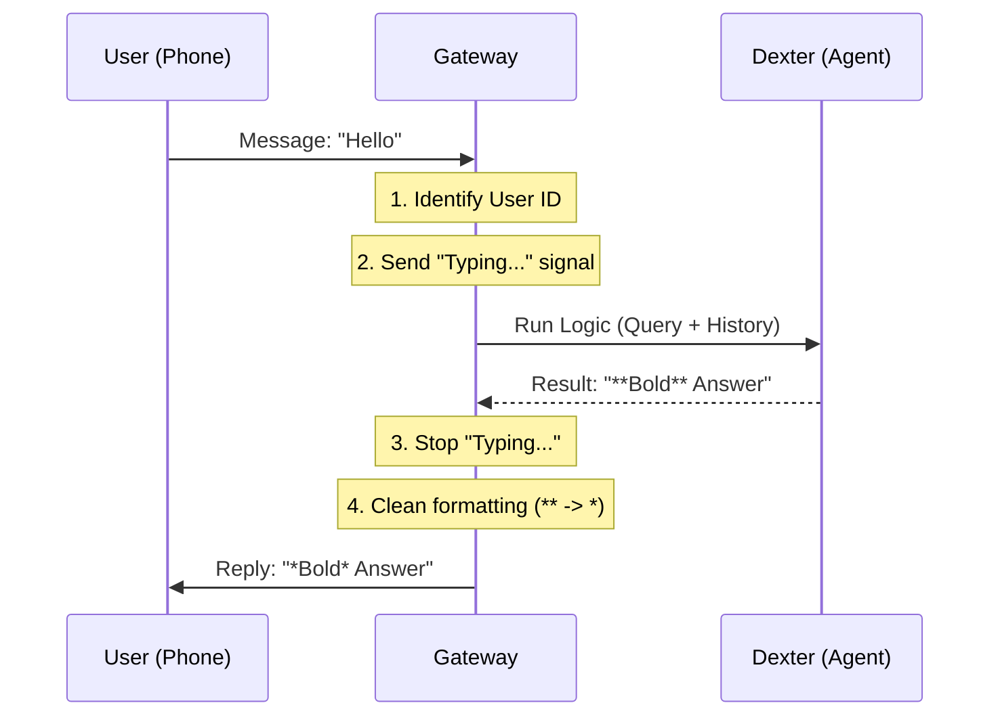

# Chapter 6: Communication Gateway

In the previous chapter, [Financial Data Layer](05_financial_data_layer.md), we turned our agent into a capable financial analyst. It can read balance sheets and analyze SEC filings.

However, right now, Dexter is trapped inside your terminal. If you are at lunch and want to ask "How is Apple doing?", you can't just open your laptop and run a command.

We need to set Dexter free. We need to connect it to the chat apps you use every day, like **WhatsApp**.

This chapter introduces the **Communication Gateway**.

---

### The Motivation: The Switchboard Operator

Imagine a large office building (Your Code). Inside, there is a brilliant analyst named Dexter (The Agent).

Outside the building, millions of people use different phones (WhatsApp, Slack, Telegram). They speak different "dialects" (different data formats).

You need a **Switchboard Operator** at the front desk.
1.  **Receive:** The phone rings (Incoming WhatsApp message).
2.  **Identify:** The operator looks at caller ID (Session Management).
3.  **Connect:** The operator puts the caller through to Dexter.
4.  **Translate:** Dexter writes a formal report (Markdown), but the operator reads it out loud over the phone (WhatsApp format).

**The Gateway is this operator.** It handles the messy work of connecting protocols so the Agent can focus on thinking.

---

### Use Case: Chatting on WhatsApp

We want to achieve this interaction on your real phone:

*   **You (on WhatsApp):** "What is the price of Bitcoin?"
*   **Gateway:** (Shows "Typing..." status)
*   **Dexter (Internal):** *Runs tools, thinks, generates answer.*
*   **Gateway:** (Converts text formatting)
*   **You (on WhatsApp):** "The current price is $65,000."

---

### Internal Implementation: The Flow

Before looking at code, let's visualize the journey of a single message.



---

### The Code: How It Works

The core logic lives in `src/gateway/gateway.ts`. Let's break down the `handleInbound` function, which is the heart of the switchboard.

#### 1. The "Hold Music" (Typing Indicators)
When a user sends a message, the Agent might take 10 seconds to think. If we don't do anything, the user thinks the bot is broken.

We start a loop that sends a "Typing..." signal every few seconds.

```typescript
// src/gateway/gateway.ts (Simplified)

// 1. Send the first "Typing..." signal immediately
await sendComposing({ to: inbound.replyToJid, accountId: inbound.accountId });

// 2. Keep sending it every 5 seconds so the status doesn't disappear
typingTimer = setInterval(() => {
  sendComposing({ to: inbound.replyToJid, accountId: inbound.accountId });
}, 5000);
```
**Explanation:** `sendComposing` tells WhatsApp to show that familiar bubble animation. We keep doing this until the agent is done.

#### 2. Connecting the Call (Running the Agent)
Now that the user knows we are listening, we send the text to the Agent (the code we built in [The Recursive Agent Loop](02_the_recursive_agent_loop.md)).

```typescript
// src/gateway/gateway.ts

// We pass the user's phone number (sessionKey) so the agent remembers context
const answer = await runAgentForMessage({
  sessionKey: route.sessionKey, // e.g., "whatsapp:1234567890"
  query: inbound.body,          // The text: "Hello"
  model: 'gpt-4',
});
```
**Explanation:** `runAgentForMessage` spins up the Agent, loads the memory for this specific phone number, runs the tools, and returns the final text answer.

#### 3. The Translator (Markdown Cleanup)
Here is a subtle but important problem.
*   **Dexter (Agent)** speaks **Markdown**. It uses `**bold**` for bold text.
*   **WhatsApp** speaks its own language. It uses `*bold*` for bold text.

If we send `**Hello**` to WhatsApp, it looks like raw stars. We need a translator function.

```typescript
// src/gateway/gateway.ts

function cleanMarkdownForWhatsApp(text: string): string {
  // Replace double stars (**text**) with single stars (*text*)
  let result = text.replace(/\*\*([^*]+)\*\*/g, '*$1*');
  
  // Merge adjacent bolds: "*A* *B*" becomes "*A B*"
  result = result.replace(/\*([^*]+)\*\s+\*([^*]+)\*/g, '*$1 $2*');
  
  return result;
}
```
**Explanation:** This regex function acts as the translator. It ensures the beautiful report Dexter wrote looks good on a mobile screen.

#### 4. Sending the Reply
Finally, we send the clean message back to the user.

```typescript
// src/gateway/gateway.ts

// 1. Stop the "Typing..." loop
clearInterval(typingTimer);

// 2. Clean the text
const cleanedAnswer = cleanMarkdownForWhatsApp(answer);

// 3. Send via WhatsApp API
await sendMessageWhatsApp({
  to: inbound.replyToJid,
  body: `[Dexter] ${cleanedAnswer}`, // We add a prefix signature
  accountId: inbound.accountId,
});
```

---

### The Infrastructure: The Plugin System

You might be wondering: *How do we actually connect to WhatsApp?*

We use a **Plugin** architecture. This allows us to easily add Telegram or Slack later without changing the core Gateway code.

In `src/gateway/channels/whatsapp/plugin.ts`, we wrap the connection logic:

```typescript
// src/gateway/channels/whatsapp/plugin.ts (Simplified)

export function createWhatsAppPlugin() {
  return {
    id: 'whatsapp',
    
    // When the gateway starts, run this:
    startAccount: async (ctx) => {
      // Connect to WhatsApp servers
      await monitorWhatsAppChannel({
        accountId: ctx.accountId,
        // When a real message comes in, call our handler
        onMessage: params.onMessage, 
      });
    }
  };
}
```

**Explanation:**
The `monitorWhatsAppChannel` function (which uses a library like Baileys under the hood) acts like a radio receiver. When it hears a message, it triggers `onMessage`, which calls `handleInbound` in the Gateway.

---

### Summary

In this chapter, we built the bridge to the outside world.

1.  **The Gateway** acts as the central hub.
2.  **State Management:** It handles "Typing..." indicators so the user feels heard.
3.  **Routing:** It uses phone numbers to keep sessions separate (so your data doesn't leak to another user).
4.  **Translation:** It converts Agent Markdown into WhatsApp-friendly text.

Now Dexter is fully functional. It has a brain (Agent), hands (Tools), specialized knowledge (Skills), and a voice (Gateway).

But... is Dexter actually *good*? Is it giving accurate financial advice, or is it hallucinating? How do we measure its performance?

In the final chapter, we will learn how to grade our agent.

**Next Chapter:** [Evaluation & Benchmarking](07_evaluation___benchmarking.md)

---

Generated by [Code IQ](https://github.com/adityasoni99/Code-IQ)