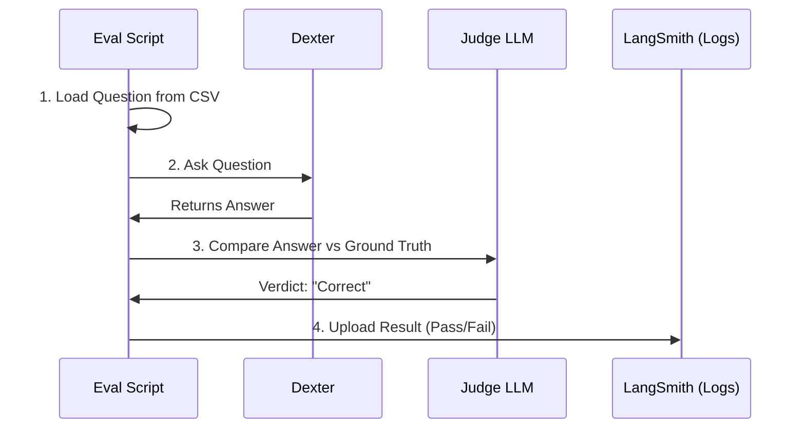

# Chapter 7: Evaluation & Benchmarking

In the previous chapter, [Communication Gateway](06_communication_gateway.md), we connected Dexter to the outside world, allowing users to chat via WhatsApp.

We now have a fully functional agent. But there is a scary question we haven't answered yet:
**Is Dexter actually smart?**

If you change a line of code in the [Financial Data Layer](05_financial_data_layer.md), how do you know you didn't accidentally break the search tool? You can't manually chat with the bot for 5 hours every time you make a change.

This chapter introduces **Evaluation (Evals)**. Think of this as the "Quality Assurance" department or the "Final Exam" that Dexter must pass before going to work.

---

### The Motivation: The Pop Quiz

Imagine you are a teacher. You want to know if your student (Dexter) understands finance.
1.  **Manual Way:** You ask a question. He answers. You nod. You ask another. This takes forever.
2.  **Automated Way:** You give him a written test with 50 questions. You have an Answer Key. You grade it instantly.

In software engineering, we call this **Benchmarking**.
We want to run a script that automatically asks 50 hard financial questions and gives us a score: *Dexter is 92% accurate.*

---

### Key Concepts

To build this system, we need three distinct parts working together.

#### 1. The Dataset (The Test Paper)
A list of questions and the **Ground Truth** (the correct answer).
*   **Question:** "What was Apple's revenue in 2022?"
*   **Ground Truth:** "$394.3 billion."

#### 2. The Target (The Student)
This is our Agent. It takes the question and produces an answer.
*   **Dexter's Answer:** "Apple reported revenue of $394B in 2022."

#### 3. The Judge (The Grader)
Here is the tricky part.
*   **Ground Truth:** "$394.3 billion"
*   **Dexter:** "$394B"

If we use standard code to compare these strings (`string A === string B`), the computer will say **FALSE**. They look different.
But a human knows they are the same.

**Solution:** We use a **Judge LLM**. We ask *another* AI (like GPT-4) to compare the two answers and decide if they match.

---

### Use Case: Grading a Financial Question

Let's look at the flow of a single evaluation.

1.  **Input:** `dataset.csv` contains: *"Who is the CEO of Tesla?"* -> *"Elon Musk"*.
2.  **Dexter Runs:** Uses tools, searches web, replies: *"The CEO is Elon Musk."*
3.  **Judge Runs:** Compares *"Elon Musk"* with *"The CEO is Elon Musk."*
4.  **Result:** Judge returns `Score: 1` (Correct).

---

### Internal Implementation: The Workflow

We implement this in `src/evals/run.ts`. It acts as the coordinator.



---

### The Code: The Target

First, we need a wrapper function that runs Dexter. The evaluation script doesn't care about tools or gateways; it just wants a string back.

```typescript
// src/evals/run.ts

async function target(inputs: { question: string }) {
  // 1. Create a fresh instance of Dexter
  const agent = Agent.create({ model: 'gpt-4', maxIterations: 5 });
  let answer = '';
  
  // 2. Run the agent loop (from Chapter 2)
  for await (const event of agent.run(inputs.question)) {
    if (event.type === 'done') {
      answer = event.answer;
    }
  }
  
  // 3. Return just the text
  return { answer };
}
```
**Explanation:** This creates a clean, isolated version of Dexter for every single question on the test.

---

### The Code: The Judge

This is the most interesting part. We write a prompt for a "Teacher AI" to grade the "Student AI."

```typescript
// src/evals/run.ts

const prompt = `
You are evaluating the correctness of an AI assistant.

Expected Answer: ${expectedAnswer}
Actual Answer: ${actualAnswer}

Evaluate and provide:
- score: 1 if the answer is correct (contains key facts), 0 if incorrect.
`;

async function correctnessEvaluator(actual, expected) {
  // We use a structured LLM call to force it to return a number
  const result = await structuredLlm.invoke(prompt);
  
  return { score: result.score };
}
```
**Explanation:**
We tell the Judge: *"The answer is correct if it conveys the same key information."* This allows Dexter to phrase things differently but still pass the test.

---

### The Code: The Main Loop

Finally, we loop through our dataset (CSV file) and run the test.

```typescript
// src/evals/run.ts

async function* runEvaluation() {
  // 1. Load the "Test Paper"
  const examples = parseCSV(fs.readFileSync('dataset.csv'));

  for (const example of examples) {
    // 2. Student takes the test
    const outputs = await target(example.inputs);

    // 3. Teacher grades the test
    const evalResult = await correctnessEvaluator(
      outputs.answer,         // What Dexter said
      example.outputs.answer  // What the CSV said
    );

    // 4. Report back to the UI
    yield { 
      question: example.inputs.question, 
      score: evalResult.score 
    };
  }
}
```
**Explanation:**
This loop runs automatically. You can start it, go grab a coffee, and come back to see if Dexter passed or failed.

---

### Analyzing Results with LangSmith

In the code, you will notice references to `client.createRun`. We use a tool called **LangSmith** to visualize these results.

Instead of staring at a terminal, LangSmith gives us a dashboard:
*   **Green Rows:** Questions Dexter got right.
*   **Red Rows:** Questions Dexter got wrong.

If you see a lot of Red Rows regarding "Balance Sheets," you know exactly which Skill (Chapter 3) or Tool (Chapter 5) needs fixing!

---

### Summary & Conclusion

In this chapter, we built the **Safety Net**:
1.  **The Target:** Runs the agent in isolation.
2.  **The Judge:** Uses an LLM to grade an LLM.
3.  **The Loop:** Automates the testing process.

### Project Conclusion

**Congratulations!** You have completed the Dexter tutorial.

Let's look back at what you have built:
1.  **[Chapter 1](01_interactive_cli___state_management.md):** A beautiful CLI Dashboard.
2.  **[Chapter 2](02_the_recursive_agent_loop.md):** An autonomous Thinking Loop.
3.  **[Chapter 3](03_skills_system.md):** A logic system driven by Markdown checklists.
4.  **[Chapter 4](04_tool_registry___execution.md):** A system to execute code safely.
5.  **[Chapter 5](05_financial_data_layer.md):** Professional financial data access.
6.  **[Chapter 6](06_communication_gateway.md):** Integration with WhatsApp.
7.  **[Chapter 7](07_evaluation___benchmarking.md):** A rigorous testing framework.

You have moved beyond simple "chatbots" and built a **Cognitive Architecture**. Dexter isn't just predicting the next word; it is reasoning, using tools, following procedures, and correcting its own mistakes.

You are now ready to extend Dexter with new skills, connect it to new platforms, or use this architecture to build completely different types of agents. Good luck!

---

Generated by [Code IQ](https://github.com/adityasoni99/Code-IQ)