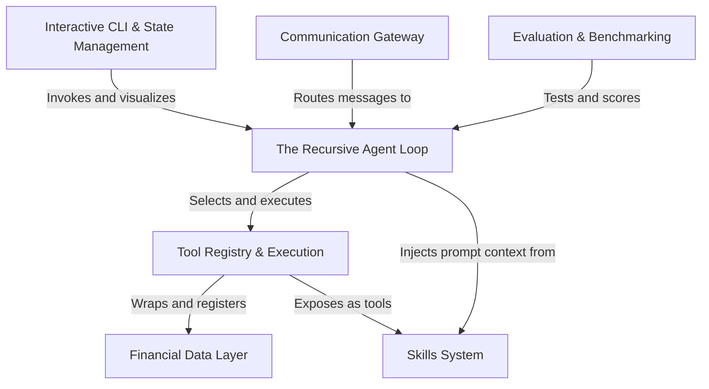

# Tutorial: dexter

**Dexter** is an autonomous *financial research agent* that bridges natural language queries with complex financial data. Instead of a linear script, it uses a **recursive loop** to iteratively "think," select from a registry of specialized **tools** and **skills** (like DCF analysis), and execute actions until a comprehensive answer is found. The system supports interaction via a **CLI** or messaging platforms like **WhatsApp**, backed by a rigorous **benchmarking** framework to ensure accuracy.

**Source Repository:** [https://github.com/virattt/dexter](https://github.com/virattt/dexter)

## Chapters

1. [Interactive CLI & State Management](01_interactive_cli___state_management.md)
2. [The Recursive Agent Loop](02_the_recursive_agent_loop.md)
3. [Skills System](03_skills_system.md)
4. [Tool Registry & Execution](04_tool_registry___execution.md)
5. [Financial Data Layer](05_financial_data_layer.md)
6. [Communication Gateway](06_communication_gateway.md)
7. [Evaluation & Benchmarking](07_evaluation___benchmarking.md)

---

Generated by [Code IQ](https://github.com/adityasoni99/Code-IQ)