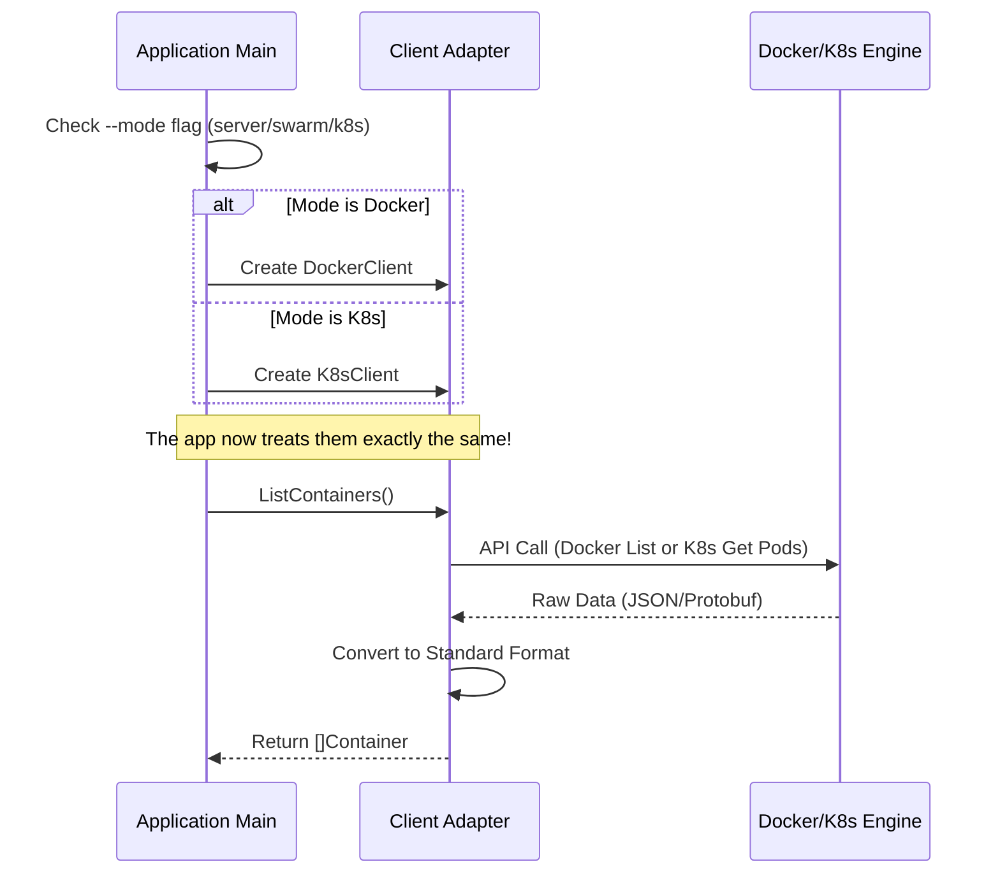

# Chapter 1: Container Client Adapters

Welcome to the first chapter of the **Dozzle** tutorial! 

Dozzle is a real-time log viewer for containers. But "containers" can live in many different places: on your laptop (Docker Desktop), on a remote server, or inside a massive Kubernetes cluster.

Each of these platforms speaks a different "language." Docker uses the Docker API, while Kubernetes uses the K8s API. If we wrote specific code for every single platform throughout the entire app, our code would be a messy tangle of `if/else` statements.

To solve this, we use **Container Client Adapters**.

## The "Universal Translator"

Think of this concept as a **Universal Translator**. 

The core of Dozzle wants to ask a simple question: *"What containers are running right now?"* 

It shouldn't care *how* that question is answered. It just wants a list. The Client Adapter's job is to take that generic question, translate it into the specific language of the underlying platform (Docker or Kubernetes), and return the results in a standard format.

### The Use Case

Imagine you are opening the Dozzle dashboard. 
1. The dashboard needs to show a list of containers on the left sidebar.
2. The application asks the **Client Adapter**: `ListContainers()`.
3. The Adapter talks to the engine (Docker or K8s).
4. The Adapter returns a unified list.

## The Common Interface

To make this work, we define a "Contract" (an Interface). Any platform we support must obey this contract.

Here is a simplified view of what this contract looks like. It doesn't matter if it's Docker or K8s, they both must provide these methods:

```go
// A simplified view of the Client interface
type Client interface {
    // Get a list of all running containers
    ListContainers(ctx context.Context, labels ContainerLabels) ([]Container, error)
    
    // Stream logs from a specific container
    ContainerLogs(ctx context.Context, id string, ...) (io.ReadCloser, error)
    
    // Get stats (CPU/Memory usage)
    ContainerStats(ctx context.Context, id string, ...) error
}
```

> **Beginner Note:** In Go, an `interface` is just a list of method signatures. If a struct (like a Docker Client) implements all these methods, it satisfies the interface.

## Implementation 1: The Docker Adapter

Let's look at how the Docker adapter implements this. It uses the official Docker SDK to talk to the Docker Daemon (usually via a Unix socket file at `/var/run/docker.sock`).

### Creating the Client
In `internal/docker/client.go`, we create a client that knows how to talk to Docker:

```go
// internal/docker/client.go
func NewLocalClient(hostname string) (*DockerClient, error) {
    // Create a connection using environment variables or defaults
    cli, err := client.NewClientWithOpts(
        client.FromEnv, 
        client.WithAPIVersionNegotiation(),
    )
    
    // Return our adapter wrapping the official Docker client
    return NewClient(cli, host), nil
}
```

### Translating "List Containers"
When Dozzle asks to list containers, the Docker adapter translates this into `cli.ContainerList`:

```go
// internal/docker/client.go
func (d *DockerClient) ListContainers(ctx context.Context, labels ...) ([]Container, error) {
    // 1. Call the Docker API
    list, err := d.cli.ContainerList(ctx, docker.ListOptions{All: true})
    
    // 2. Translate Docker-specific format to Dozzle's generic format
    var containers []Container
    for _, c := range list {
        // newContainer normalizes the data
        containers = append(containers, newContainer(c, d.host.ID)) 
    }
    return containers, nil
}
```

## Implementation 2: The Kubernetes Adapter

Now, let's look at Kubernetes. It's completely different under the hood. It doesn't have "containers" as top-level objects; it has "Pods," which contain containers.

### Creating the Client
In `internal/k8s/client.go`, we connect using a `kubeconfig` file or the cluster's internal service token:

```go
// internal/k8s/client.go
func NewK8sClient(namespace []string) (*K8sClient, error) {
    // Build config from flags or in-cluster environment
    config, err := clientcmd.BuildConfigFromFlags("", kubeconfig)
    
    // Create the official Kubernetes clientset
    clientset, err := kubernetes.NewForConfig(config)
    
    return &K8sClient{Clientset: clientset, ...}, nil
}
```

### Translating "List Containers"
When Dozzle asks for containers here, the adapter has to fetch Pods and extract the container information from them:

```go
// internal/k8s/client.go
func (k *K8sClient) ListContainers(ctx context.Context, labels ...) ([]Container, error) {
    // 1. Call K8s API to list Pods
    pods, _ := k.Clientset.CoreV1().Pods(namespace).List(ctx, options)

    var containers []Container
    for _, pod := range pods.Items {
        // 2. Extract containers from the Pod definition
        // podToContainers converts Pod specs into Dozzle containers
        containers = append(containers, podToContainers(&pod)...)
    }
    return containers, nil
}
```

## How It Works: The Flow

Let's visualize what happens when the application starts up and requests data.



### Choosing the Adapter
In `main.go`, the application decides which "translator" to hire based on how you launch Dozzle.

```go
// main.go
if args.Mode == "server" {
    // Connect to Docker
    multiHostService := cli.CreateMultiHostService(certs, args)
    hostService = multiHostService
} else if args.Mode == "k8s" {
    // Connect to Kubernetes
    localClient, _ := k8s.NewK8sClient(args.Namespace)
    clusterService, _ := k8s_support.NewK8sClusterService(localClient)
    hostService = clusterService
}
```

By the time the code reaches `srv := createServer(...)`, the rest of the application doesn't know (or care) if it's running on a laptop or a cloud cluster.

## Why This Matters

1.  **Simplicity:** The frontend web application only needs to handle one data format.
2.  **Extensibility:** If we wanted to support a new system (like Podman directly), we just write a new Adapter. The rest of the app stays the same.
3.  **Testing:** We can create a "Fake" adapter for testing that returns dummy data without needing a real Docker engine running.

## Conclusion

You've learned how Dozzle standardizes communication with different container platforms. By wrapping Docker and Kubernetes APIs into a common **Client Adapter**, the application creates a consistent experience regardless of where it is deployed.

Now that we can fetch lists of containers and connect to them, we need a place to keep track of them efficiently so we aren't spamming the API constantly.

[Next Chapter: In-Memory Container Store](02_in_memory_container_store.md)

---

Generated by [Code IQ](https://github.com/adityasoni99/Code-IQ)