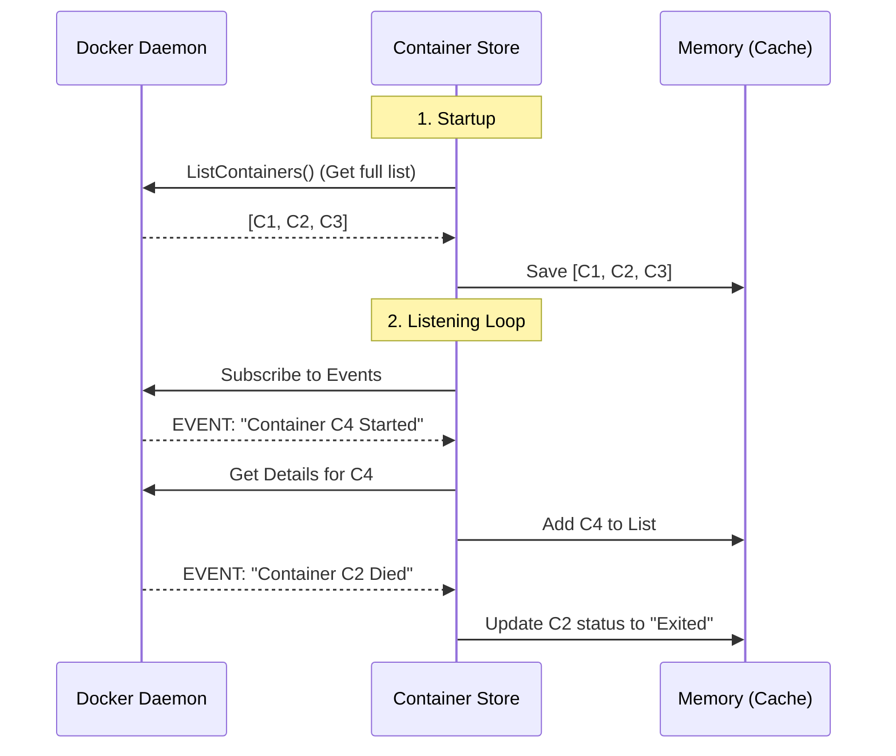

# Chapter 2: In-Memory Container Store

In the previous chapter, [Container Client Adapters](01_container_client_adapters.md), we built a "Universal Translator" that allows Dozzle to speak to both Docker and Kubernetes.

However, asking the Docker engine for a list of containers every single time a user refreshes the page is inefficient. It’s slow, it consumes resources, and it doesn't scale well if multiple users are looking at the dashboard.

In this chapter, we will build the **In-Memory Container Store** to solve this problem.

## The Warehouse Analogy

Imagine a busy warehouse.

*   **The Old Way:** Every time a customer calls to ask, "Do you have red boxes in stock?", the clerk hangs up, walks to the back of the warehouse, counts the boxes, walks back, and calls the customer. This is slow.
*   **The Dozzle Way:** The clerk has a computer screen.
    1.  In the morning, the clerk does **one** full count of the inventory.
    2.  Throughout the day, whenever a truck arrives (Stock In) or leaves (Stock Out), the computer updates the count automatically.
    3.  When a customer calls, the clerk looks at the screen and answers **instantly**.

In Dozzle, the **Container Store** is that computer screen. It acts as a live cache.

## The Problem: API Fatigue

Without a store, the flow looks like this:
1. User loads page.
2. Frontend requests `/api/containers`.
3. Backend calls `docker.ListContainers()`.
4. Docker Daemon calculates the list.
5. Response is sent back.

If 100 users open Dozzle, the Docker Daemon gets hit 100 times. This causes lag.

## The Solution: A Live Cache

The `ContainerStore` sits between the User and the Client Adapter. It keeps a copy of the container list in the application's memory (RAM).

### Key Concepts

1.  **The Cache (Map):** A thread-safe list of containers currently running.
2.  **The Initializer:** When Dozzle starts, it fetches the full list once.
3.  **The Event Listener:** Dozzle subscribes to system events (like `container start`, `container die`).
4.  **The Broadcaster:** When the cache changes, Dozzle notifies the frontend immediately.

## Implementation Details

Let's look at `internal/container/container_store.go`.

### 1. The Structure

At its heart, the store is just a fancy Map (Key-Value pair). We use `xsync.Map` which is a special map designed to be safe when multiple parts of the code try to read or write to it at the same time.

```go
// internal/container/container_store.go

type ContainerStore struct {
    // The "Cache": Maps ContainerID -> Container Struct
    containers *xsync.Map[string, *Container]
    
    // The "Universal Translator" from Chapter 1
    client Client 
    
    // A channel to receive updates from Docker/K8s
    events chan ContainerEvent
}
```

### 2. Initialization

When we create the store, we immediately start a background process (`go s.init()`) to keep it alive.

```go
func NewContainerStore(ctx context.Context, client Client, ...) *ContainerStore {
    s := &ContainerStore{
        containers: xsync.NewMap[string, *Container](),
        client:     client,
        events:     make(chan ContainerEvent),
        // ...
    }
    
    // Start the background brain
    go s.init() 
    return s
}
```

### 3. Answering the User

When the frontend asks for containers, we don't call Docker. We just read our map. This is incredibly fast (microseconds vs milliseconds).

```go
func (s *ContainerStore) ListContainers(labels ContainerLabels) ([]Container, error) {
    containers := make([]Container, 0)
    
    // Iterate over our in-memory map
    s.containers.Range(func(_ string, c *Container) bool {
        containers = append(containers, *c)
        return true
    })

    return containers, nil
}
```

> **Beginner Note:** Because `s.containers` is in memory, this function returns instantly, no matter how slow the Docker engine is running!

## The "Brain": Processing Events

The magic happens in the `init()` method. This runs in an infinite loop, waiting for signals from the system.

Here is the flow of the `ContainerStore` logic:



### The Code: Event Loop

Let's look at how we handle these events in Go. We use a `select` statement to listen for messages on the `events` channel.

```go
// internal/container/container_store.go (Simplified)

func (s *ContainerStore) init() {
    // 1. Initial Fetch (The "Morning Inventory Count")
    s.checkConnectivity() 

    for {
        // 2. Wait for updates (The "Truck arriving at dock")
        select {
        case event := <-s.events:
            switch event.Name {
            case "start":
                // Fetch new container details and add to store
                s.handleStartEvent(event) 
                
            case "die":
                // Update the specific container in the map to "exited"
                s.markContainerAsExited(event.ActorID)
                
            case "destroy":
                // Remove from map completely
                s.containers.Delete(event.ActorID)
            }
        case <-s.ctx.Done():
            return // Stop if app shuts down
        }
    }
}
```

### Handling a Specific Event

When a container dies (stops), we don't need to re-fetch the whole list. We just update that one specific entry in our map.

```go
case "die":
    // Compute updates the map safely
    s.containers.Compute(event.ActorID, func(c *Container, loaded bool) (*Container, op) {
        if loaded {
            // Update the status in memory
            c.State = "exited"
            c.FinishedAt = time.Now()
            return c, xsync.UpdateOp
        }
        return c, xsync.CancelOp
    })
```

## Broadcasting Updates

The `ContainerStore` isn't just a static list; it's reactive. When the store updates its own map, it also needs to tell the frontend, "Hey! The list changed!"

It does this by maintaining a list of **Subscribers**.

```go
func (s *ContainerStore) SubscribeEvents(ctx context.Context, events chan<- ContainerEvent) {
    // Add a channel to the list of subscribers
    s.subscribers.Store(ctx, events)
    
    // Cleanup when the request ends
    go func() {
        <-ctx.Done()
        s.subscribers.Delete(ctx)
    }()
}
```

When an event is processed in the loop above, the store loops through all `s.subscribers` and forwards the event to them.

## Conclusion

By implementing the **In-Memory Container Store**, we have transformed Dozzle from a simple API proxy into a real-time, high-performance application.

1.  **Speed:** We serve lists instantly from RAM.
2.  **Efficiency:** We only bother the Docker Engine when things actually change.
3.  **Reactivity:** We have a foundation to push updates to the browser in real-time.

But simply having the data in memory isn't enough. We are building a *log viewer*. We need a way to capture, process, and stream the logs from these containers efficiently.

[Next Chapter: Log Processing Pipeline](03_log_processing_pipeline.md)

---

Generated by [Code IQ](https://github.com/adityasoni99/Code-IQ)