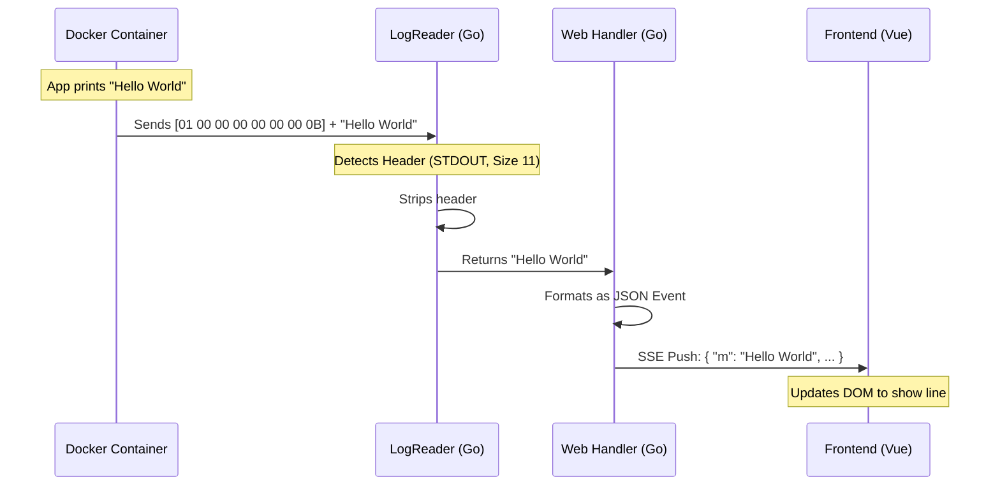

# Chapter 3: Log Processing Pipeline

In the previous chapter, [In-Memory Container Store](02_in_memory_container_store.md), we built a "Warehouse Inventory" system that keeps a real-time list of running containers.

Now that we know *which* containers are running, the user wants to see what's happening inside them. This brings us to the core feature of Dozzle: **Real-time Log Streaming**.

## The "Live TV" Analogy

Streaming logs isn't like downloading a file. It's infinite. As long as the container is running, the data keeps coming.

Think of the **Log Processing Pipeline** like a **Live TV Broadcast Truck**.

1.  **The Source (The Container):** Something is happening live (an application is printing text).
2.  **The Mixer (Log Reader):** The camera cable (Docker API) sends a messy signal. The mixer cleans it up, separating the audio (STDERR) from the video (STDOUT).
3.  **The Broadcast (SSE):** The signal is beamed out over the airwaves.
4.  **The TV (Frontend):** The viewer tunes in and sees the picture immediately.

## The Problem: The "Messy" Signal

You might think reading logs is just reading a text file. But when we ask the [Container Client Adapter](01_container_client_adapters.md) for logs, Docker sends us a **multiplexed binary stream**.

It looks like this:
`[8 bytes of metadata] [The actual log message] [8 bytes of metadata] [Next message...]`

If we just sent this directly to the browser, it would look like gibberish. We need a "Decoder" to strip those 8 bytes and figure out if the message is an error or standard output.

## Solution Part 1: The Log Reader (The Decoder)

Located in `internal/docker/log_reader.go`, the `LogReader` is responsible for reading the raw stream byte-by-byte.

### Reading the Header
Every message from Docker starts with an 8-byte header.
1.  **Byte 1:** Stream Type (1 = STDOUT, 2 = STDERR).
2.  **Bytes 2-4:** Empty padding.
3.  **Bytes 5-8:** The size of the message.

Here is how the code handles this logic (simplified):

```go
// internal/docker/log_reader.go

func (d *LogReader) readEvent() (string, StdType, error) {
    header := make([]byte, 8)
    
    // 1. Read exactly 8 bytes to get the header
    _, err := io.ReadFull(d.reader, header)
    if err != nil {
        return "", 0, err
    }

    // 2. Determine if it is STDOUT (1) or STDERR (2)
    // header[0] contains the stream type
    streamType := header[0] 

    // 3. Calculate message size (bytes 4-7)
    count := binary.BigEndian.Uint32(header[4:])

    // ... (next step: read 'count' bytes of the actual message)
}
```

> **Beginner Note:** `io.ReadFull` pauses the program until it gets exactly 8 bytes. This effectively waits for the container to say something.

## Solution Part 2: The Broadcast (SSE)

Once we have a clean string, we need to send it to the browser. Standard HTTP requests (like loading a webpage) close the connection once the data is sent.

For live logs, we use **Server-Sent Events (SSE)**. This keeps the HTTP connection open indefinitely, allowing the backend to "push" new log lines whenever they appear.

### The Streaming Loop
In `internal/web/logs.go`, we set up an infinite loop that waits for data and pushes it to the `sseWriter`.

```go
// internal/web/logs.go (Simplified)

func (h *handler) streamLogsForContainers(w http.ResponseWriter, ...) {
    // 1. Setup the SSE connection (keep-alive)
    sseWriter, _ := support_web.NewSSEWriter(r.Context(), w, r)

    // 2. Start the infinite loop
    for {
        select {
        case logEvent := <-liveLogs:
            // A new log line arrived!
            // Send it to the browser immediately
            sseWriter.Message(logEvent)

        case <-r.Context().Done():
            // User closed the tab, stop the loop
            return 
        }
    }
}
```

## Solution Part 3: The Viewer (Frontend)

The frontend needs to tune into this broadcast. In JavaScript/TypeScript, we use the `EventSource` API. This connects to our Go backend and listens for messages.

This logic is found in `assets/composable/eventStreams.ts`.

```typescript
// assets/composable/eventStreams.ts

function connect() {
    // 1. Dial the backend URL
    const es = new EventSource("/api/containers/123/logs/stream");

    // 2. Listen for messages
    es.onmessage = (e) => {
        // Parse the JSON data from Go
        const logEntry = JSON.parse(e.data);
        
        // Add it to our frontend buffer array
        buffer.value.push(logEntry);
    };
}
```

## The Data Flow Diagram

Let's visualize the entire journey of a single log line, from the container to your screen.



## Internal Implementation: Handling History vs. Live

When you open Dozzle, you don't just want to see what happens *now*. You also want to see what happened 5 minutes ago.

The pipeline handles this in two phases:

1.  **Backfill (History):** We ask Docker for the last 300 logs. These are sent quickly in a batch.
2.  **Streaming (Live):** We keep the connection open and wait for new logs.

### Go Implementation Detail

In `internal/web/logs.go`, we use Go routines (background threads) to manage this.

```go
// internal/web/logs.go

// Start a background thread to read logs
go func(c container.Container) {
    // Determine where to start reading from (e.g., 5 mins ago)
    start := time.Now().Add(-5 * time.Minute)
    
    // Call the Client Adapter to start the stream
    // 'liveLogs' is a channel (pipe) where logs will land
    containerService.StreamLogs(ctx, start, stdTypes, liveLogs)
}(container)
```

This design is powerful because it allows Dozzle to merge logs from **multiple containers** into one screen. We just start multiple Go routines (one for each container), and they all funnel their logs into the single `liveLogs` channel!

## Conclusion

The **Log Processing Pipeline** is the bridge between the raw, binary world of container runtimes and the user-friendly web interface.

1.  It **decodes** the custom headers used by Docker.
2.  It **streams** data continuously using SSE.
3.  It **merges** historical data with live data.

Now that we have a stream of data coming in, how do we ensure the right user sees the right logs? We need to route these requests to the correct handlers.

[Next Chapter: Web Request Router & SSE](04_web_request_router___sse.md)

---

Generated by [Code IQ](https://github.com/adityasoni99/Code-IQ)