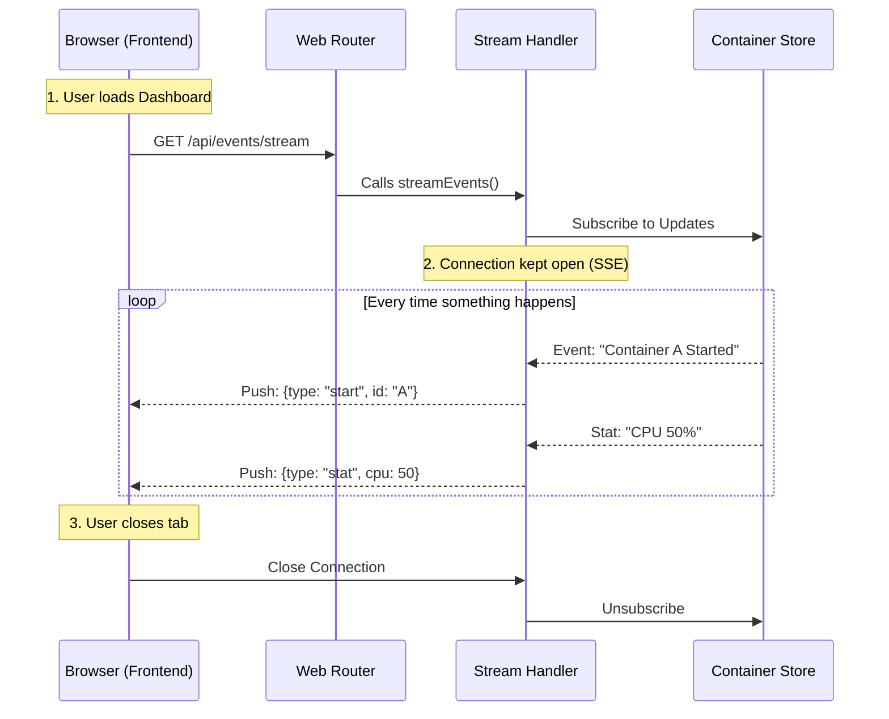

# Chapter 4: Web Request Router & SSE

In the previous chapter, [Log Processing Pipeline](03_log_processing_pipeline.md), we learned how to extract, clean, and stream logs from deep inside the container engine.

But right now, that data is just sitting inside our Go application. We need a way to deliver it to the user's browser.

In this chapter, we will build the **Web Request Router** and implement **Server-Sent Events (SSE)**. This layer acts as the bridge between the user interface and the internal logic of Dozzle.

## The Problem: Connecting the Browser to the Backend

Imagine you are running a busy restaurant kitchen (the backend). You have chefs cooking (Log Processing) and a manager tracking inventory (Container Store).

However, you have customers (the Frontend) sitting in the dining room.
1.  **Ordering:** They need a way to request things ("Give me the list of containers").
2.  **Updates:** If the "Special of the Day" changes, you want to announce it to the whole room instantly, without every single customer asking "Is the menu changed?" every 5 seconds.

## Concept 1: The Traffic Controller (The Router)

The **Router** is the entry point for all traffic. When a browser requests a URL like `http://localhost:8080/api/containers`, the Router decides which Go function should handle that request.

In Dozzle, we use a library called `chi`. It allows us to organize URLs into neat groups.

### Defining Routes
In `internal/web/routes.go`, we define the map of the world.

```go
// internal/web/routes.go (Simplified)
func createRouter(h *handler) *chi.Mux {
    r := chi.NewRouter()

    // Group all API calls under "/api"
    r.Route("/api", func(r chi.Router) {
        
        // If a user asks for events, start the stream
        r.Get("/events/stream", h.streamEvents)

        // If a user wants to download logs
        r.Get("/containers/{id}/download", h.downloadLogs)
    })

    return r
}
```

> **Beginner Note:** `r.Get` means "Listen for HTTP GET requests". The second argument is the function that actually does the work.

## Concept 2: The Ticker Tape (SSE)

Standard HTTP requests are short-lived:
*   **Browser:** "Give me the page."
*   **Server:** "Here is the page."
*   **Connection:** *Closed.*

This works for loading the site, but it fails for **Logs** and **Status Updates**. Logs are infinite!

We use **Server-Sent Events (SSE)**.
*   **Browser:** "I'm listening for updates."
*   **Server:** "Okay, keeping the line open..."
*   *(Time passes)*
*   **Server:** "New Log Line!"
*   **Server:** "Container X just stopped!"

This is like a stock ticker tape running at the bottom of a TV screen.

## Implementation: The Event Stream

Let's look at how we implement the "Ticker Tape" in `internal/web/events.go`. This is one of the most important functions in the entire app: `streamEvents`.

### Step 1: Establish the Connection
When the frontend calls `/api/events/stream`, we wrap the standard HTTP writer with an SSE Writer.

```go
// internal/web/events.go
func (h *handler) streamEvents(w http.ResponseWriter, r *http.Request) {
    // Upgrade the connection to support SSE
    sseWriter, err := support_web.NewSSEWriter(r.Context(), w, r)
    if err != nil {
        http.Error(w, err.Error(), 500)
        return
    }
    // Ensure we close the connection when the function exits
    defer sseWriter.Close()
```

### Step 2: Subscribe to Internal Updates
Remember the [In-Memory Container Store](02_in_memory_container_store.md)? We need to ask it to notify us whenever something changes.

```go
    // Create channels (pipes) to receive data
    events := make(chan container.ContainerEvent)
    stats := make(chan container.ContainerStat)

    // Tell the HostService: "Send any new events to these channels"
    h.hostService.SubscribeEventsAndStats(r.Context(), events, stats)
```

### Step 3: The Infinite Loop
Now, the function enters an infinite loop. It sits and waits. When data arrives on a channel, it instantly pushes it to the browser.

```go
    for {
        select {
        // Case A: A container changed state (e.g., died or started)
        case event := <-events:
            // Send JSON message to browser: type="container-event"
            sseWriter.Event("container-event", event)

        // Case B: New CPU/Memory stats arrived
        case stat := <-stats:
            sseWriter.Event("container-stat", stat)

        // Case C: The user closed the browser tab
        case <-r.Context().Done():
            return // Stop the loop
        }
    }
}
```

## How It Works: The Flow

Let's visualize what happens when you open the Dozzle dashboard.



## Handling Specific Actions

While SSE handles the *streaming* data, the Router also handles specific commands, like telling a container to stop or restart.

In `internal/web/routes.go`, we defined:
`r.Post("/hosts/{host}/containers/{id}/actions/{action}", h.containerActions)`

When the user clicks "Restart", the Frontend sends a POST request. The router sends it to `h.containerActions`.

```go
// Simplified view of an action handler
func (h *handler) containerActions(w http.ResponseWriter, r *http.Request) {
    action := chi.URLParam(r, "action") // e.g., "restart"
    id := chi.URLParam(r, "id")         // e.g., "a1b2c3d4"

    // Call the internal service to perform the action
    err := h.hostService.ContainerAction(action, id)
    
    if err != nil {
        http.Error(w, err.Error(), 500)
    }
}
```

## Why Separate Routes and Streams?

You might wonder why we don't do everything over one connection.

1.  **Streams (SSE)** are for **reading** live data (Logs, Stats, Status).
2.  **REST Routes (GET/POST)** are for **control** (Restarting, Downloading files).

This separation keeps the application architecture clean. If the stream disconnects, the buttons to restart a container still work via standard HTTP.

## Conclusion

We have successfully exposed our internal application to the outside world!

1.  The **Router** acts as the receptionist, directing traffic to the right place.
2.  **REST Endpoints** handle specific tasks like "Restart Container".
3.  **SSE (Server-Sent Events)** creates a live data pipe to push stats and logs to the browser in real-time.

Now that the backend is pushing all this exciting data, we need a way for the Frontend to catch it, store it, and display it without freezing the user's browser.

[Next Chapter: Frontend State Management (Pinia)](05_frontend_state_management__pinia_.md)

---

Generated by [Code IQ](https://github.com/adityasoni99/Code-IQ)