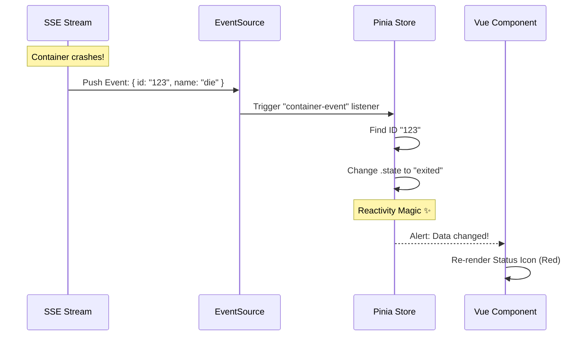

# Chapter 5: Frontend State Management (Pinia)

In the previous chapter, [Web Request Router & SSE](04_web_request_router___sse.md), we built a high-speed data pipeline. The backend is now broadcasting real-time updates about containers using Server-Sent Events (SSE).

However, broadcasting data is only half the battle. We need something in the browser to *catch* that data, organize it, and display it to the user.

In this chapter, we will build the **Frontend State Management** system using **Pinia**.

## The Dashboard Analogy

Think of Dozzle like a modern car's dashboard.
*   **The Backend (Engine):** Generates raw data (RPM, Speed, Fuel Level).
*   **The Store (Car Computer):** Receives the raw signals and processes them into meaningful numbers.
*   **The UI (Gauges):** Displays the numbers.

If the engine speeds up, the computer updates the value, and the speedometer needle moves instantly. The needle doesn't need to ask the engine "How fast are we?" every second. It just reacts to the computer.

## The Problem: Keeping UI in Sync

Without a central store, our application would be chaotic.

Imagine we have three components on the screen:
1.  **Sidebar:** Lists container names.
2.  **Main Area:** Shows CPU usage graphs.
3.  **Header:** Shows the total number of running containers.

If a container stops, the Backend sends *one* message. Without a store, we would have to manually tell the Sidebar to delete the name, the Main Area to stop the graph, and the Header to subtract 1. This is messy and bug-prone.

## The Solution: The Single Source of Truth

We use **Pinia**, the official state management library for Vue.js.

Pinia acts as a "Single Source of Truth."
1.  All components look at the **Store**.
2.  When data arrives from the backend, we only update the **Store**.
3.  Because the Store is "reactive," every component looking at it updates **automatically**.

## Step 1: Defining the Store

In `assets/stores/container.ts`, we define our store. It's essentially a smart container for our variables.

### The State (The Data)
We need a list to hold our containers. In Vue/Pinia, we use `ref` to make this list reactive.

```typescript
// assets/stores/container.ts
export const useContainerStore = defineStore("container", () => {
  // This is our database in the browser's memory
  const containers = ref<Container[]>([]);
  
  // A flag to know if we are connected to the backend
  const ready = ref(false);

  return { containers, ready };
});
```
> **Beginner Note:** `ref([])` creates a special array. When you modify this array, Vue automatically detects the change and updates the HTML of the webpage.

## Step 2: Connecting the Pipe

Now we need to plug the Store into the SSE stream we created in the previous chapter. We use the browser's native `EventSource` API.

Inside the store, we create a `connect()` function:

```typescript
// assets/stores/container.ts
function connect() {
    // Connect to the route we defined in Chapter 4
    const es = new EventSource("/api/events/stream");

    // When the connection opens, clear the list
    es.onopen = () => {
        containers.value = [];
        ready.value = true;
    };
    
    // ... listeners go here
}
```

## Step 3: Listening for Events

The backend sends different types of events (e.g., "container-event", "container-stat"). We add listeners for each one.

### Handling Status Changes
When a container starts or dies, the backend sends a `container-event`.

```typescript
// assets/stores/container.ts
es.addEventListener("container-event", (e) => {
    // 1. Parse the text data from the backend into an Object
    const event = JSON.parse(e.data);
    
    // 2. Find the specific container in our list
    const container = findContainerById(event.actorId);
    
    // 3. Update its state (e.g., "running" -> "exited")
    if (container) {
        container.state = event.name === "die" ? "exited" : "running";
    }
});
```

Because `container` is part of our reactive list, changing `.state` here immediately turns the status icon from Green to Red on the screen!

## Step 4: Computed Properties (Smart Filters)

Sometimes the UI needs a filtered version of the data. For example, "Show me only running containers."

Instead of creating a new list, we use `computed`.

```typescript
// assets/stores/container.ts
const visibleContainers = computed(() => {
    // This function runs automatically whenever 'containers' changes
    return containers.value.filter(c => c.state === "running");
});
```

## How It Works: The Flow

Let's visualize the data flow from the moment a container crashes to the moment the user sees it.



## Implementation: Using the Store in Components

Now let's look at how a UI component uses this. Open `assets/pages/index.vue`.

The component doesn't care about WebSockets, APIs, or JSON parsing. It just asks the store for data.

```vue
<!-- assets/pages/index.vue -->
<script setup lang="ts">
// 1. Get access to the store
const containerStore = useContainerStore();

// 2. Extract the reactive list of containers
const { containers } = storeToRefs(containerStore);

// 3. Create a simple count for the header
const runningCount = computed(() => 
    containers.value.filter(c => c.state === "running").length
);
</script>

<template>
  <!-- 4. Use the data directly in HTML -->
  <h1>Running: {{ runningCount }}</h1>
  
  <!-- Pass the data to the table component -->
  <ContainerTable :containers="containers" />
</template>
```

## Deep Dive: The Container Table

In `assets/components/ContainerTable.vue`, we display the data. Notice how cleaner the code is because the complex logic is hidden in the Store.

```vue
<!-- assets/components/ContainerTable.vue -->
<template>
  <table>
    <tr v-for="container in containers" :key="container.id">
      <!-- We just read properties. If they change, this text changes. -->
      <td>{{ container.name }}</td>
      <td>{{ container.state }}</td>
      <td>
          <!-- Even complex objects like CPU stats update live -->
          <ContainerStatCell :container="container" type="cpu" />
      </td>
    </tr>
  </table>
</template>
```

## Why This Matters

1.  **Performance:** We only parse the JSON message once in the Store, not in every component.
2.  **Simplicity:** The UI components are "dumb." They just display what they are told.
3.  **Real-Time:** The user doesn't have to refresh the page. The `EventSource` keeps the Store fresh, and the Store keeps the UI fresh.

## Conclusion

You have successfully built the brain of the frontend! 
*   We created a **Pinia Store** to hold our application state.
*   We connected it to the **SSE Stream** from the backend.
*   We wired up our **Vue Components** to react automatically to changes.

Now our dashboard is alive. But currently, it's "Read-Only." We can see what containers are doing, but we can't control them. In the next chapter, we will learn how to send commands back to the server to restart or stop containers.

[Next Chapter: Agent & RPC System](06_agent___rpc_system.md)

---

Generated by [Code IQ](https://github.com/adityasoni99/Code-IQ)