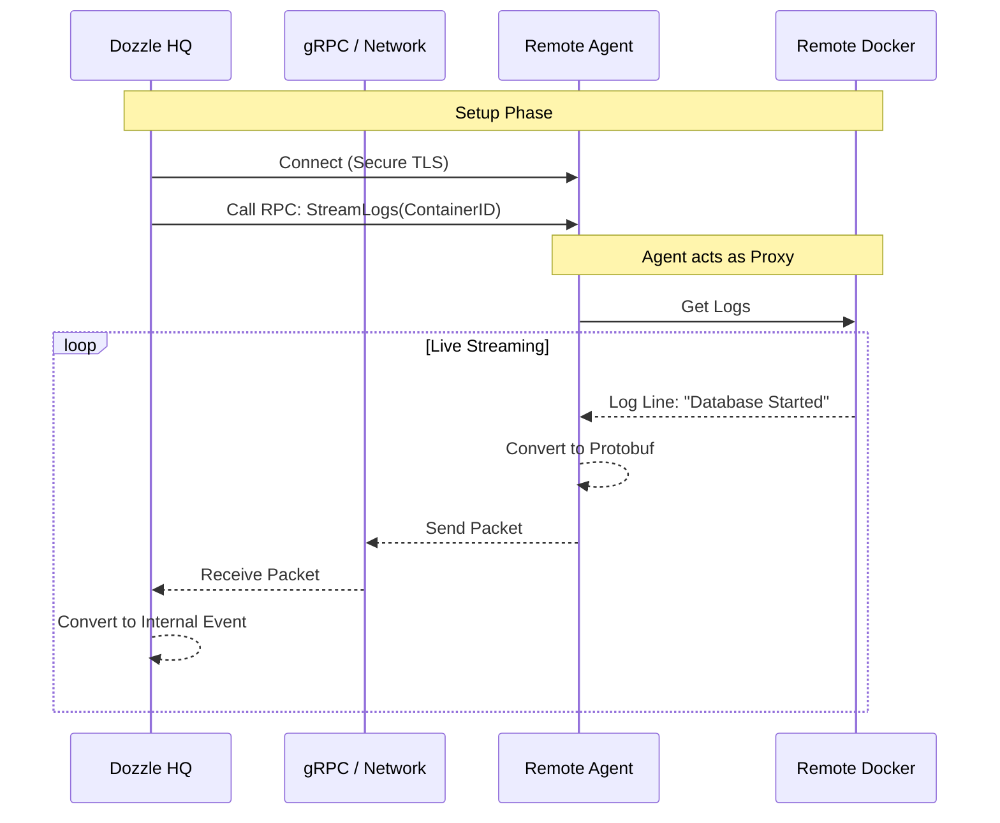

# Chapter 6: Agent & RPC System

In the previous chapter, [Frontend State Management (Pinia)](05_frontend_state_management__pinia_.md), we completed the frontend loop, allowing the browser to react instantly to changes on a single server.

But what if your infrastructure isn't just one computer? What if you have a Web Server in New York, a Database Server in London, and a Backup Server in Tokyo? Opening three different tabs to monitor them is tedious.

In this chapter, we explore the **Agent & RPC System**. This allows a central Dozzle instance to connect to multiple remote machines, gathering logs and stats into one unified dashboard.

## The Newsroom Analogy

To understand this architecture, think of a TV News Network.

*   **The Newsroom (Central Server):** This is the headquarters. The producers sit here. They can't see what is happening in London personally.
*   **The Field Reporter (Agent):** This is a person standing in London with a camera. They see the event (Local Docker Container) and transmit the footage back to HQ.
*   **The Satellite Link (gRPC):** This is the high-speed, secure connection used to send that footage.

In Dozzle:
1.  You run the **Agent** on your remote servers.
2.  The Agent talks to the local Docker Engine (using the [Container Client Adapters](01_container_client_adapters.md) from Chapter 1).
3.  The Agent streams the data back to the **Central Server** using **gRPC**.

## Concept 1: The Contract (Protobuf)

Before two computers can talk, they need to agree on a language. Dozzle uses **Protocol Buffers** (Protobuf). We define a "Contract" in a `.proto` file. This file describes exactly what functions the Agent must provide.

Located in `protos/rpc.proto`, this is the heart of the system.

```protobuf
// protos/rpc.proto (Simplified)
syntax = "proto3";

service AgentService {
  // "Hey Agent, give me a list of containers"
  rpc ListContainers(ListContainersRequest) returns (ListContainersResponse) {}

  // "Hey Agent, keep sending me log lines for this container"
  rpc StreamLogs(StreamLogsRequest) returns (stream StreamLogsResponse) {}
}
```

> **Beginner Note:** `rpc` stands for **Remote Procedure Call**. It means "Running a function on someone else's computer." The keyword `stream` means the connection stays open, and data keeps flowing (like a video call).

## Concept 2: The Field Reporter (The Agent)

The Agent is a small program that runs on the remote machine. It doesn't have a UI. Its only job is to listen for commands from the HQ and execute them.

It implements the "Contract" we defined above. Let's look at `internal/agent/server.go`.

### Starting the Stream
When the HQ asks for logs, the Agent calls its local Docker Adapter and pipes the results into the network connection.

```go
// internal/agent/server.go
func (s *server) StreamLogs(in *pb.StreamLogsRequest, out pb.AgentService_StreamLogsServer) error {
    // 1. Find the container on this local machine
    c, _ := s.service.FindContainer(out.Context(), in.ContainerId, ...)

    // 2. Create a channel to receive logs from Docker
    events := make(chan *container.LogEvent)
    
    // 3. Start reading Docker logs in background
    go s.service.StreamLogs(out.Context(), c, ..., events)

    // ... (continued below)
```

### Transmitting Data
As logs arrive from Docker, the Agent wraps them in a Protobuf message and sends them over the wire.

```go
    // 4. Loop through events as they happen
    for event := range events {
        // 5. Send to HQ via gRPC
        out.Send(&pb.StreamLogsResponse{
            Event: logEventToPb(event), // Convert to Protobuf format
        })
    }

    return nil
}
```

## Concept 3: The Newsroom (The Client)

Back at HQ (the main Dozzle instance), we need a way to talk to these agents. We create a **gRPC Client**.

This code, found in `internal/agent/client.go`, acts like a translator. It takes Dozzle's internal commands and converts them into gRPC calls.

```go
// internal/agent/client.go
func (c *Client) StreamContainerLogs(ctx context.Context, id string, ..., events chan<- *container.LogEvent) error {
    // 1. Call the remote Agent
    stream, err := c.client.StreamLogs(ctx, &pb.StreamLogsRequest{
        ContainerId: id,
        // ... params
    })

    // 2. Process the incoming stream
    return sendLogs(stream, events)
}
```

## The Flow: How It Connects

Let's visualize the journey of a log message from a remote server to your screen.



## Internal Implementation: Handling Types

One challenge with gRPC is that it requires strict typing, but logs can be messy (text, JSON, complex objects).

To solve this, we use a helper to convert our internal `LogEvent` into a `pb.LogEvent` (Protobuf Log Event).

### converting to Protobuf
In `internal/agent/server.go`:

```go
func logEventToPb(event *container.LogEvent) *pb.LogEvent {
    // We use "Any" or specific types to handle different log formats
    return &pb.LogEvent{
        ContainerId: event.ContainerID,
        Timestamp:   timestamppb.New(time.Unix(event.Timestamp, 0)),
        RawMessage:  string(event.RawMessage),
        // ... mapping other fields
    }
}
```

### Security: The Badge

You can't just let anyone walk into a Newsroom, and you can't let just anyone connect to your Agent. That would give them root access to your logs!

Dozzle uses **mTLS (Mutual TLS)**.
1.  **The Server** has a certificate (ID Badge).
2.  **The Agent** has a certificate.
3.  They verify each other before exchanging a single byte of data.

In `internal/support/cli/agent_command.go`, we enforce this:

```go
// internal/support/cli/agent_command.go
func (a *AgentCmd) Run(...) error {
    // Load certificates from disk
    certs, _ := ReadCertificates(..., args.CertPath, args.KeyPath)

    // Create the secure server
    server, _ := agent.NewServer(clientService, certs, ...)
    
    // Listen on TCP port (default :7007)
    listener, _ := net.Listen("tcp", args.Agent.Addr)
    
    return server.Serve(listener)
}
```

## How This Fits the Big Picture

Remember the **Client Adapter** interface from [Chapter 1](01_container_client_adapters.md)? 

The genius of Dozzle's design is that the **Agent Client** (running on HQ) implements the *exact same interface* as the **Local Docker Client**.

To the rest of the application (The Store, The UI), it doesn't matter if the logs are coming from `localhost` or a server in Tokyo. They just call `ListContainers()`.

*   If Local: `Dozzle -> Docker Socket`
*   If Remote: `Dozzle -> gRPC Client -> Network -> gRPC Server -> Docker Socket`

## Conclusion

We have successfully scaled our application! 

*   We defined a **Contract** using Protobuf.
*   We built an **Agent** to gather data remotely.
*   We built a **Client** to stream that data back to HQ.

Your Dozzle instance can now monitor an entire fleet of servers. However, staring at logs all day is tiring. What if a container crashes while you are asleep? You need to be alerted.

[Next Chapter: Notification Manager](07_notification_manager.md)

---

Generated by [Code IQ](https://github.com/adityasoni99/Code-IQ)