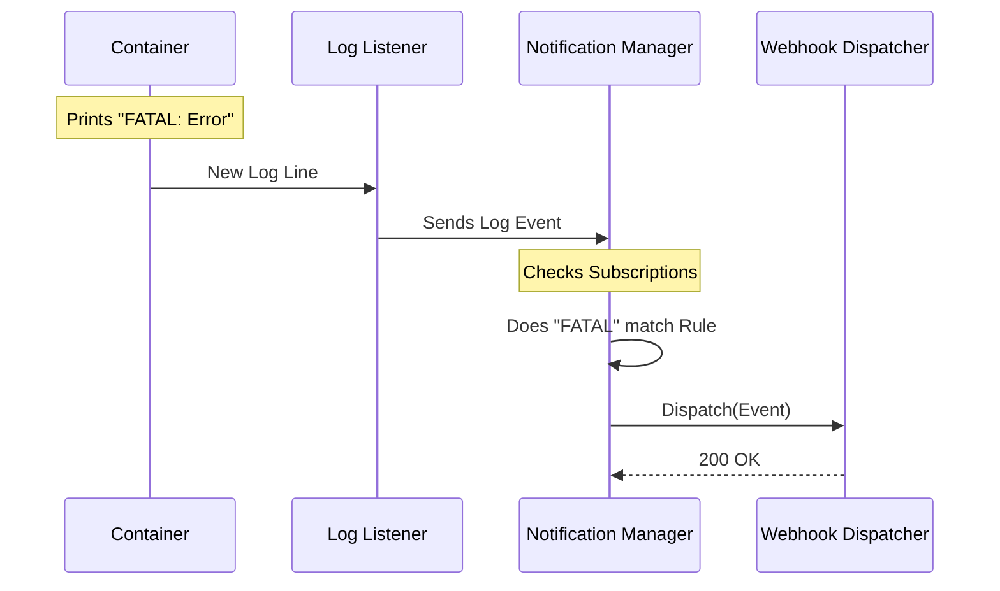

# Chapter 7: Notification Manager

Welcome to the final chapter of the **Dozzle** tutorial!

In the previous chapter, [Agent & RPC System](06_agent___rpc_system.md), we scaled our application to monitor multiple servers from a single dashboard. We can now see logs from Tokyo, New York, and London all in one place.

But there is still one problem: **You have to be looking at the screen.**

If a critical database crashes at 3:00 AM, looking at a dashboard the next morning is too late. We need a system that watches the logs for us and taps us on the shoulder when something goes wrong.

In this chapter, we will build the **Notification Manager**.

## The Security Guard Analogy

Think of the Notification Manager as a **Security Guard** in a room full of CCTV monitors.

1.  **The Monitors (Logs/Stats):** The streams of data coming from your containers.
2.  **The "Wanted" List (Subscriptions):** A list of specific things to look for (e.g., "Panic", "Error", "CPU > 90%").
3.  **The Phone (Dispatcher):** The method used to alert the owner (e.g., Email, Slack, Discord).

The Guard (Manager) watches the monitors. If they see an image that matches the "Wanted" list, they pick up the phone and call you.

## Use Case: The "Database Crash" Alert

Let's imagine a concrete scenario. You have a Postgres container. If the log ever prints `FATAL: connection failed`, you want a message sent to your **Discord** channel immediately.

To make this happen, we need three parts working together:
1.  **The Dispatcher:** Knows *how* to send the message.
2.  **The Subscription:** Knows *what* to look for.
3.  **The Manager:** Connects the two.

## Concept 1: The Dispatcher (The Phone)

A Dispatcher is a simple plugin that knows how to talk to external services. It could be an Email sender, a Slack bot, or a generic Webhook.

In Dozzle, we treat dispatchers as interchangeable parts.

```go
// internal/notification/dispatcher/interface.go (Simplified)
type Dispatcher interface {
    // Send a message with some details
    Send(ctx context.Context, event Event) error
}
```

If we want to add Discord support, we just configure a `WebhookDispatcher`. It doesn't care *why* it's sending a message; it just delivers it.

## Concept 2: The Subscription (The Rules)

This is the brain of the operation. A subscription tells Dozzle exactly what to filter.

It uses a powerful expression language (Regex-like) to define the rules.

*   **Container Logic:** `container.Name startsWith "postgres"`
*   **Log Logic:** `log.Message contains "FATAL"`
*   **Action:** Use Dispatcher #1.

## Concept 3: The Manager (The Guard)

Now let's look at the implementation of the `Manager` in `internal/notification/manager.go`. This struct holds everything together.

### The Structure

```go
// internal/notification/manager.go
type Manager struct {
    // Map of ID -> Subscription (The Rules)
    subscriptions *xsync.Map[int, *Subscription]
    
    // Map of ID -> Dispatcher (The Output Channels)
    dispatchers   *xsync.Map[int, dispatcher.Dispatcher]
    
    // The eyes that watch the logs
    listener      *ContainerLogListener
}
```

The Manager creates a bridge between the **Log Listener** (which receives raw text) and the **Dispatchers**.

### 1. Starting the Watch

When the application starts, we create the Manager and tell it to start processing events in the background.

```go
// internal/notification/manager.go
func NewManager(listener *ContainerLogListener, ...) *Manager {
    m := &Manager{
        subscriptions: xsync.NewMap[int, *Subscription](),
        // ... initialize maps
    }

    // Start the background thread (The Guard takes their post)
    go m.processLogEvents()

    return m
}
```

> **Beginner Note:** `go m.processLogEvents()` starts a "Goroutine." This is like hiring the security guard to work in a separate room so they don't block the main hallway (the rest of the app).

### 2. Adding a "Wanted" Item (Subscription)

When a user creates a new alert via the UI, we call `AddSubscription`.

This function doesn't just save the rule; it **compiles** it. We use a library called `expr` to turn the text string `"log.Message contains 'Error'"` into a fast, executable program.

```go
// internal/notification/manager.go
func (m *Manager) AddSubscription(sub *Subscription) error {
    // 1. Assign a unique ID
    sub.ID = int(m.subscriptionCounter.Add(1))
    
    // 2. Compile the text rules into executable code for speed
    if err := sub.CompileExpressions(); err != nil {
        return err
    }

    // 3. Store it safely in the map
    m.subscriptions.Store(sub.ID, sub)
    
    // 4. Update the listener to look for new things
    m.updateListeners()
    
    return nil
}
```

### 3. Filtering Noise

Monitoring every single log line from every single container is expensive (high CPU usage). We want to filter things out as early as possible.

The Manager asks: *"Does any subscription care about THIS specific container?"*

```go
// internal/notification/manager.go
func (m *Manager) ShouldListenToContainer(c container.Container) bool {
    shouldListen := false
    
    // Loop through all subscriptions
    m.subscriptions.Range(func(_ int, sub *Subscription) bool {
        // Check if the container matches the rule (e.g., Name == "postgres")
        if sub.MatchesContainer(c) {
            shouldListen = true
            return false // Stop looking, we found a match!
        }
        return true
    })
    
    return shouldListen
}
```

If this returns `false`, the Security Guard ignores that monitor completely, saving energy.

## Internal Flow: Processing an Alert

Let's visualize exactly what happens when your database crashes.



## Configuring Dispatchers

Managing the output channels (Dispatchers) is similar to managing subscriptions. We can Add, Update, or Remove them.

The code exposes a way to list them for the UI, hiding sensitive details (like API keys) if necessary, but showing enough to identify them.

```go
// internal/notification/manager.go
func (m *Manager) Dispatchers() []DispatcherConfig {
    result := make([]DispatcherConfig, 0)
    
    m.dispatchers.Range(func(id int, d dispatcher.Dispatcher) bool {
        // Convert the internal struct to a safe config object
        // This is what the Frontend will see
        result = append(result, DispatcherConfig{
            ID:   id,
            Type: "webhook", // or "slack", "email"
            URL:  d.URL,
        })
        return true
    })
    
    return result
}
```

## Smart Features: Cooldowns

One common problem with automated alerts is **Spam**. 

If your database fails, it might print `FATAL ERROR` 50 times a second. You do not want 50 Discord notifications per second.

The Subscription struct (inside the Manager) handles **Cooldowns**.
1.  Alert triggers.
2.  Manager checks `LastTriggered` timestamp.
3.  If it was less than 5 minutes ago, **ignore it**.
4.  If it was more than 5 minutes ago, **send alert** and update timestamp.

## Conclusion

You have now completed the Dozzle Architecture Tutorial!

In this final chapter, we built a **Notification Manager** that turns Dozzle from a passive viewer into an active monitor.

Let's recap the entire journey:
1.  **[Adapters](01_container_client_adapters.md):** We learned to speak to Docker and Kubernetes.
2.  **[Store](02_in_memory_container_store.md):** We cached the state to be fast.
3.  **[Pipeline](03_log_processing_pipeline.md):** We processed infinite streams of logs.
4.  **[Router & SSE](04_web_request_router___sse.md):** We pushed that data to the browser.
5.  **[Pinia](05_frontend_state_management__pinia_.md):** We made the UI reactive.
6.  **[Agents](06_agent___rpc_system.md):** We connected remote servers.
7.  **Notifications:** We automated the monitoring process.

You now understand the internal architecture of a modern, real-time observability tool. Whether you are contributing to Dozzle or building your own system, these patterns—Adapters, Stores, Event Streams, and Managers—are universal building blocks of robust software.

**Happy Coding!**

---

Generated by [Code IQ](https://github.com/adityasoni99/Code-IQ)