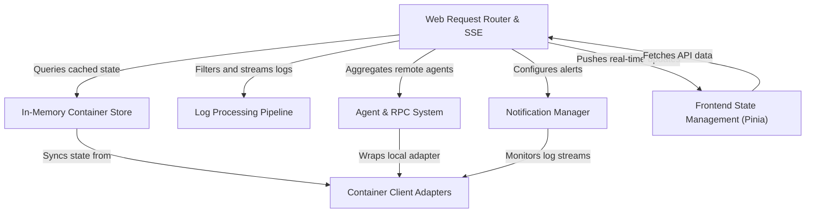

# Tutorial: dozzle

Dozzle is a real-time **log viewer** for Docker containers that provides a modern, responsive web interface. It acts as a **Universal Translator** for container metrics and logs, supporting local Docker instances, Swarm clusters, and Kubernetes, while using an **intelligent caching system** to minimize load on the container runtime. The architecture allows for multi-host monitoring via **remote agents**, real-time updates via **Server-Sent Events (SSE)**, and automated alerting through a built-in **notification manager**.

**Source Repository:** [https://github.com/amir20/dozzle](https://github.com/amir20/dozzle)

## Chapters

1. [Container Client Adapters](01_container_client_adapters.md)
2. [In-Memory Container Store](02_in_memory_container_store.md)
3. [Log Processing Pipeline](03_log_processing_pipeline.md)
4. [Web Request Router & SSE](04_web_request_router___sse.md)
5. [Frontend State Management (Pinia)](05_frontend_state_management__pinia_.md)
6. [Agent & RPC System](06_agent___rpc_system.md)
7. [Notification Manager](07_notification_manager.md)

---

Generated by [Code IQ](https://github.com/adityasoni99/Code-IQ)