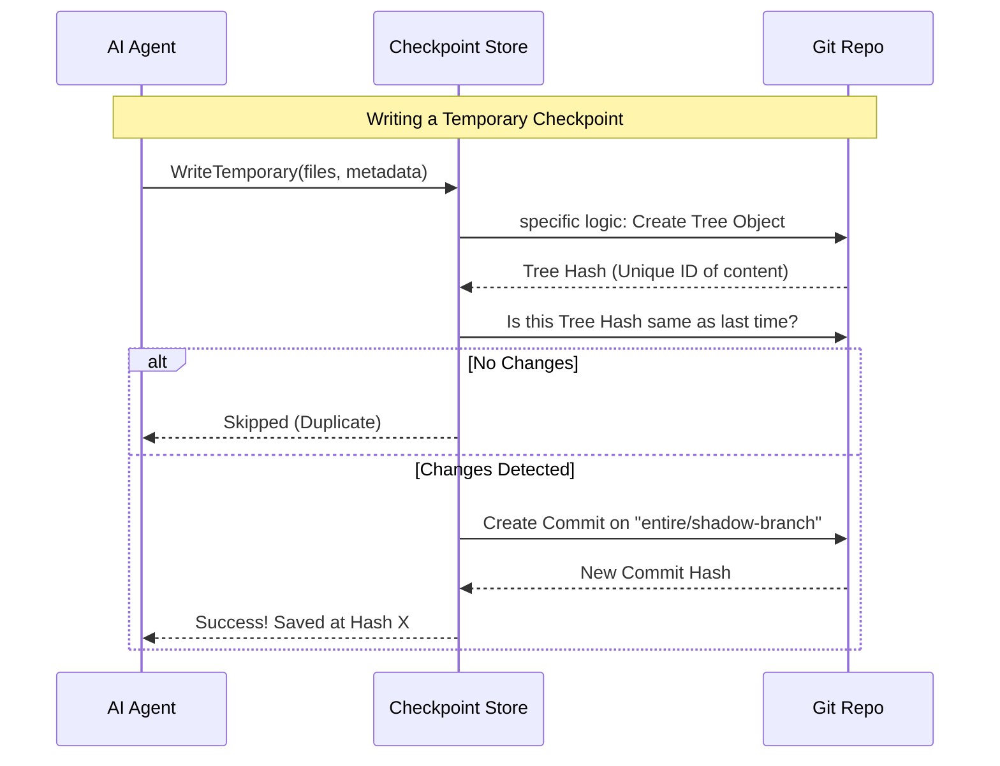

# Chapter 1: Checkpoint Storage

Welcome to the `entireio-cli` project! If you are new here, you are starting at the very beginning.

Imagine you are playing a difficult video game. Before you fight a boss, you save your game. If you lose, you reload that save point and try again.

In AI-assisted coding, **Checkpoint Storage** provides exactly this feature. It creates "Save Points" for your development session. When an AI agent writes code, it might make a mistake or delete something important. Checkpoints allow you to "rewind" time, restoring both your code and the AI's memory (the transcript) to a specific moment.

## The Core Concept

A **Checkpoint** captures the state of your project at a specific point in time. It is the fundamental unit of history in `entireio-cli`.

There are two distinct types of checkpoints to understand:

1.  **Temporary Checkpoints (The "Drafts"):**
    *   **What:** A full snapshot of your files and the AI's chat history.
    *   **Where:** Stored on hidden "shadow branches" (e.g., `entire/a1b2c...`).
    *   **Why:** Used while you are actively working. They allow you to undo the AI's last action instantly. They are temporary and messy.

2.  **Committed Checkpoints (The "Permanent Record"):**
    *   **What:** Metadata that points to a specific Git commit in your history.
    *   **Where:** Stored on a special branch `entire/checkpoints/v1`.
    *   **Why:** Used for long-term history. When you view a project from months ago, these checkpoints tell the story of how the code was written.

## How It Works: The Use Case

Let's say you are building a website, and you ask the AI to "Change the button color to blue."

Here is how the **Checkpoint Storage** handles this:

1.  **Before** the AI changes anything, the system creates a **Temporary Checkpoint**.
2.  The AI modifies `style.css`.
3.  If you don't like the result, you tell the system to **Restore** that checkpoint.
4.  The system resets your files and the chat transcript back to step 1.

### The Interface

The logic for saving and loading these points is defined in the `Store` interface. This interface handles the low-level "plumbing" of talking to Git.

Here is a simplified look at the `Store` interface from `cmd/entire/cli/checkpoint/checkpoint.go`:

```go
// Store manages reading and writing checkpoints to Git.
type Store interface {
    // Save a full snapshot to a shadow branch
    WriteTemporary(ctx context.Context, opts WriteTemporaryOptions) (WriteTemporaryResult, error)

    // Read the latest snapshot from a shadow branch
    ReadTemporary(ctx context.Context, baseCommit, worktreeID string) (*ReadTemporaryResult, error)

    // Write permanent metadata to the entire/checkpoints/v1 branch
    WriteCommitted(ctx context.Context, opts WriteCommittedOptions) error
}
```

*Explanation:* The `Store` acts like a librarian. You give it data (`Write`), or ask for data (`Read`). It hides the complexity of *how* that data is organized on the shelves (Git branches).

## Using the Storage

Let's look at how we actually save a checkpoint in code.

### Writing a Temporary Checkpoint

When the AI is about to make a change, we call `WriteTemporary`. We need to provide the current session ID and which files have changed.

```go
// Example: Saving a temporary checkpoint
opts := checkpoint.WriteTemporaryOptions{
    SessionID:     "session-123",
    BaseCommit:    "abc1234",      // The git commit we started from
    ModifiedFiles: []string{"main.go"},
    CommitMessage: "AI is updating main.go",
}

// result contains the hash of the saved state
result, err := store.WriteTemporary(ctx, opts)
```

*Explanation:* This command takes the current state of `main.go` and saves it to a shadow branch. If `main.go` hasn't actually changed since the last save, the store is smart enough to skip writing (deduplication), keeping things fast.

### Reading a Temporary Checkpoint

If we need to undo, we read back the data.

```go
// Example: Reading the latest temporary state
// We look up by the commit we started from (BaseCommit)
result, err := store.ReadTemporary(ctx, "abc1234", "")

if result != nil {
    fmt.Printf("Found checkpoint created at: %s", result.Timestamp)
    // We can now restore files using result.CommitHash
}
```

*Explanation:* Unlike standard databases where you look up by ID, temporary checkpoints are often looked up by the `BaseCommit`—the commit your working branch is currently sitting on.

## Under the Hood: Implementation

How does `entireio-cli` keep these checkpoints without cluttering your main Git history? It uses **Shadow Branches**.

When you write a temporary checkpoint, the system switches to a detached, orphan branch that doesn't share history with your `main` branch.



### Directory Sharding (Performance)

For **Committed Checkpoints** (the permanent ones), we store metadata in JSON files on the `entire/checkpoints/v1` branch.

If we just threw 10,000 files into one folder, Git would become very slow. To solve this, we use **Sharding**.

The ID of a checkpoint is 12 characters, e.g., `a3b2c4d5e6f7`.
We split this ID to create a folder structure:

1.  Take the first 2 characters: `a3`
2.  Take the rest: `b2c4d5e6f7`
3.  Path: `a3/b2c4d5e6f7/metadata.json`

This ensures that no single folder contains too many files, keeping the system performant even after years of use.

### The Code: GitStore

The implementation resides in `cmd/entire/cli/checkpoint/store.go`. It wraps a standard Go git library.

```go
// GitStore implements the Store interface using a git repository.
type GitStore struct {
    repo *git.Repository
}

func NewGitStore(repo *git.Repository) *GitStore {
    return &GitStore{repo: repo}
}
```

*Explanation:* The `GitStore` struct is simple. It just holds a reference to your repository. All the complex logic happens inside the methods (like `WriteTemporary`) which use `repo` to manipulate Git objects directly.

## Summary

In this chapter, you learned:
1.  **Checkpoints** are save points for your code and AI chat history.
2.  **Temporary Checkpoints** are full snapshots on shadow branches used for "undoing" while you work.
3.  **Committed Checkpoints** are permanent metadata stored on a special branch, sharded for performance.
4.  The `Store` interface hides the complex Git plumbing required to make this happen.

Now that we know *how* to save checkpoints, we need to decide *when* to save them and how to organize them into a workflow. This is handled by the **Strategy Pattern**.

[Next Chapter: Strategy Pattern](02_strategy_pattern.md)

---

Generated by [Code IQ](https://github.com/adityasoni99/Code-IQ)