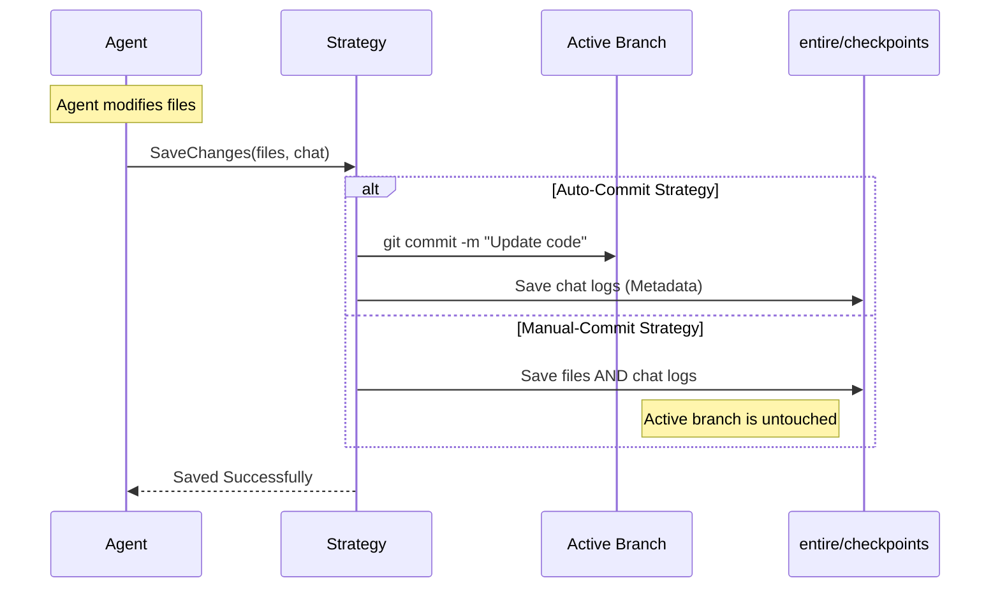

# Chapter 2: Strategy Pattern

Welcome back! In the previous chapter, [Checkpoint Storage](01_checkpoint_storage.md), we learned **how** `entireio-cli` saves snapshots of your code and chat history using Git plumbing.

Now, we need to answer a different question: **When** should we save? And **where** exactly should those saves go?

Different developers have different workflows. Some want every AI change to be a permanent commit immediately. Others prefer to work in a "sandbox" and only commit when they are satisfied. To handle this without rewriting the whole system for every preference, we use the **Strategy Pattern**.

## The Core Concept

The **Strategy Pattern** is like the shooting modes on a digital camera.

*   **The Camera (The CLI):** It knows how to take a picture (capture code state).
*   **The Mode (The Strategy):** Decides *how* that picture is processed.
    *   **Manual Mode (`manual-commit`):** You are in control. The AI works in a temporary "shadow" layer. Nothing touches your permanent Git history until *you* decide to commit.
    *   **Auto Mode (`auto-commit`):** Point and shoot. Every change the AI makes is immediately committed to your active branch.

By defining a common interface, the rest of the application doesn't care which mode you are using. It just says, "Save the changes," and the active Strategy handles the logic.

## The Use Case

Imagine an AI agent has just finished writing a Python script. The system needs to save this progress.

If we didn't use the Strategy Pattern, our code might look like this messy `if/else` block:

```go
// BAD CODE: Hardcoded logic
if userSettings.Mode == "auto" {
    git.Commit("Update script.py") // Write to main branch
} else {
    shadowBranch.Write("script.py") // Write to hidden branch
}
```

With the Strategy Pattern, the code becomes clean and agnostic:

```go
// GOOD CODE: Strategy Pattern
currentStrategy.SaveChanges(context)
```

## The Interface

The "Contract" that every mode must follow is defined in the `Strategy` interface. This is found in `cmd/entire/cli/strategy/strategy.go`.

Here is a simplified view of the most critical methods:

```go
type Strategy interface {
    // Save the current state of files and chat
    SaveChanges(ctx SaveContext) error

    // Return a list of points we can undo to
    GetRewindPoints(limit int) ([]RewindPoint, error)

    // Actually perform the undo operation
    Rewind(point RewindPoint) error
}
```

*Explanation:*
1.  **SaveChanges**: Called when the AI finishes a turn.
2.  **GetRewindPoints**: Called when you ask to list history.
3.  **Rewind**: Called when you want to revert to a previous point.

## Implementing a Strategy: Auto-Commit

Let's look at how the `auto-commit` strategy implements this contract. Its goal is to make every AI change a real Git commit on your active branch.

### Saving Changes

When `SaveChanges` is called in Auto Mode, it performs two distinct actions:
1.  Commits the code changes to your active branch.
2.  Saves the "Session Metadata" (the chat logs) to a special background branch (`entire/checkpoints/v1`).

Here is the logic from `cmd/entire/cli/strategy/auto_commit.go`:

```go
func (s *AutoCommitStrategy) SaveChanges(ctx SaveContext) error {
    // Step 1: Commit code to the active branch
    // We add a specific ID to the commit message to link it later
    _, err := s.commitCodeToActive(repo, ctx, cpID)
    if err != nil {
        return err
    }

    // Step 2: Save the chat transcript to the background branch
    _, err = s.commitMetadataToMetadataBranch(repo, ctx, cpID)
    
    return err
}
```

*Explanation:* The strategy coordinates the work. It ensures that your code history stays visible (Step 1), but your chat logs are stored separately to keep your folder clean (Step 2).

### Rewinding

How does Auto Mode handle an "Undo"? Since every change was a real Git commit, an undo is simply a Git Reset.

```go
func (s *AutoCommitStrategy) Rewind(point RewindPoint) error {
    // Convert the ID string back to a hash
    commitHash := plumbing.NewHash(point.ID)
    
    // Perform a hard reset to that commit
    _, err := HardResetWithProtection(commitHash)
    
    return err
}
```

*Explanation:* The `RewindPoint.ID` in this strategy is just a standard Git Commit Hash. To rewind, we just tell Git to "Hard Reset" to that hash.

## Under the Hood: Workflow Diagram

Here is how the system flows when an Agent finishes a task. Notice how the "Agent" doesn't know where the data goes; it relies on the Strategy.



## Deep Dive: Sharding Metadata

You might wonder: if `auto-commit` saves chat logs to a background branch, how do we find them later?

The strategy links them using a **Trailer** (a hidden footer in a commit message).

1.  **Code Commit Message:**
    ```text
    Update main.go to fix bug
    
    Entire-Checkpoint: a1b2c3d4e5f6
    ```
2.  **Metadata Location:**
    The strategy takes that ID (`a1b2c3d4e5f6`) and looks in the background branch at:
    `entire/checkpoints/v1/a1/b2c3d4e5f6/transcript.json`

This requires the Strategy to construct paths carefully.

```go
// From auto_commit.go
func (s *AutoCommitStrategy) commitMetadataToMetadataBranch(...) {
    // ... setup code ...

    // Use the Checkpoint Store (from Chapter 1) to write the data
    store.WriteCommitted(ctx, checkpoint.WriteCommittedOptions{
        CheckpointID: checkpointID,
        Strategy:     "auto-commit",
        // ... other data ...
    })
}
```

*Explanation:* The Strategy reuses the `Checkpoint Store` we built in [Chapter 1: Checkpoint Storage](01_checkpoint_storage.md). This is a great example of composition: The **Strategy** handles the *logic* (workflow), and the **Store** handles the *IO* (reading/writing to Git).

## Summary

In this chapter, you learned:

1.  The **Strategy Pattern** abstracts *when* and *where* work is saved.
2.  The **Auto-Commit Strategy** writes directly to your active branch for code, and a background branch for metadata.
3.  The **Manual-Commit Strategy** (implied) keeps everything in the background until you are ready.
4.  The rest of the `entireio-cli` system interacts with the simple `Strategy` interface, keeping the core code clean.

Now that we have a storage mechanism (Chapter 1) and a strategy for saving data (Chapter 2), we need to track the conversation flow itself. How does the system know if the AI is "Thinking", "Waiting for User", or "Done"?

[Next Chapter: Session State Machine](03_session_state_machine.md)

---

Generated by [Code IQ](https://github.com/adityasoni99/Code-IQ)