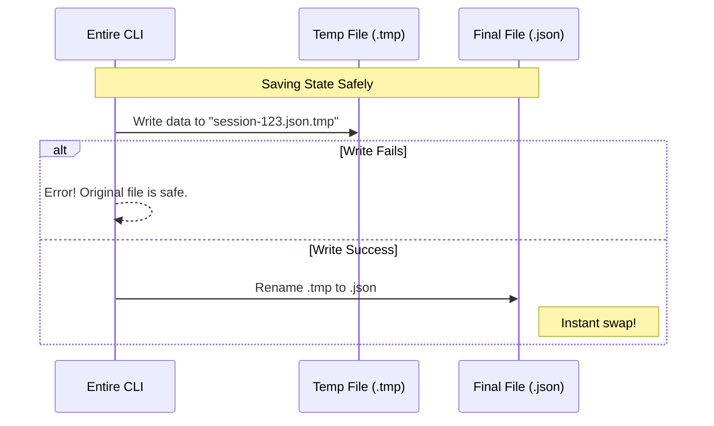

# Chapter 3: Session State Machine

Welcome back! In [Chapter 2: Strategy Pattern](02_strategy_pattern.md), we learned how to save code changes using different strategies (like Auto-Commit).

However, saving files is only half the battle. We also need to save **Context**.

Imagine you are reading a book and you close it. To resume reading later, you need a **bookmark**. You need to know:
1.  Which book you were reading.
2.  Which page you were on.
3.  Which line you just finished.

In `entireio-cli`, the **Session State Machine** is that bookmark.

## The Core Concept

Command Line Interfaces (CLIs) have short memories. When you run a command, it starts, does its job, and dies. It forgets everything immediately.

But an AI Agent needs a long memory. It needs to know:
*   "What is the current conversation ID?"
*   "What Git commit did we start this conversation on?"
*   "Is the AI currently thinking, or is it waiting for the human?"

To bridge this gap, `entire` writes a "Sticky Note" to your hard drive. This is the **Session State**.

### The "Sticky Note" (JSON File)

The state is stored as a simple JSON file inside your hidden `.git` folder:
`.git/entire-sessions/<session-id>.json`

This ensures that even if you restart your computer, the AI remembers exactly where it left off.

## Use Case: The "Disconnected" Problem

Here is why this is critical.

1.  **You:** "Refactor the login page."
2.  **AI:** Starts writing files...
3.  **Git Hook:** A separate process wakes up to check the files.

The **Git Hook** is a completely different program from the AI Agent. It has no idea an AI is even running.

By reading the **Session State** file, the Git Hook can say:
*"Ah! I see `session-123.json` exists. I know this file change belongs to that AI session. I will log it correctly."*

Without this state file, the Git Hook would treat the AI's changes as anonymous, messy edits.

## The Data Structure

The structure of this "bookmark" is defined in `cmd/entire/cli/session/state.go`.

Here is a simplified version of the `State` struct that acts as our bookmark:

```go
type State struct {
    // The unique ID of the conversation
    SessionID string `json:"session_id"`

    // The "Page Number": The git commit where we started
    BaseCommit string `json:"base_commit"`

    // The "Line Number": The specific turn/reply we are on
    TurnID string `json:"turn_id"`

    // Is the session Active, Idle, or Done?
    Phase Phase `json:"phase"`
}
```

*Explanation:*
*   **SessionID:** Like the Book Title.
*   **BaseCommit:** Like the Chapter you are in.
*   **TurnID:** Like the specific Paragraph you are reading.
*   **Phase:** Tells us if the book is open or closed.

## Using the State Store

To read and write these bookmarks, we use the `StateStore`. It handles the messy work of finding the `.git` folder and writing JSON files.

### 1. Loading the Bookmark

When `entireio-cli` wakes up, the first thing it does is look for an active bookmark.

```go
// Create the store manager
store, _ := session.NewStateStore()

// Try to load state for a specific session ID
state, err := store.Load(ctx, "session-abc-123")

if state != nil {
    fmt.Printf("Resuming session started at: %s", state.StartedAt)
}
```

*Explanation:* If `state` comes back `nil`, it means no session exists with that ID. It's like looking for a bookmark that isn't there.

### 2. Updating the Bookmark (Saving)

Every time the AI does something (like finishing a sentence or writing code), we update the bookmark.

```go
// Update the turn ID to mark progress
state.TurnID = "turn_456"
state.Phase = session.PhaseActive

// Save it back to disk
err := store.Save(ctx, state)
```

*Explanation:* This writes the JSON file to `.git/entire-sessions/`. Now, any other tool (like a Git Hook or a VS Code extension) can read this file and know exactly what is happening.

## Under the Hood: Atomic Writes

You might be wondering: *"What if the computer crashes while writing the file? Will I get a corrupted half-written JSON file?"*

The `StateStore` uses a technique called **Atomic Writing** to prevent this.



### The Implementation

Here is how `state.go` implements this safety mechanism.

```go
func (s *StateStore) Save(ctx context.Context, state *State) error {
    // 1. Convert struct to JSON text
    data, _ := jsonutil.MarshalIndentWithNewline(state, "", "  ")

    // 2. Define filenames
    stateFile := s.stateFilePath(state.SessionID)
    tmpFile := stateFile + ".tmp"

    // 3. Write to the temporary file first
    os.WriteFile(tmpFile, data, 0o600)

    // 4. Rename temp file to replace the real file
    return os.Rename(tmpFile, stateFile)
}
```

*Explanation:* The `os.Rename` operation is "Atomic" on most operating systems. It happens instantly. This guarantees that `session-123.json` is either the old version or the new version, but never a corrupted mess.

## The Lifecycle: From Start to Finish

Let's visualize how the Session State changes over time.

1.  **Initialize:** You type `entire "Fix bug"`.
    *   *State:* Created. `Phase = Active`. `BaseCommit = HEAD`.
2.  **Working:** AI thinks and writes files.
    *   *State:* Updated. `TurnID` changes.
3.  **Waiting:** AI asks "Do you want to proceed?"
    *   *State:* `Phase = WaitingForUser`.
4.  **Finish:** You type "exit".
    *   *State:* `Phase = Done` (or the file is deleted/cleared).

This lifecycle ensures that if you run `entire resume`, the system looks at the file, sees `Phase = WaitingForUser`, and immediately puts you back in the prompt.

## Summary

In this chapter, you learned:

1.  **Session State** acts as a "Bookmark" so the CLI and Git Hooks can share context.
2.  It stores metadata like **Session ID**, **Base Commit**, and **Turn ID**.
3.  The data is stored in simple **JSON files** inside `.git/entire-sessions/`.
4.  The `StateStore` ensures data safety using **Atomic Writes** (Write Temp -> Rename).

Now we have a way to Store data (Chapter 1), a Strategy to organize it (Chapter 2), and a Memory of what we are doing (Chapter 3).

Next, we need to learn how to trigger these updates automatically when Git events happen. This is done using **Lifecycle Hooks**.

[Next Chapter: Lifecycle Hooks](04_lifecycle_hooks.md)

---

Generated by [Code IQ](https://github.com/adityasoni99/Code-IQ)