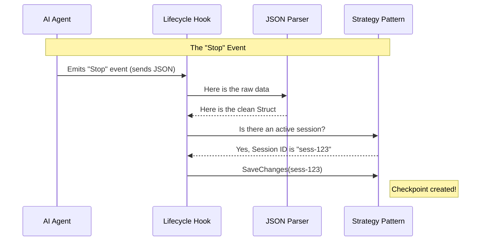

# Chapter 4: Lifecycle Hooks

Welcome back! In [Chapter 3: Session State Machine](03_session_state_machine.md), we created a "Bookmark" (Session State) to remember where we are in a conversation. Before that, in [Chapter 2: Strategy Pattern](02_strategy_pattern.md), we defined the logic for *how* to save checkpoints.

But we are missing a critical piece. **Who pulls the trigger?**

Our system currently has a brain (Strategy) and a memory (State), but it has no senses. It doesn't know *when* the AI starts typing or *when* you commit code.

**Lifecycle Hooks** are the "Motion Sensors" of `entireio-cli`. They detect events in the outside world (like Claude finishing a thought) and trigger our internal code to save checkpoints.

## The Core Concept

`entireio-cli` sits in the middle of two powerful forces:
1.  **The AI Agent** (e.g., Claude Code, Gemini).
2.  **The Version Control System** (Git).

Since these are separate programs, `entire` needs to listen to them. We do this using **Hooks**. A Hook is simply a script that runs automatically when a specific event happens.

### The "Bridge" Analogy

Think of **Lifecycle Hooks** as a translator at the United Nations.
1.  **External Event:** The AI speaks in a foreign language (a messy JSON file sent to `stdin`).
2.  **The Hook (Translator):** Catches the message, parses it, and cleans it up.
3.  **Internal Action:** The Hook tells the **Strategy** what to do in plain English (e.g., "Save the file now").

## The Use Case: The "Auto-Save" Moment

Let's look at the most common scenario: **The AI finishes writing code.**

1.  **AI:** Writes code to `main.go`.
2.  **AI:** Signals "I am done processing."
3.  **Hook:** Catches this signal (`Stop` hook).
4.  **Hook:** Tells `entire` to take a snapshot.

Without this hook, the AI would write code, but `entire` would never know, and no checkpoint would be created.

## Handling Agent Hooks

Agent hooks are triggered by the AI tool itself. When using Claude Code, for example, it sends data to us via **Standard Input (stdin)**.

### 1. Parsing the Input

The AI sends us a JSON payload containing details like the `session_id` and the `transcript_path`. Our first job is to catch this data.

Here is a simplified look at the `TaskHookInput` struct from `cmd/entire/cli/hooks.go`:

```go
// TaskHookInput represents the data sent by the AI
type TaskHookInput struct {
    SessionID      string          `json:"session_id"`
    TranscriptPath string          `json:"transcript_path"`
    ToolUseID      string          `json:"tool_use_id"`
    // ... other raw JSON data
}
```

*Explanation:* This struct is our "net". When the AI throws data at us, we catch it in this shape so our code can understand it.

### 2. Reading the Stream

To actually read this data, we use a parser. It reads the raw text from the AI and fills our struct.

```go
// parseTaskHookInput reads JSON from the input stream (stdin)
func parseTaskHookInput(r io.Reader) (*TaskHookInput, error) {
    // Read all data coming from the AI
    data, err := io.ReadAll(r)
    
    var input TaskHookInput
    // Convert the raw JSON text into our Go struct
    json.Unmarshal(data, &input)

    return &input, nil
}
```

*Explanation:* This function converts the "foreign language" (JSON text) into "native objects" (Go Structs) that the rest of our application can use.

## Handling Git Hooks

While Agent hooks track the AI, **Git Hooks** track *you*. When you manually commit code, we want to ensure the AI's session data is attached to that commit.

`entireio-cli` manages standard Git hooks like `prepare-commit-msg` and `post-commit`.

### Installing Git Hooks

We don't want to manually copy-paste scripts into the hidden `.git/hooks` folder. `entire` automates this.

Here is how the system installs a hook (simplified from `cmd/entire/cli/strategy/hooks.go`):

```go
func InstallGitHook(silent bool) (int, error) {
    // 1. Find the .git/hooks directory
    gitDir, _ := GetGitDir()
    hooksDir := filepath.Join(gitDir, "hooks")

    // 2. Define the script content
    // This script simply tells Git to call "entire" when triggered
    content := "#!/bin/sh\nentire hooks git prepare-commit-msg \"$1\""

    // 3. Write the file to disk
    os.WriteFile(filepath.Join(hooksDir, "prepare-commit-msg"), []byte(content), 0o755)
    
    return 1, nil
}
```

*Explanation:* This code creates a tiny shell script inside your Git folder. Now, whenever you run `git commit`, Git runs this script, which in turn wakes up `entireio-cli`.

## Under the Hood: The Flow

Let's visualize exactly what happens when an AI Agent (like Claude) finishes a task.



### Deep Dive: Subagent Checkpoints

Advanced AI agents use "Subagents" (or Tools) to do specific tasks. For example, a main agent might delegate writing a file to a "Writer Subagent".

We need to track exactly when these sub-tasks start and stop to create accurate history. We use `PreToolUse` and `PostToolUse` hooks.

#### The "Pre" Hook (Taking a 'Before' Photo)

Before the subagent starts, we capture the state of the files.

```go
// Handler for PreToolUse[Task]
func handlePreTask(input *TaskHookInput) {
    // 1. Identify which tool is being used
    toolID := input.ToolUseID

    // 2. Run 'git status' to see current files
    // 3. Save this list to a temp file: .entire/tmp/pre-task-123.json
    capturePreTaskState(toolID)
}
```

*Explanation:* We don't save a full checkpoint yet. We just make a quick note of what files looked like *before* the AI touched them.

#### The "Post" Hook (Taking an 'After' Photo)

When the subagent finishes, we compare the current state to our 'Before' photo.

```go
// Handler for PostToolUse[Task]
func handlePostTask(input *PostTaskHookInput) {
    // 1. Load the 'Before' photo we saved earlier
    preState := loadPreTaskState(input.ToolUseID)

    // 2. Compare with current files to find what changed
    newFiles := compareFiles(preState, currentFiles)

    // 3. If files changed, save a checkpoint!
    if len(newFiles) > 0 {
        strategy.SaveTaskCheckpoint(ctx)
    }
}
```

*Explanation:* By comparing "Pre" and "Post", we know exactly which files *this specific subagent* modified. This allows `entire` to attribute changes accurately in the history logs.

## Incremental Progress: The "Todo" Hook

Sometimes a subagent works for a long time. We don't want to wait until the very end to save. We can hook into the `TodoWrite` event (when the AI checks off an item on its to-do list).

This allows us to save **Incremental Checkpoints**.

```go
// From hooks_claudecode_handlers.go
func handlePostTodo(input *SubagentCheckpointHookInput) {
    // 1. Check if files physically changed on disk
    if !DetectFileChanges() {
        return // Don't save if nothing happened
    }

    // 2. Extract the item just completed, e.g., "Fix login bug"
    taskName := ExtractLastCompletedTodoFromToolInput(input.ToolInput)

    // 3. Create a checkpoint named after that task
    strategy.SaveTaskCheckpoint(ctx, taskName)
}
```

*Explanation:* This creates a beautiful history trail. Instead of one big "Updated files" commit, you get a sequence: "Completed: Login Logic", "Completed: Database Schema", "Completed: UI Button".

## Summary

In this chapter, you learned:
1.  **Lifecycle Hooks** act as sensors that trigger internal actions based on external events.
2.  **Agent Hooks** parse JSON from the AI to track tasks, tool usage, and session starts.
3.  **Git Hooks** allow `entire` to attach metadata when you manually commit or push code.
4.  **Pre/Post Patterns** allow us to isolate exactly what a specific AI subagent changed.

We now have storage, strategy, memory, and sensors. The final piece of the puzzle is defining how we format the data we send *back* to the agent to help it understand the project better.

[Next Chapter: Agent Interface](05_agent_interface.md)

---

Generated by [Code IQ](https://github.com/adityasoni99/Code-IQ)