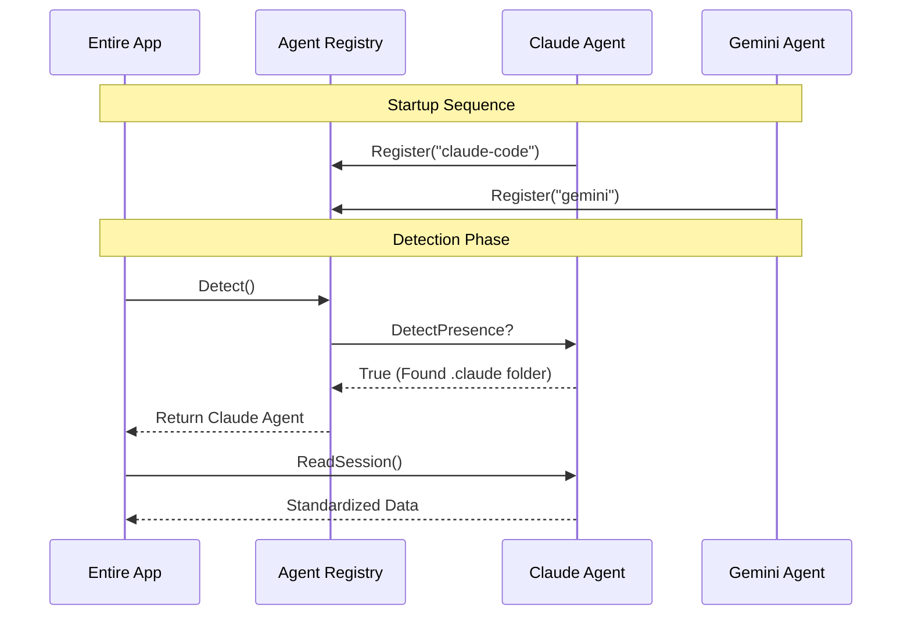

# Chapter 5: Agent Interface

Welcome back! In [Chapter 4: Lifecycle Hooks](04_lifecycle_hooks.md), we built "Motion Sensors" that trigger our system whenever an AI starts or stops working.

But knowing *that* something happened isn't enough. We need to know *what* happened.

Here is the problem: **Every AI tool speaks a different language.**
*   **Claude Code** stores chat logs in `~/.claude/projects` using a `.jsonl` format (one JSON object per line).
*   **Gemini CLI** stores logs in `~/.gemini/tmp` using a standard `.json` format.
*   **Aider** might store them in a local `.aider.chat` file.

If we wrote code like `if agent == "claude" do this, else do that`, our software would become a nightmare to maintain.

Enter the **Agent Interface**. This is the "Universal Translator" for `entireio-cli`.

## The Core Concept

Think of the Agent Interface like a **Universal Travel Adapter**.

Regardless of whether you are in the UK, US, or Europe, your laptop plug looks the same. You plug it into the adapter, and the adapter handles the messy details of the wall socket.

In `entireio-cli`, the rest of the application (Checkpointing, UI, Strategy) only speaks to the **Adapter** (The Agent Interface). It never speaks directly to Claude or Gemini.

## Key Capabilities

The Agent Interface standardizes three main questions:

1.  **Identity:** "Who are you?" (Detection)
2.  **Location:** "Where are your files?" (Path Resolution)
3.  **Translation:** "What did you say?" (Normalization)

Let's look at how we solve a specific use case using this interface.

## Use Case: "Read the Last Session"

Imagine you want to see what the AI did yesterday. You run a command to list the history.

Without the Agent Interface, you would need to know exactly where Claude hides its files. With the Interface, the code is simple.

### Step 1: The Contract

First, we define what an "Agent" must be able to do. This is the Interface definition found in `cmd/entire/cli/agent/agent.go`.

```go
// Agent is the "Universal Adapter" interface
type Agent interface {
    // 1. Identity: What is your name?
    Name() AgentName

    // 2. Detection: Are you currently active in this folder?
    DetectPresence() (bool, error)

    // 3. Translation: Read your specific file format into a standard struct
    ReadSession(input *HookInput) (*AgentSession, error)
}
```

*Explanation:* Any tool we want to support—Claude, Gemini, or a future tool—must implement these methods.

### Step 2: Detection (Who is here?)

When you run `entire`, it needs to know which AI you are using. It asks every registered agent, "Are you here?"

Here is how **Claude** answers that question (from `cmd/entire/cli/agent/claudecode/claude.go`):

```go
func (c *ClaudeCodeAgent) DetectPresence() (bool, error) {
    // Check if the hidden .claude folder exists in this project
    claudeDir := filepath.Join(repoRoot, ".claude")
    
    if _, err := os.Stat(claudeDir); err == nil {
        return true, nil // "Yes, I am here!"
    }
    return false, nil
}
```

*Explanation:* Claude looks for a `.claude` folder. If found, it raises its hand.

Here is how **Gemini** answers (from `cmd/entire/cli/agent/geminicli/gemini.go`):

```go
func (g *GeminiCLIAgent) DetectPresence() (bool, error) {
    // Check if the hidden .gemini folder exists
    geminiDir := filepath.Join(repoRoot, ".gemini")

    if _, err := os.Stat(geminiDir); err == nil {
        return true, nil
    }
    return false, nil
}
```

*Explanation:* The logic is similar, but the folder name is different. The main application doesn't care; it just calls `DetectPresence()`.

### Step 3: Translation (Reading the Session)

This is the most important part. Claude speaks `.jsonl`, Gemini speaks `.json`. We need to convert both into a standardized `AgentSession` object.

**Claude's Implementation:**

```go
func (c *ClaudeCodeAgent) ReadSession(input *HookInput) (*AgentSession, error) {
    // Read the raw file from Claude's folder
    data, _ := os.ReadFile(input.SessionRef)

    // Return the standard object
    return &agent.AgentSession{
        AgentName:  c.Name(),
        NativeData: data, // Keep raw data for later
        // ... standard fields
    }, nil
}
```

**Gemini's Implementation:**

```go
func (g *GeminiCLIAgent) ReadSession(input *HookInput) (*AgentSession, error) {
    // Read the raw file from Gemini's folder
    data, _ := os.ReadFile(input.SessionRef)

    // Even though the file format is different, 
    // we return the EXACT SAME struct type.
    return &agent.AgentSession{
        AgentName:  g.Name(),
        NativeData: data,
        // ... standard fields
    }, nil
}
```

*Explanation:* By the time the data leaves this function, `entireio-cli` doesn't care where it came from. It treats all sessions exactly the same.

## Under the Hood: The Registry

How does the system know which agents are available? We use a **Registry Pattern**.

When the program starts, each agent "registers" itself.



### The Registry Code

This logic lives in `cmd/entire/cli/agent/registry.go`.

```go
// Loop through all known agents to find the active one
func Detect() (Agent, error) {
    for _, factory := range registry {
        agent := factory()
        
        // Ask the agent if it is present
        if present, _ := agent.DetectPresence(); present {
            return agent, nil
        }
    }
    return nil, fmt.Errorf("no agent detected")
}
```

*Explanation:* This loop is the "Auto-Detect" feature. It tries every adapter until one fits.

## Advanced Capabilities

The Interface isn't just for reading files. It also handles complex behaviors that differ between agents.

### 1. Formatting the "Resume" Command

If you want to resume a session, the command line arguments are different.

*   **Claude:** `claude -r <session_id>`
*   **Gemini:** `gemini --resume <session_id>`

The interface handles this:

```go
// In Claude Agent
func (c *ClaudeCodeAgent) FormatResumeCommand(id string) string {
    return "claude -r " + id
}

// In Gemini Agent
func (g *GeminiCLIAgent) FormatResumeCommand(id string) string {
    return "gemini --resume " + id
}
```

### 2. Path Sanitization

Agents are picky about filenames.
*   **Claude** replaces special characters in project paths with dashes (`-`).
*   **Gemini** uses a hash of the project path.

If `entire` tried to guess these paths, it would fail. Instead, we ask the agent: `agent.GetSessionDir(repoPath)`.

## Summary

In this chapter, you learned:

1.  The **Agent Interface** acts as a "Universal Adapter" for different AI tools.
2.  **Detection** allows `entire` to automatically figure out if you are using Claude or Gemini.
3.  **Normalization** converts different file formats (JSON vs JSONL) into a single, standard data structure.
4.  The **Registry** manages the list of available adapters.

We now have a system that can **Save** data (Chapter 1), decide **When** to save (Chapter 2), track **Context** (Chapter 3), detect **Events** (Chapter 4), and understand **Different Agents** (Chapter 5).

However, reading the raw session file is only the first step. The raw log is often messy and full of JSON formatting. To make it useful for humans and the AI, we need to clean it up.

[Next Chapter: Transcript Processing](06_transcript_processing.md)

---

Generated by [Code IQ](https://github.com/adityasoni99/Code-IQ)