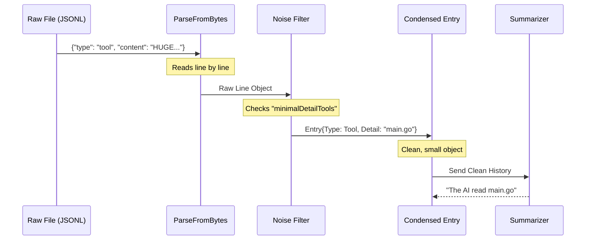

# Chapter 6: Transcript Processing

Welcome to the final chapter of the `entireio-cli` tutorial!

In [Chapter 5: Agent Interface](05_agent_interface.md), we built a "Universal Adapter" that helps us find where different AI agents (like Claude or Gemini) store their data. We know *where* the file is, and we can read the raw bytes.

But have you ever looked at a raw AI log file? It is a mess. It is full of JSON brackets, escape characters, massive file dumps, and debug information.

**Transcript Processing** is the "Stenographer" of our system. It takes that messy, noisy raw data and turns it into a clean, readable story of what happened.

## The Core Concept

Imagine a court reporter (Stenographer). People in the courtroom talk over each other, cough, and stutter. The reporter's job is to write down exactly what matters:
*   **Judge:** "Overruled."
*   **Witness:** "I was at the bank."

They strip out the noise.

In `entireio-cli`, the raw logs contain:
1.  **User Prompts:** "Fix the bug."
2.  **Tool Outputs:** The AI reading a 5,000-line file (we don't want to read this!).
3.  **System Tags:** Hidden instructions like `<ide_context>`.

**Transcript Processing** parses these bytes, strips the noise, and structures the data so we can generate summaries like: *"The AI modified `main.go` to fix a null pointer exception."*

## Use Case: "What did the AI do?"

Let's say you worked with the AI for an hour. You want to generate a commit message.

**Raw Input (What the machine sees):**
```json
{"type": "user", "text": "update styles"}
{"type": "tool", "name": "read_file", "content": "body { color: red; ... [500 lines] ... }"}
{"type": "assistant", "text": "I have updated the css."}
```

**Processed Output (What we want):**
*   **User:** update styles
*   **Action:** Modified `style.css`
*   **Result:** Updated CSS colors.

Let's see how we build the code to do this.

## Step 1: Parsing the Stream

The first step is simply reading the file. However, these files can be huge. We can't just load the whole thing into a string variable, or the computer might run out of memory.

We use a "buffered reader" to process it line-by-line.

Here is the logic from `cmd/entire/cli/transcript/parse.go`:

```go
// ParseFromBytes reads raw content line by line
func ParseFromBytes(content []byte) ([]Line, error) {
    var lines []Line
    // Create a reader that handles large files efficiently
    reader := bufio.NewReader(bytes.NewReader(content))

    for {
        // Read until the next newline character
        lineBytes, err := reader.ReadBytes('\n')
        
        // Convert that single line from JSON to a Go Struct
        var line Line
        json.Unmarshal(lineBytes, &line)
        lines = append(lines, line)
        
        if err == io.EOF { break }
    }
    return lines, nil
}
```

*Explanation:* We treat the file like a stream of water. We catch one cup (line) at a time, inspect it, and put it in our bucket (`lines`).

## Step 2: Cleaning the Noise

Now we have a list of lines, but they are still noisy.

For example, when an AI uses a tool to read a file, the log contains the *entire content* of that file. For a summary, we only care *that* the file was read, not what was in it.

We need to create a **Condensed Transcript**.

Here is the structure we want to build (from `cmd/entire/cli/summarize/summarize.go`):

```go
type Entry struct {
    // Is this the User, the AI, or a Tool?
    Type EntryType 

    // What did they say? (Clean text)
    Content string

    // If it was a tool, just show the filename, not the content
    ToolDetail string
}
```

### Filtering Tool Details

We use a "lookup map" to decide which tools are too noisy to show fully.

```go
var minimalDetailTools = map[string]bool{
    "Read":     true, // Don't show file contents
    "WebFetch": true, // Don't show full HTML
}

func extractToolDetail(toolName string, input ToolInput) string {
    // If the tool is noisy, just return the path/URL
    if minimalDetailTools[toolName] {
        if input.FilePath != "" {
            return input.FilePath
        }
        return input.URL
    }
    // Otherwise, return the full description
    return input.Description
}
```

*Explanation:* If the tool is "Read", we throw away the file content and just keep the filename. This reduces a 1MB log entry into a 20-byte string.

### Cleaning User Prompts

Sometimes, the IDE injects invisible tags into your prompt to help the AI. We need to strip these out so the summary looks natural.

```go
func ExtractUserContent(message json.RawMessage) string {
    // 1. Unmarshal the raw message
    var msg UserMessage
    json.Unmarshal(message, &msg)

    // 2. Get the text string
    rawText := msg.Content

    // 3. Remove tags like <ide_opened_file>
    cleanText := textutil.StripIDEContextTags(rawText)

    return cleanText
}
```

*Explanation:* This ensures that even if the system sent hidden context, the human user only sees what *they* actually typed.

## Step 3: Attribution (The "Group Project" Problem)

One of the most complex features of `entireio-cli` is **Attribution**.

Imagine a group project in school. You write some code. The AI writes some code. Then you edit the AI's code. Finally, you submit it.
**Who did the work?** Was it 50/50? 90/10?

`entireio-cli` calculates this automatically for commit trailers:
`Entire-Attribution: 73% agent (146/200 lines)`

### How It Works

We cannot simply count lines at the end, because you might have deleted the AI's work. We have to track changes *over time*.

1.  **Before AI runs:** We count exactly how many lines *you* wrote manually.
2.  **After AI runs:** We see how many lines the *AI* added.
3.  **Final Calculation:** We compare the final file against the snapshots.

It looks roughly like this logic:

```go
// Simplified logic for attribution
func CalculatePercentage(agentLines, userLines int) float64 {
    total := agentLines + userLines
    if total == 0 {
        return 0
    }
    
    // If user edited an AI line, it becomes a "User Line"
    // We track this using file diffs
    return (float64(agentLines) / float64(total)) * 100
}
```

*Note:* The real implementation uses "Per-File Pools" to handle complex cases where you modify the AI's code. If you touch it, you own it!

## Under the Hood: The Summary Pipeline

Let's visualize the full journey of a transcript from raw disk bytes to a helpful summary.



## Putting It All Together: The Summarizer

Now that we have clean data, we can send it to an LLM (Large Language Model) to write our commit message.

This logic lives in `GenerateFromTranscript` inside `summarize.go`.

```go
func GenerateFromTranscript(ctx context.Context, rawBytes []byte) (*Summary, error) {
    // 1. Parse and Clean the raw bytes
    entries, _ := BuildCondensedTranscriptFromBytes(rawBytes, agentType)

    // 2. Prepare the input for the LLM
    input := Input{
        Transcript:   entries,
        FilesTouched: []string{"main.go", "style.css"},
    }

    // 3. Ask the Generator (Claude/Gemini) to write English
    summary, err := generator.Generate(ctx, input)
    
    return summary, nil
}
```

*Explanation:* This function is the conductor. It calls the **Parser**, then the **Cleaner**, and finally the **Generator** to produce the final result.

## Conclusion of the Tutorial

Congratulations! You have navigated the entire architecture of `entireio-cli`.

Let's look back at the journey:

1.  **[Checkpoint Storage](01_checkpoint_storage.md):** We learned *how* to save files to Git shadow branches.
2.  **[Strategy Pattern](02_strategy_pattern.md):** We decided *when* to save (Auto vs. Manual).
3.  **[Session State Machine](03_session_state_machine.md):** We created a "Bookmark" to remember our place in the conversation.
4.  **[Lifecycle Hooks](04_lifecycle_hooks.md):** We built "Sensors" to detect when the AI starts and stops.
5.  **[Agent Interface](05_agent_interface.md):** We built a "Universal Adapter" to talk to different AI tools.
6.  **Transcript Processing:** (This chapter) We learned to read, clean, and understand the AI's messy logs.

You now understand how `entireio-cli` acts as a transparent layer between your AI agent and your version control system, keeping your history clean and your code safe.

Happy Coding!

---

Generated by [Code IQ](https://github.com/adityasoni99/Code-IQ)