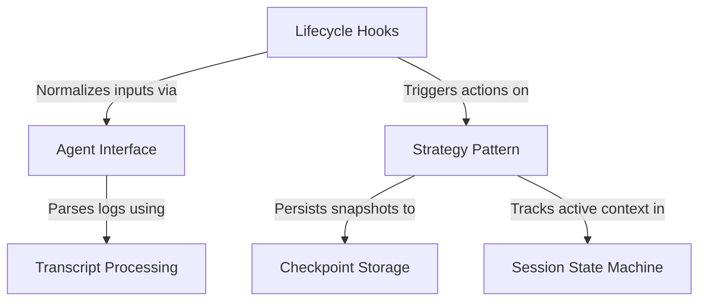

# Tutorial: entireio-cli

**Entire** is a CLI tool that bridges the gap between AI coding assistants (like *Claude Code* or *Gemini*) and **Git**. It automatically captures conversation history and code changes as **checkpoints**, managing the complex lifecycle of AI sessions through flexible **strategies** that can either auto-commit changes or stage them for manual review.

**Source Repository:** [https://github.com/entireio/cli](https://github.com/entireio/cli)

## Chapters

1. [Checkpoint Storage](01_checkpoint_storage.md)
2. [Strategy Pattern](02_strategy_pattern.md)
3. [Session State Machine](03_session_state_machine.md)
4. [Lifecycle Hooks](04_lifecycle_hooks.md)
5. [Agent Interface](05_agent_interface.md)
6. [Transcript Processing](06_transcript_processing.md)

---

Generated by [Code IQ](https://github.com/adityasoni99/Code-IQ)