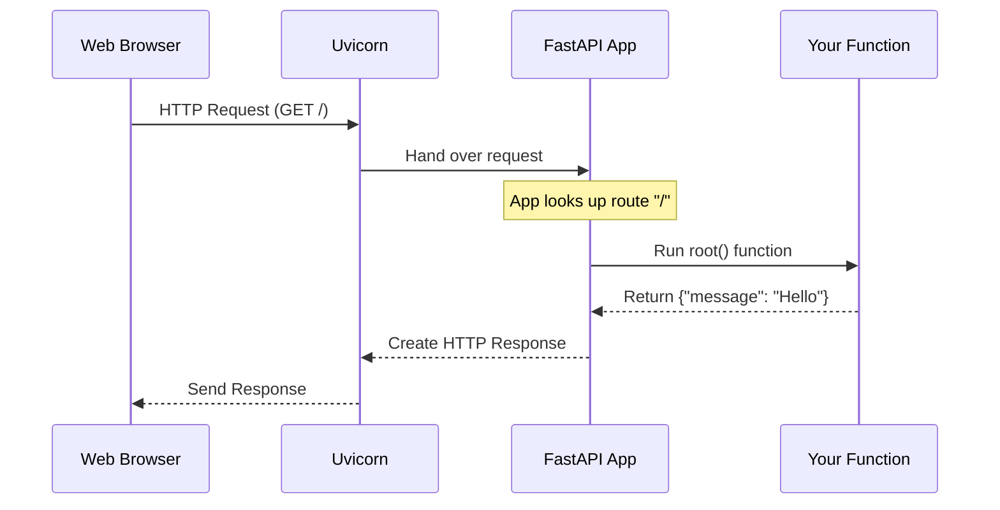

# Chapter 1: The FastAPI App Instance

Welcome to the world of FastAPI!

If you are building a web API, you need a central "hub" to manage all the moving parts: receiving requests, figuring out which function to run, and sending back responses.

In FastAPI, this hub is the **App Instance**.

## The Central Manager

Imagine a busy restaurant. You have chefs (your code logic), ingredients (data), and customers (web requests). But without a **Manager**, the customers wouldn't know where to sit, and the chefs wouldn't know what to cook.

The `FastAPI` class is that manager.

### The Problem it Solves
Without a central app instance, your code is just a collection of disconnected functions. You need an object that speaks the language of the web server (ASGI) and knows how to route traffic to your specific Python functions.

### The Solution
You create a single instance of the `FastAPI` class. This object becomes the container for:
1.  **Routes**: The paths (URLs) your API handles.
2.  **Configuration**: Settings like the API title or version.
3.  **Middleware**: Security and background processing tools.

## Creating Your First App

Let's look at the absolute minimum code required to create this foundation.

### Step 1: Import and Instantiate

```python
from fastapi import FastAPI

# Create the app instance
app = FastAPI()
```

**Explanation:**
*   We import the `FastAPI` class.
*   We create a variable named `app` (this is a standard convention).
*   `app = FastAPI()` creates the actual instance. This `app` object is now ready to be configured.

### Step 2: Registering a Route

The app instance holds the "map" of your website. We need to tell the app that when a user visits `/`, it should run a specific function.

```python
# Tell the app to handle GET requests at "/"
@app.get("/")
async def root():
    return {"message": "Hello World"}
```

**Explanation:**
*   `@app.get("/")` is a **decorator**. It tells the `app` instance: "Hey, store this information! When a user requests the path `/`, use the function below."
*   The `app` serves as the registry for this logic.

### Step 3: Configuration

The `FastAPI` class accepts parameters to configure your API's metadata. This is useful for the automatic documentation.

```python
# Configuring the app with metadata
app = FastAPI(
    title="My Super API",
    version="1.0.0",
    description="This is a tutorial API"
)
```

**Explanation:**
*   You can pass arguments directly to the class constructor.
*   These settings don't change how the code runs, but they change how the API presents itself in the documentation.

## How it Works: The Mental Model

When you run your server (usually with a tool called **Uvicorn**), you pass it the `app` object.

1.  **The Server (Uvicorn)** listens to the network port.
2.  A **Request** arrives.
3.  The Server hands the request to your **FastAPI App Instance**.
4.  The **App** looks at its internal map (routes).
5.  The **App** finds the matching function and runs it.

Here is a visualization of the flow:



## Internal Implementation: Under the Hood

To understand how the `FastAPI` instance works, we need to look at what it inherits from.

### The Foundation: Starlette
FastAPI is actually a "subclass" of a framework called **Starlette**. Starlette provides the high-speed web tools (routing, WebSocket support, etc.).

When you do `app = FastAPI()`, you are creating a Starlette application with extra superpowers.

### The Superpower: Pydantic
The main difference between a plain Starlette app and a FastAPI app is how it handles data. The FastAPI instance automatically integrates **Pydantic** for data validation.

Let's look at a simplified conceptual view of the `FastAPI` class structure:

```python
# Conceptual implementation (Simplified)
from starlette.applications import Starlette

class FastAPI(Starlette):
    def __init__(self, title: str = "FastAPI", **kwargs):
        super().__init__(**kwargs)
        self.title = title
        self.router = APIRouter() # Manages the paths
```

**Explanation:**
*   **Inheritance**: `class FastAPI(Starlette)` means FastAPI *is* a Starlette app. It can do everything Starlette can do.
*   **Initialization**: When `__init__` is called, it sets up the `router`. This router is the internal list where `@app.get("/")` stores your functions.

### The Setup Process

When Python reads your file, here is what happens internally:

1.  `app = FastAPI()` initializes the internal routing list (currently empty).
2.  The interpreter reads `@app.get("/")`.
3.  The `.get()` method runs immediately. It takes the function defined below it (`root`) and adds it to the app's internal routing list.
4.  By the time the file finishes reading, `app` contains a complete map of every URL your API supports.

## Summary

The `FastAPI` app instance is the **container** for your entire application. It bridges the gap between the web server and your Python logic.

*   You instantiate it once: `app = FastAPI()`.
*   It acts as a registry for your routes using decorators like `@app.get`.
*   It combines the web routing of **Starlette** with the data validation of **Pydantic**.

Now that we have our house built (the App Instance), we need to learn how to open the doors and let specific data in.

[Next Chapter: Request Parameters and Validation](02_request_parameters_and_validation.md)

---

Generated by [Code IQ](https://github.com/adityasoni99/Code-IQ)