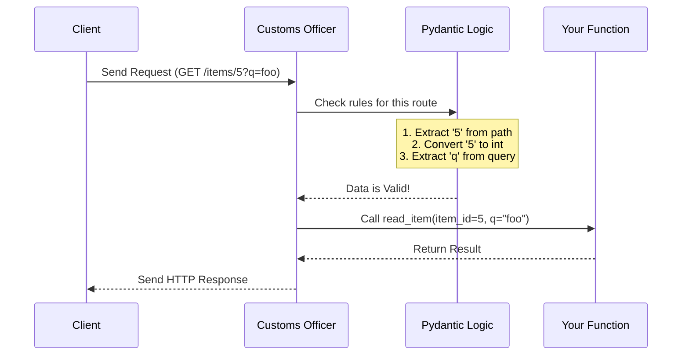

# Chapter 2: Request Parameters and Validation

In the previous chapter, [The FastAPI App Instance](01_the_fastapi_app_instance.md), we built the foundation of our API: the "Manager" that directs traffic.

Now that our application is running, it needs to accept data from the outside world. This is where **Request Parameters** come in. But we can't just trust whatever users send us. We need a security guard.

## The Problem: Trusting Strangers

Imagine you are running a high-security facility (your specific Python function). People (web requests) try to enter to give you information.

If you let everyone in blindly, someone might hand you a text file when you asked for a number, or a box of spiders when you asked for a JSON object. Your function tries to do math on the text file (or the spiders), crashes, and the whole facility goes into lockdown (500 Server Error).

## The Solution: The Customs Officer

FastAPI acts like a strict **Customs Officer**.

Before any data is allowed into your function, the officer stops it at the border.
1.  **Passport Check (Type Hints):** "You claim to be an Integer. Let me see your ID."
2.  **Luggage Check (Validation):** "Is this number greater than zero? Does this text contain an email address?"

If everything looks good, the data is passed to your function as clean, ready-to-use Python variables. If not, the officer turns them away immediately with a specific error report.

## 1. Path Parameters

The simplest way to send data is directly in the URL (the path).

Think of your website as a filing cabinet. `/items/5` tells the API specifically which folder to open.

### Defining a Path Parameter

To capture a value from the URL, we use curly braces `{}` in the path decorator.

```python
from fastapi import FastAPI

app = FastAPI()

@app.get("/items/{item_id}")
async def read_item(item_id):
    return {"item_id": item_id}
```

**Explanation:**
*   `{item_id}` in the URL tells FastAPI: "Expect a variable here."
*   The function argument `item_id` catches that value.

### Adding Validation (The "Passport Check")

By default, `item_id` is treated as a string. If a user visits `/items/foo`, `item_id` will be `"foo"`. But what if we only want numbers?

We use standard Python **Type Hints**.

```python
# We add ': int' to the argument
@app.get("/items/{item_id}")
async def read_item(item_id: int):
    # item_id is guaranteed to be an integer here
    return {"item_id": item_id}
```

**Explanation:**
*   `item_id: int` tells FastAPI to validate the input.
*   **Success:** If you visit `/items/5`, the function runs, and `item_id` is the number `5` (not string "5").
*   **Failure:** If you visit `/items/foo`, FastAPI stops the request *before* the function runs and sends a helpful error saying the value is not a valid integer.

## 2. Query Parameters

Sometimes you want to add optional configuration, like filtering a search. These appear at the end of a URL after a `?`, like `/items?skip=0&limit=10`.

FastAPI is smart. If a function argument is **not** part of the path `{...}`, FastAPI assumes it is a **Query Parameter**.

```python
# 'skip' and 'limit' are not in the path string
@app.get("/items/")
async def read_items(skip: int = 0, limit: int = 10):
    return {"skip": skip, "limit": limit}
```

**Explanation:**
*   Because `skip` and `limit` are not in the `@app.get` path, they are read from the `?` part of the URL.
*   `= 0` and `= 10` provide **default values**.
*   If the user visits `/items/`, they get the defaults.
*   If they visit `/items/?skip=20`, `skip` becomes 20.

## 3. The Request Body

For complex data (like creating a new user), URLs aren't enough. We need to send a "package" of data, known as the **Request Body**. This is usually done with `POST` requests.

FastAPI uses a library called **Pydantic** to define the "shape" of this package.

### Step 1: Define the Model

We create a class that inherits from `BaseModel`. This is our "Form" that the user must fill out.

```python
from pydantic import BaseModel

class Item(BaseModel):
    name: str
    price: float
    is_offer: bool = None
```

**Explanation:**
*   `name` must be a string.
*   `price` must be a number.
*   `is_offer` is optional (defaults to `None`).

### Step 2: Use the Model in a Route

Now we tell our function to expect this specific form.

```python
@app.post("/items/")
async def create_item(item: Item):
    # 'item' is now a Python object
    return {"item_name": item.name, "item_price": item.price}
```

**Explanation:**
*   FastAPI reads the raw JSON sent by the user.
*   It validates that `name` exists and `price` is a float.
*   It converts the JSON into your `Item` python object.
*   Your function gets clean data with full autocomplete support in your code editor.

## Internal Implementation: Under the Hood

How does FastAPI know to treat `{id}` as a path parameter but `skip` as a query parameter?

### The Mental Model

When you define a function, FastAPI inspects the "signature" (the arguments and type hints) of that function. It builds a checklist of rules.

When a request arrives:



### The Code: Metadata Extraction

Internally, FastAPI has classes that define these parameters. When you write code, usually FastAPI infers the type automatically. However, you can use these classes explicitly to add extra rules (like "number must be greater than 0").

These classes reside in `fastapi/params.py`.

Here is a simplified view of how they are structured:

```python
# Simplified concept from fastapi/params.py
from pydantic.fields import FieldInfo

class Param(FieldInfo):
    pass

class Path(Param):
    # Marks data coming from the URL path
    in_ = "path"

class Query(Param):
    # Marks data coming from ?query=string
    in_ = "query"
```

**Explanation:**
*   **Inheritance:** They all inherit from `FieldInfo` (from Pydantic). This means they are essentially storage boxes for validation rules (metadata).
*   **The `in_` attribute:** This tells FastAPI *where* to look for the data (the URL path, the query string, or the header).

### Using the Classes Explicitly

You can use these classes to make the "Customs Officer" even stricter.

```python
from fastapi import Query

# We explicitly require the query string to be max 50 chars
@app.get("/items/")
async def read_items(q: str = Query(default=None, max_length=50)):
    return {"q": q}
```

**Explanation:**
*   `Query(...)` creates an instance of the `Query` class we saw above.
*   It stores the metadata `max_length=50`.
*   FastAPI reads this metadata and instructs Pydantic to reject any text longer than 50 characters before your function ever runs.

## Summary

In this chapter, we learned that validation is the gatekeeper of our API.

*   **Path Parameters** (`/items/{id}`) identify specific resources.
*   **Query Parameters** (`?skip=0`) handle sorting and filtering.
*   **Request Body** (`class Item(BaseModel)`) handles complex data submissions.
*   **Type Hints** act as the rules for the Customs Officer.

By defining these rules, we ensure our functions only ever deal with valid, clean data.

Now that we have defined our app (Chapter 1) and validated our inputs (Chapter 2), we need to understand how FastAPI shares these rules with the outside world automatically.

[Next Chapter: OpenAPI Schema Generation](03_openapi_schema_generation.md)

---

Generated by [Code IQ](https://github.com/adityasoni99/Code-IQ)