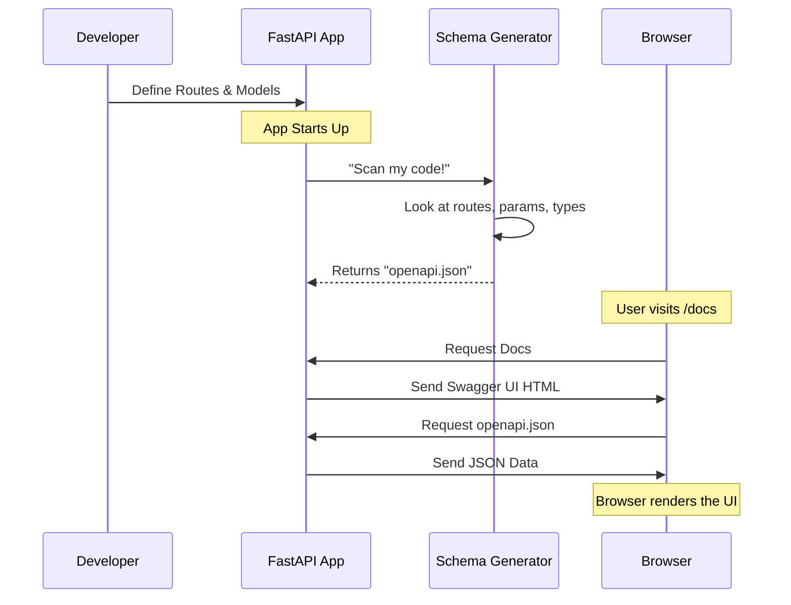

# Chapter 3: OpenAPI Schema Generation

In the previous chapter, [Request Parameters and Validation](02_request_parameters_and_validation.md), we set up a strict "Customs Officer" to validate incoming data.

But here is the problem: **How do visitors know what rules the Customs Officer is enforcing?**

If a developer tries to use your API, they don't want to guess. They need a manual. Historically, developers wrote documentation manually in Word documents or Wikis. But the moment you changed a line of code, that documentation became outdated.

FastAPI solves this with **OpenAPI Schema Generation**.

## The Problem: The Outdated Map

Imagine an architect building a complex maze. If they draw a map on paper before they start building, and then change the layout of the walls during construction, the map becomes useless. Visitors will get lost.

## The Solution: The Magic Map

FastAPI acts like a magical architect. As you place a "wall" (write code) or a "door" (define a route), FastAPI simultaneously draws a perfect, up-to-date map.

This map is called the **OpenAPI Schema**.

Because FastAPI generates this schema automatically from your code, your documentation is **never** out of date.

## Seeing the Magic: Swagger UI

Let's see this in action immediately. We don't even need to write new code—FastAPI does this by default.

### Step 1: Create a Basic App

We will use a simple app similar to what we built in Chapter 1 and 2.

```python
from fastapi import FastAPI
from pydantic import BaseModel

app = FastAPI()

class Item(BaseModel):
    name: str
    price: float

@app.post("/items/")
async def create_item(item: Item):
    return item
```

### Step 2: Run the App

Run your server (usually `uvicorn main:app --reload`).

### Step 3: Visit the Documentation

Open your web browser and go to: `http://127.0.0.1:8000/docs`.

You will see an interactive website called **Swagger UI**.


*(Conceptual visualization of the UI)*

**What just happened?**
*   FastAPI saw you created a `POST` route at `/items/`.
*   It saw you used the `Item` model.
*   It noticed `price` is a `float` and `name` is a `string`.
*   It generated a web page where you can actually click "Try it out", type in data, and send it to your API.

## Customizing the Map

You can add details to this map to make it friendlier for humans.

### 1. App Metadata
When creating the [The FastAPI App Instance](01_the_fastapi_app_instance.md), you can give your API a name and description.

```python
app = FastAPI(
    title="Bakery API",
    description="An API to manage cakes and cookies.",
    version="2.5.0"
)
```

**Explanation:**
This text will appear at the very top of the `/docs` page, telling users what your API is for.

### 2. Route Documentation
FastAPI reads your Python **Docstrings** (comments inside functions) and adds them to the documentation.

```python
@app.get("/items/{item_id}")
async def read_item(item_id: int):
    """
    Retrieve a specific item by its ID.
    
    - **item_id**: The unique identifier of the item.
    """
    return {"item_id": item_id}
```

**Explanation:**
When a user clicks on the `/items/{item_id}` row in the documentation, they will read your description ("Retrieve a specific item...").

## Internal Implementation: Under the Hood

How does FastAPI turn Python code into a website? It uses a standard called **OpenAPI** (formerly known as Swagger).

### The Mental Model: The Robot Cartographer

Imagine a small robot inside your computer. When you start your app, this robot runs through your code *once*.

1.  It visits every `@app.get` and `@app.post`.
2.  It inspects the Pydantic models you used.
3.  It writes down a giant JSON file describing everything.
4.  It hands this JSON file to the web browser.

The web browser uses a tool (Swagger UI) to turn that JSON into the pretty blue-and-green website.



### The Code: The `get_openapi` Function

Deep inside FastAPI, there is a utility function that performs this "Scan". It resides in `fastapi/openapi/utils.py`.

Here is a simplified version of what that logic looks like.

```python
# Simplified concept from fastapi/openapi/utils.py

def get_openapi(routes):
    # This dictionary will hold the final schema
    output = {"paths": {}}

    for route in routes:
        # 1. Get the path, e.g., "/items/"
        path = route.path 
        
        # 2. Get the method, e.g., "GET" or "POST"
        method = route.methods[0].lower()

        # 3. Add to the output dictionary
        output["paths"][path] = {
            method: {
                "summary": route.name,
                "parameters": [] 
                # ... extracts params and models here ...
            }
        }
    
    return output
```

**Explanation:**
1.  **Input:** The function takes the list of `routes` registered in your [The FastAPI App Instance](01_the_fastapi_app_instance.md).
2.  **Loop:** It loops through every route you defined.
3.  **Extraction:** It pulls out the URL path, the HTTP method (GET/POST), and the Pydantic models.
4.  **Output:** It constructs a standard Python dictionary representing the API structure.

### Accessing the Raw Schema

You can actually see this "raw map" generated by the function above.

If your app is running at `localhost:8000`, visit: `http://127.0.0.1:8000/openapi.json`.

You will see a raw text result like this:

```json
{
  "openapi": "3.1.0",
  "info": {
    "title": "Bakery API",
    "version": "2.5.0"
  },
  "paths": {
    "/items/": { ... }
  }
}
```

This JSON file is the "source of truth". The visual `/docs` page is just a pretty skin on top of this file.

## Why This Matters

Because FastAPI adheres to this **OpenAPI Standard**, you gain superpowers:

1.  **Client Generation:** You can feed `openapi.json` into tools that automatically write code in JavaScript, Java, or Swift to talk to your API.
2.  **Alternative Documentation:** Don't like Swagger UI? You can use **ReDoc**. Just visit `/redoc` on your running FastAPI app for a different documentation style.
3.  **Testing:** Automated testing tools can read the schema to fuzz-test your API (throw random data at it) to see if it breaks.

## Summary

In this chapter, we learned that FastAPI is a self-documenting framework.

*   It acts as an **Architect** that draws a map while you build.
*   It generates an **OpenAPI Schema** (a JSON file) describing your API.
*   It provides interactive documentation automatically at `/docs`.
*   It uses the types and validation rules from [Request Parameters and Validation](02_request_parameters_and_validation.md) to make the documentation accurate.

Now that our API is built and documented, we need to organize our code better. We often need to share logic (like database connections or current user info) across many different routes.

[Next Chapter: Dependency Injection System](04_dependency_injection_system.md)

---

Generated by [Code IQ](https://github.com/adityasoni99/Code-IQ)