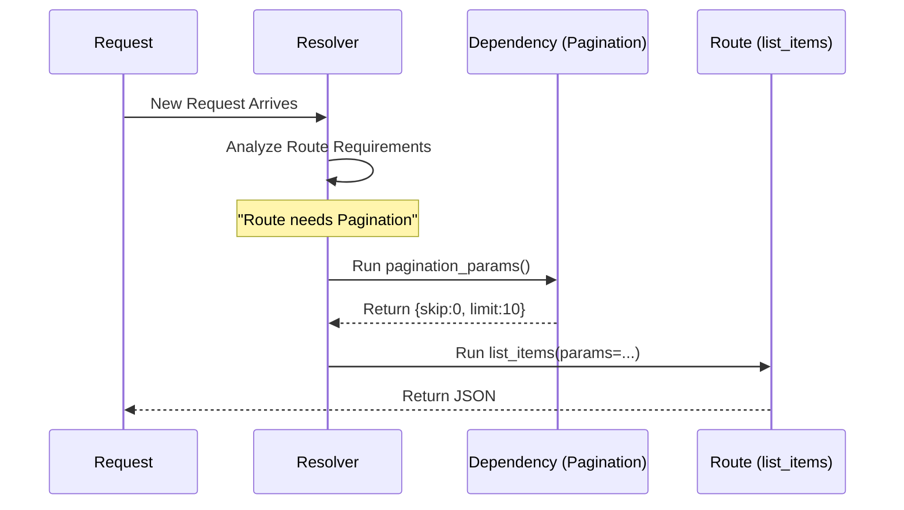

# Chapter 4: Dependency Injection System

In the previous chapter, [OpenAPI Schema Generation](03_openapi_schema_generation.md), we saw how FastAPI automatically documents your API. Now, we are going to look at how to clean up your code, make it reusable, and handle shared logic efficiently.

Welcome to **Dependency Injection**, arguably the most powerful feature in FastAPI.

## The Problem: The "Swiss Army Knife" Function

Imagine you are writing a route to get the current user's profile. Your function has to:
1.  Look for a token in the header.
2.  Decode the token.
3.  Check if the token is expired.
4.  Look up the user in the database.
5.  **Finally**, return the user profile.

If you have 50 routes that need user authentication, you have to copy-paste steps 1-4 fifty times. If you change how tokens work, you have to edit 50 files. This is a maintenance nightmare.

## The Solution: The Personal Assistant

Think of your route function as a **CEO**. The CEO shouldn't be making coffee or finding pens. The CEO should just say "I need a pen," and start writing.

**Dependency Injection** is your Personal Assistant.
1.  You define **how** to get a pen (the Dependency).
2.  The CEO (your Route) declares: "I need a pen" (`Depends`).
3.  FastAPI ensures the pen is there when the CEO starts working.

## Creating Your First Dependency

Let's use a simple example: **Pagination**. Many routes need to handle `skip` and `limit` query parameters. Instead of repeating them, let's create a dependency.

### Step 1: Create the Dependency Function

A dependency is just a standard Python function. It can accept parameters (like `Query` or `Path` parameters we learned in [Request Parameters and Validation](02_request_parameters_and_validation.md)).

```python
async def pagination_params(skip: int = 0, limit: int = 10):
    return {"skip": skip, "limit": limit}
```

**Explanation:**
*   This function looks exactly like a route function, but it doesn't have a decorator (like `@app.get`).
*   It defines the logic: "Look for `skip` and `limit` in the URL."

### Step 2: Inject into the Route

Now, we tell our route to use this logic using `Depends`.

```python
from fastapi import FastAPI, Depends

app = FastAPI()

@app.get("/items/")
async def list_items(params: dict = Depends(pagination_params)):
    return params
```

**Explanation:**
*   We import `Depends`.
*   In the function arguments, we declare `params`.
*   `Depends(pagination_params)` tells FastAPI: "Before running `list_items`, run `pagination_params` first, and give me the result."

### What happens at Runtime?

If a user visits `/items/?skip=20&limit=50`:

1.  FastAPI sees `list_items` needs `pagination_params`.
2.  FastAPI runs `pagination_params(skip=20, limit=50)`.
3.  That function returns `{"skip": 20, "limit": 50}`.
4.  FastAPI runs `list_items(params={...})`.
5.  Your route gets the clean data dictionary directly.

## Sub-Dependencies (The Chain)

Dependencies can have their *own* dependencies. FastAPI resolves this "graph" automatically.

Imagine a kitchen:
1.  **Recipe** requires **Ingredients**.
2.  **Ingredients** require a **Shopper**.

```python
def shopper():
    return "Groceries"

def ingredients(data: str = Depends(shopper)):
    return f"Chopped {data}"

@app.get("/cook")
async def cook_meal(food: str = Depends(ingredients)):
    return {"meal": f"Cooked {food}"}
```

**Explanation:**
*   When you call `/cook`, FastAPI figures out the chain:
*   It runs `shopper()` -> gets "Groceries".
*   It runs `ingredients("Groceries")` -> gets "Chopped Groceries".
*   It runs `cook_meal("Chopped Groceries")`.

You didn't have to manage this chain manually. FastAPI did the "plumbing" for you.

## Internal Implementation: Under the Hood

How does FastAPI know what to run and in what order? It uses a system called **Topological Sort** to resolve the dependency graph.

### The Mental Model

When a request arrives, FastAPI doesn't just run your function. It builds a stack of tasks.



### The Code: `solve_dependencies`

The magic happens in `fastapi/dependencies/utils.py`. The core function is `solve_dependencies`.

When you start your app (as described in [The FastAPI App Instance](01_the_fastapi_app_instance.md)), FastAPI analyzes all your functions. When a request comes in, it executes this logic:

```python
# Simplified concept from fastapi/dependencies/utils.py

async def solve_dependencies(request, dependant):
    values = {}
    
    # Loop through everything the route "Depends" on
    for sub_dep in dependant.dependencies:
        
        # RECURSION: Solve sub-dependencies first
        sub_result = await solve_dependencies(request, sub_dep)
        
        # Run the actual dependency function
        call = sub_dep.call
        solved = await call(**sub_result.values)
        
        # Store the result
        values[sub_dep.name] = solved

    return values
```

**Explanation:**
1.  **Recursion:** The function calls itself. If dependency A needs dependency B, it goes deeper to solve B first.
2.  **Execution:** Once the sub-dependencies are ready, it executes `call(...)`.
3.  **Collection:** It gathers all the results into a `values` dictionary.
4.  **Injection:** Finally, this dictionary is mapped to the arguments of your route function.

### The Cache

By default, `Depends` has a smart feature: **use_cache=True**.

If the same dependency is used multiple times in one request (e.g., getting the `current_user` for permission checks AND for logging), FastAPI runs it **once** and reuses the result.

```python
# In fastapi/dependencies/models.py
@dataclass
class Dependant:
    call: Callable[..., Any] | None = None
    use_cache: bool = True  # <--- Default is True
```

This prevents your API from doing unnecessary work, like hitting the database twice for the exact same user data in a single request.

## Summary

The Dependency Injection system is the glue that holds a FastAPI application together.

*   **Clean Code:** It moves logic (validation, database connections, auth) out of your routes.
*   **Reusability:** Write the logic once, reuse it in 100 routes.
*   **Smart Execution:** It resolves complex chains of requirements automatically.

This system is essentially a pipeline that prepares data for your function. In the next chapter, we will use this system to inject one of the most common requirements for any API: a Database Session.

[Next Chapter: SQLModel Integration](05_sqlmodel_integration.md)

---

Generated by [Code IQ](https://github.com/adityasoni99/Code-IQ)