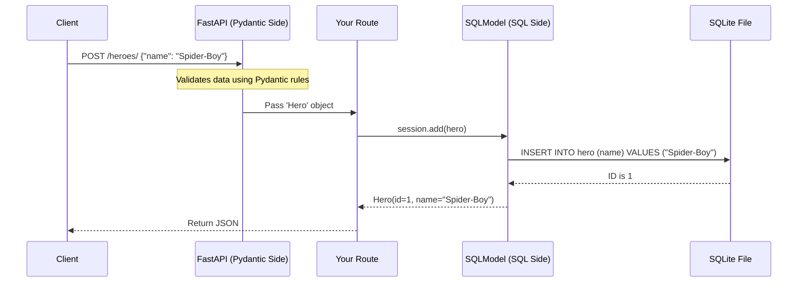

# Chapter 5: SQLModel Integration

In the previous chapter, [Dependency Injection System](04_dependency_injection_system.md), we built a powerful system to manage shared logic like database connections.

But we are missing a crucial piece: **The Database itself.**

Up until now, our data disappeared every time we restarted the server. To build a real application, we need to save data permanently. This is where **SQLModel** enters the stage.

## The Problem: The Double-Work Trap

In most web frameworks, you have to do double the work to handle data:
1.  **For the API:** You write a Pydantic model (Schema) to validate incoming JSON.
2.  **For the Database:** You write a SQL Alchemy model (Table Definition) to save data to the disk.

If you add a field like `email` to your user, you have to copy-paste that change into two different files. If you forget one, your app crashes.

## The Solution: The Universal Translator

**SQLModel** solves this by allowing you to write **one single Python class** that acts as both:
1.  The **Database Table** (for storage).
2.  The **Pydantic Model** (for validation and documentation).

It acts like a **Universal Translator**. When talking to the API, it speaks JSON. When talking to the database, it speaks SQL.

## 1. Defining the Model

Let's build an app to track "Heroes". We need a model that defines what a Hero looks like.

We create a class that inherits from `SQLModel`.

```python
from typing import Optional
from sqlmodel import Field, SQLModel

class Hero(SQLModel, table=True):
    id: Optional[int] = Field(default=None, primary_key=True)
    name: str
    secret_name: str
    age: Optional[int] = None
```

**Explanation:**
*   `table=True`: This tells SQLModel, "Hey, this isn't just data validation; please create a generic SQL table for this."
*   `Field(...)`: This allows us to configure database settings.
*   `primary_key=True`: This makes `id` the unique identifier for each row in the database.

## 2. Setting Up the Engine

The **Engine** is the actual connection to the database file. We will use **SQLite**, which stores the whole database in a simple file (`database.db`).

```python
from sqlmodel import create_engine

# The name of the file on your disk
sqlite_file_name = "database.db"
sqlite_url = f"sqlite:///{sqlite_file_name}"

# Create the engine connection
engine = create_engine(sqlite_url)
```

**Explanation:**
*   `sqlite:///` tells the system to use the SQLite driver.
*   `create_engine` establishes the communication line. We haven't connected yet, just prepared the phone line.

## 3. Creating the Tables

Now we need to tell the database to actually build the structure we defined in step 1.

```python
from sqlmodel import SQLModel

def create_db_and_tables():
    # Looks at all classes with table=True and creates them
    SQLModel.metadata.create_all(engine)

# We usually run this when the app starts
if __name__ == "__main__":
    create_db_and_tables()
```

**Explanation:**
*   `SQLModel.metadata` is a registry that automatically remembers every class you wrote with `table=True`.
*   `create_all(engine)` sends the SQL commands (like `CREATE TABLE hero...`) to the database file.

## 4. The Session Dependency

This is where we use the skills we learned in [Dependency Injection System](04_dependency_injection_system.md).

We need a **Session** to talk to the database. A session is like a "transaction sandwich." You open it, do some work, and then close it.

We don't want to open/close it manually in every route. We create a Dependency!

```python
from sqlmodel import Session

def get_session():
    with Session(engine) as session:
        yield session
```

**Explanation:**
*   `with Session(engine)`: Opens the connection.
*   `yield session`: Pauses execution and hands the open session to the route.
*   After the route finishes, the code resumes and the `with` block automatically closes the connection.

## 5. Writing the Route (CRUD)

Now, let's combine everything. We will create a route that accepts JSON data, validates it, and saves it to the database using the same `Hero` class.

```python
from fastapi import FastAPI, Depends

app = FastAPI()

@app.post("/heroes/")
def create_hero(hero: Hero, session: Session = Depends(get_session)):
    session.add(hero)      # 1. Add to the waiting room
    session.commit()       # 2. Save changes to disk
    session.refresh(hero)  # 3. Get the new ID from DB
    return hero
```

**Explanation:**
*   `hero: Hero`: FastAPI uses Pydantic to validate the input (ensures `name` is a string).
*   `session: Session`: FastAPI injects the database connection.
*   `session.add(hero)`: Tells the session we want to save this object.
*   `session.commit()`: Actually writes the data to the file.
*   `session.refresh(hero)`: The database generated an `id` (like 1, 2, 3). We need to pull that data back into our Python object.

## Internal Implementation: Under the Hood

How can one class be two things at once? How can `Hero` be a Pydantic model AND a SQLAlchemy model?

### The Mental Model

SQLModel uses a concept called **Multiple Inheritance**. It's like having two parents and inheriting powers from both.

1.  From **Pydantic**, it inherits the ability to read JSON and validate types.
2.  From **SQLAlchemy**, it inherits the ability to map Python objects to SQL rows.

When a request comes in:



### The Code: The Hybrid Class

Internally, the `SQLModel` class is a clever combination of Pydantic's `BaseModel` and SQLAlchemy's `DeclarativeMeta`.

Here is a simplified view of what the `SQLModel` source code looks like conceptually:

```python
# Conceptual implementation - Simplified
from pydantic import BaseModel
from sqlalchemy.orm import DeclarativeBase

# It inherits from BOTH worlds
class SQLModel(BaseModel, DeclarativeBase):
    metadata = MetaData()
    
    def __init__(self, **kwargs):
        # Initializes Pydantic validation
        super().__init__(**kwargs) 
```

**Explanation:**
*   **BaseModel**: Gives the class `.dict()`, `.json()`, and type validation.
*   **DeclarativeBase**: Gives the class the ability to be read by the database engine.

When you write `class Hero(SQLModel, table=True)`, SQLModel uses a Python feature called a **Metaclass**. This Metaclass runs effectively during the "compile time" of your code. It looks at your fields and:
1.  Creates Pydantic fields for API validation.
2.  Creates SQLAlchemy columns for the Database schema.

This happens automatically in the background so you don't have to manage the complexity.

## Summary

In this chapter, we integrated a database using **SQLModel**.

*   We learned that **SQLModel** bridges the gap between API validation and Database storage.
*   We defined a single `Hero` class to serve two purposes.
*   We used our **Dependency Injection** knowledge to manage Database Sessions efficiently.
*   We implemented a real persistent `POST` route.

Your API can now remember data! But currently, *anyone* can add heroes or delete them. We need to secure our API doors.

[Next Chapter: Security and Authentication](06_security_and_authentication.md)

---

Generated by [Code IQ](https://github.com/adityasoni99/Code-IQ)