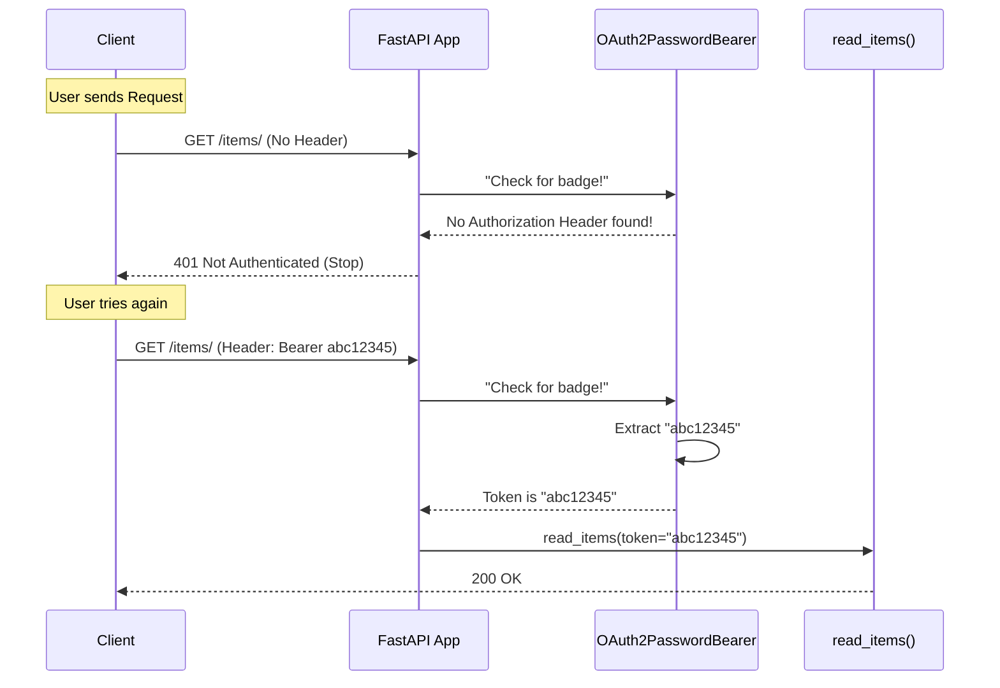

# Chapter 6: Security and Authentication

In the previous chapter, [SQLModel Integration](05_sqlmodel_integration.md), we built a working database to store our "Heroes". However, we have a major problem: **The doors are unlocked.**

Right now, anyone who knows your API URL can add, delete, or modify data. In a real application, we need to know *who* is knocking at the door (Authentication) and check if they are allowed inside (Authorization).

## The Problem: The Unprotected Club

Imagine you are running an exclusive club (your API).
1.  **Without Security:** Strangers walk in, eat the buffet, and rearrange the furniture.
2.  **With Security:** You hire a Bouncer. The Bouncer checks if guests have a valid membership badge before letting them in.

## The Solution: The Badge System

FastAPI has a built-in security system based on **OAuth2**. While the name sounds complex, the concept is simple. It works exactly like a corporate office badge system.

1.  **The Login Office:** The user presents their ID (username/password) and gets a **Token** (The Badge).
2.  **The Scanner:** When the user wants to enter a room (an API Endpoint), they scan their badge.
3.  **The Verification:** The system checks if the badge is valid.

FastAPI handles the "Scanner" part automatically using the **Dependency Injection System** we learned in Chapter 4.

## 1. Setting up the Scanner (OAuth2 Scheme)

First, we need to tell FastAPI where the "Login Office" is. We use `OAuth2PasswordBearer`.

```python
from fastapi import FastAPI
from fastapi.security import OAuth2PasswordBearer

app = FastAPI()

# This tells FastAPI: "To get a token, go to the URL /token"
oauth2_scheme = OAuth2PasswordBearer(tokenUrl="token")
```

**Explanation:**
*   `OAuth2PasswordBearer` is a class that defines how we extract the security token.
*   `tokenUrl="token"` is a configuration setting. It tells the automatic documentation (Swagger UI): "If the user wants to log in, send them to the `/token` route."

## 2. Using the Scanner (The Dependency)

Now, let's protect a route. We want to ensure that only people with a "Badge" (Token) can see our items.

We use `Depends` to inject the security scheme.

```python
from fastapi import Depends

@app.get("/items/")
async def read_items(token: str = Depends(oauth2_scheme)):
    return {"token": token}
```

**Explanation:**
*   **The Magic:** When a user calls this route, FastAPI pauses.
*   It looks at the HTTP **Header** of the request.
*   It looks for a header named `Authorization` with a value like `Bearer mysecrettoken`.
*   If the header is missing, FastAPI **rejects the request automatically** (401 Unauthorized).
*   If found, the variable `token` is populated with `"mysecrettoken"`.

## 3. The Login Office (Generating Tokens)

The scanner expects a token. But how does the user get one? We need a route to exchange a username and password for that token.

FastAPI provides a helper called `OAuth2PasswordRequestForm` to handle the login data.

```python
from fastapi.security import OAuth2PasswordRequestForm

@app.post("/token")
async def login(form_data: OAuth2PasswordRequestForm = Depends()):
    # In a real app, verify user/pass from DB here!
    return {"access_token": form_data.username, "token_type": "bearer"}
```

**Explanation:**
*   `OAuth2PasswordRequestForm`: This is a dependency that reads `username` and `password` from the **Form Data** (not JSON) sent by the user.
*   **The Return:** The standard requires us to return a JSON with `access_token` and `token_type`.
*   *Note:* In this simple example, we are just returning the username as the "token". In a real app, you would generate a secure cryptographic string (like a JWT).

## 4. Identifying the User

Usually, you don't just want the token string; you want to know *which user* owns that token.

We can create a powerful dependency called `get_current_user`.

```python
# 1. This dependency gets the token string
def get_current_user(token: str = Depends(oauth2_scheme)):
    # 2. In real life, decode the token to find the user ID
    user = fake_decode_token(token) 
    return user

@app.get("/users/me")
async def read_users_me(user: dict = Depends(get_current_user)):
    return user
```

**Explanation:**
1.  `read_users_me` asks for `user`.
2.  FastAPI runs `get_current_user`.
3.  `get_current_user` asks for `token` (via `oauth2_scheme`).
4.  FastAPI extracts the token from the header -> passes it to `get_current_user` -> which finds the user object -> which is passed to your route.

## Integration with Documentation

Because FastAPI uses the standard OpenAPI specification (Chapter 3), using these security tools adds a special feature to your `/docs` page.

You will see a green **Authorize** button.
1.  Click **Authorize**.
2.  Type a username and password.
3.  Click **Login**.

FastAPI will automatically attach the "Badge" (Token) to every request you make in the documentation browser. You don't have to manually copy-paste headers!

## Internal Implementation: Under the Hood

How does `OAuth2PasswordBearer` actually work? It is simply a Dependency class that acts like a gatekeeper.

### The Mental Model



### The Code: Inside `oauth2.py`

The logic resides in `fastapi/security/oauth2.py`. It inherits from `SecurityBase`.

Here is a simplified version of the logic:

```python
# Simplified concept from fastapi/security/oauth2.py
from starlette.requests import Request
from fastapi.exceptions import HTTPException

class OAuth2PasswordBearer:
    def __init__(self, tokenUrl: str):
        self.tokenUrl = tokenUrl

    async def __call__(self, request: Request) -> str:
        # 1. Get the header
        authorization = request.headers.get("Authorization")
        
        # 2. Check if it exists and starts with "Bearer"
        if not authorization or not authorization.startswith("Bearer "):
            raise HTTPException(status_code=401, detail="Not authenticated")
            
        # 3. return the token string
        return authorization.split(" ")[1]
```

**Explanation:**
*   **`__call__`**: This magic method allows the class instance to be used as a function (a callable). This is why we can pass it to `Depends()`.
*   **Request Object**: It accesses the raw Request object (from Starlette) to inspect headers.
*   **Exception**: It raises the 401 error immediately if the check fails, protecting your route.

## Summary

In this chapter, we secured our application using FastAPI's integrated tools.

*   We used **OAuth2PasswordBearer** to act as the "Badge Scanner".
*   We used **Dependency Injection** (`Depends`) to place this scanner in front of our routes.
*   We learned how `OAuth2PasswordRequestForm` helps create a login endpoint.
*   We saw how FastAPI automatically updates the **OpenAPI Documentation** with an "Authorize" button.

Now that our API is secure, we need to look at how to run code *before* or *after* a request is processed globally, such as for tracking performance or handling CORS headers.

[Next Chapter: Middleware](07_middleware.md)

---

Generated by [Code IQ](https://github.com/adityasoni99/Code-IQ)