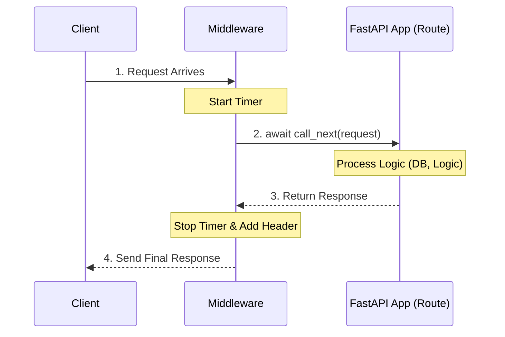

# Chapter 7: Middleware

In the previous chapter, [Security and Authentication](06_security_and_authentication.md), we acted like security guards, checking ID badges (Tokens) for specific rooms (Routes).

But sometimes, you need to do something for **every single person** who enters the building, regardless of which room they are going to. For example, you might want to:
*   Log the exact time every person enters and leaves.
*   Decontaminate every package (GZip compression).
*   Add a standard sticker to every outgoing package (Headers).

In FastAPI, we use **Middleware** to handle these global tasks.

## The Problem: Repetitive Global Logic

Imagine you want to calculate how long every request takes to process so you can monitor performance.

Without Middleware, you would have to:
1.  Start a timer at the beginning of *every* function.
2.  Stop the timer at the end of *every* function.
3.  Calculate the difference.

If you have 100 routes, you are writing the same code 100 times. That is messy and hard to maintain.

## The Solution: The "Hallway Filter"

Think of Middleware as a special section of the hallway that leads to your office.

1.  **Entry:** Every request must pass through the middleware *before* it reaches your route.
2.  **Processing:** The middleware hands the request to your route.
3.  **Exit:** The response from your route must pass back through the middleware *before* leaving the building.

This gives you two chances to run code: once on the way in, and once on the way out.

## Creating Your First Middleware

Let's build a middleware that tracks time. It will add a "stopwatch" reading to the response headers.

### Step 1: The Decorator

We use `@app.middleware("http")` to tell FastAPI: "Run this function for every HTTP request."

```python
import time
from fastapi import FastAPI, Request

app = FastAPI()

@app.middleware("http")
async def add_process_time_header(request: Request, call_next):
    # CODE HERE RUNS BEFORE THE ROUTE
    start_time = time.time()
    
    # Pass the request to the next step (the route)
    response = await call_next(request)
    
    # CODE HERE RUNS AFTER THE ROUTE
    process_time = time.time() - start_time
    
    # Add a custom header to the response
    response.headers["X-Process-Time"] = str(process_time)
    
    return response
```

**Explanation:**
*   `request`: The incoming information from the user.
*   `call_next`: This is a special function. It passes the request to the actual path operation (like `@app.get("/items")`).
*   `await call_next(request)`: This line pauses the middleware, runs your route logic, and waits for the route to return a response.
*   `response.headers[...]`: We modify the response *after* the route is finished but *before* the user receives it.

### Step 2: Testing it

Now, define a simple route.

```python
@app.get("/")
async def main():
    # Simulate some work
    time.sleep(1)
    return {"message": "Hello World"}
```

If you run this app and inspect the network tools in your browser, you will see a header `X-Process-Time: 1.000...`. The middleware successfully intercepted the traffic!

## Solved Problem: CORS (Cross-Origin Resource Sharing)

The most common use of middleware in the real world is **CORS**.

**The Scenario:**
*   Your API is running on `localhost:8000` (Backend).
*   Your React/Vue/Angular website is running on `localhost:3000` (Frontend).
*   The Frontend tries to fetch data from the Backend.

**The Crash:**
The web browser will block this request for security reasons because the ports (3000 vs 8000) are different. This is called a "Cross-Origin" request.

**The Fix:**
We need a middleware that adds specific headers to tell the browser: "It's okay, `localhost:3000` is allowed to talk to us."

FastAPI has this built-in.

```python
from fastapi.middleware.cors import CORSMiddleware

origins = [
    "http://localhost:3000",
    "https://my-app.com",
]

app.add_middleware(
    CORSMiddleware,
    allow_origins=origins,
    allow_credentials=True,
    allow_methods=["*"], # Allow GET, POST, DELETE, etc.
    allow_headers=["*"],
)
```

**Explanation:**
*   `app.add_middleware`: This registers a class-based middleware (different from the function decorator we used above).
*   `allow_origins`: A list of the "friends" allowed to visit your API.
*   `allow_methods=["*"]`: The `*` is a wildcard. It means "Allow everything."

## Internal Implementation: Under the Hood

How does FastAPI wrap your application in these layers?

### The Mental Model: The Onion

Imagine your application is an onion.
1.  The **Core** is your Route (the function you wrote).
2.  The **Layers** are Middlewares.

When a request comes in, it drills through the outer layers to get to the core. When the response comes out, it passes back through the layers in reverse order.



### The Code: The ASGI Pattern

FastAPI is based on **Starlette**, which follows the **ASGI** (Asynchronous Server Gateway Interface) standard.

In ASGI, a middleware is simply a class that takes an "App" and behaves like an "App" itself. It acts as a proxy.

Here is a simplified version of how the `CORSMiddleware` works internally.

```python
# Simplified concept of Starlette/FastAPI middleware structure

class SimpleMiddleware:
    def __init__(self, app):
        # We store the "inner" application (the next layer)
        self.app = app

    async def __call__(self, scope, receive, send):
        # 1. Do something before (Incoming)
        print("Someone is knocking!")

        # 2. Call the inner app
        await self.app(scope, receive, send)

        # 3. Do something after (Outgoing)
        print("They have left the building.")
```

**Explanation:**
*   `__init__`: When you say `app.add_middleware`, FastAPI initializes this class and passes the rest of the application as `self.app`.
*   `__call__`: This is the standard ASGI entry point. When a request comes in, this function runs.
*   It surrounds `self.app(...)` with its own logic.

### Middleware vs. Dependencies

It is easy to confuse Middleware (Chapter 7) with Dependencies ([Dependency Injection System](04_dependency_injection_system.md)).

| Feature | Middleware | Dependency Injection |
| :--- | :--- | :--- |
| **Scope** | Global (Runs for *every* route) | Specific (Runs only for routes that ask for it) |
| **Focus** | Low-level (Headers, CORS, GZip, Protocol) | High-level (Database, User Auth, Logic) |
| **Data Access** | Can only see the raw Request object | Can see parsed JSON, Typed Parameters, etc. |

**Rule of Thumb:**
*   Use **Middleware** for "Plumbing" (things that happen to the raw HTTP traffic).
*   Use **Dependencies** for "Logic" (things your code needs to do its job).

## Summary

Congratulations! You have completed the FastAPI tutorial series.

In this final chapter, we learned:
*   **Middleware** wraps your entire application like layers of an onion.
*   It allows you to run code **before** and **after** every request.
*   We use the `@app.middleware` decorator for custom logic (like timing).
*   We use `app.add_middleware` for pre-built tools like **CORS**.
*   We distinguished between global Middleware and specific Dependencies.

### Where to go from here?

You now have a complete toolkit:
1.  [The FastAPI App Instance](01_the_fastapi_app_instance.md) (The Foundation)
2.  [Request Parameters and Validation](02_request_parameters_and_validation.md) (The Inputs)
3.  [OpenAPI Schema Generation](03_openapi_schema_generation.md) (The Documentation)
4.  [Dependency Injection System](04_dependency_injection_system.md) (The Logic Sharer)
5.  [SQLModel Integration](05_sqlmodel_integration.md) (The Database)
6.  [Security and Authentication](06_security_and_authentication.md) (The Protection)
7.  **Middleware** (The Traffic Control)

You are now ready to build robust, high-performance web APIs. Happy Coding!

---

Generated by [Code IQ](https://github.com/adityasoni99/Code-IQ)